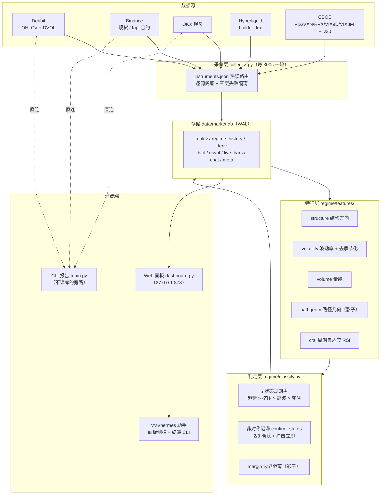

# VVV_Trade 系统日志 · 2026-07-31

> **本文是截至 2026-08-02 的快照**。此后系统已升 RULES_VERSION v2 / AUDIT_VERSION a6，
> 版本谓词取代了文中描述的 regime_audit_vN 全表清空机制、面板已改只读连接、
> deriv 已逐指标取窗——现状以 README 与 classify.py/storage.py 为准，本文不逐条改史。
> 覆盖期：项目启动 → 2026-08-01 UTC
> 数据基准：`data/market.db`（只读 `mode=ro` 盘点）、`data/collector.log`（全量）、`tests/` 实跑输出
> 数字来源标注：📊 库内实测 / 🧪 测试实跑 / 📐 外推推算（非实测）/ ⚠️ 一次性执行、无留存工件
> 库行数为 2026-08-01 01:28 的快照；collector 仍在跑，当前值会有小幅增长
> （复核时点 02:2x 实测 regime_history 已 5,170 行、`state≠raw_state` 609 行、`atr_ds` 非空 1,323 行——
> 与正文的 5,160 / 607 / 1,316 差的就是这段时间新采的 10 行，不是口径错误）

---

## 这个系统是什么

VVV_Trade 是一套**市场状态（regime）识别与路由系统**，不是信号系统，也不是预测器。它回答的唯一问题是：**当前这个品种、这个周期，处在哪一类市场状态**——趋势上行 / 趋势下行 / 低波动挤压 / 高波动无序 / 震荡，五选一。得到状态之后，用什么策略是人的事；系统只负责把「现在是什么环境」这件事做得可解释、可复现、可回测。

它刻意放弃了两样东西：黑盒模型和预测。规则树全显式、阈值集中一处、每根 K 线的判定结果连同当时的 22 项特征值和规则命中情况一起入库——目的是让「三个月后回头质疑这个判断」这件事有据可查。系统当前覆盖 3 个加密永续 + 7 个美股永续，三个周期（1d/4h/1h），每 5 分钟采集一轮，本地 SQLite 累积历史。

一句话概括当前进度：**采集、特征、判定、存储、面板、助手六层全部贯通并在跑，但阈值仍是先验值、回测框架尚未开工**。这是 v1 的诚实状态。

---

## 系统总览



链路要点：

- **采集与展示是两个进程**，靠 SQLite WAL 解耦。collector 写行情/状态/meta；dashboard **对行情与状态只读，但不是纯读进程**——它写 `chat` 表（`dashboard.py:504-505` 的 `add_chat`、`:517` 的 `clear_chat`→`DELETE FROM chat`），且每次 `storage.connect()`（`:402/446/464/495/515`）都无条件跑 `_migrate()`（`storage.py:64-85`，内含 ALTER TABLE、`UPDATE regime_history SET raw_state=...`、审计代际未命中时的 `DELETE FROM regime_history`）。也就是说**两个进程都能触发迁移与 purge**，这放大了缺口 #14 的并发问题。日常读写互不阻塞，任一侧崩溃另一侧照常工作。
- **特征与判定跑在 collector 进程内**（`collector.py:138` 起，`get_ohlcv(limit=1200)` 深度重算），面板另有一条实时重算路径用于未收线预览。
- **main.py 是完全不读库的旁路**（全文无 `import storage`），用于「面板不对时判断是数据问题还是计算问题」。
- **VVVhermes 挂在面板载荷之上**：把 `build_dashboard()` 的完整 JSON 降维成纯文本上下文注入模型，面板侧栏与终端 CLI（`vvvhermes.py`，92 行）共享同一张 SQLite `chat` 表。

---

## 已交付能力

### 1. 数据采集层（1,150 行 = data 306 + storage 338 + collector 273 + deriv 99 + usvol 93 + instruments 41）

**多源路由与逐源兜底。** 六个数据源实现：Deribit（`regime/data.py:80-112`）、OKX（`:137-153`）、Binance 现货双域名（`:156-174`）、Binance fapi 合约（`:177-196`）、Hyperliquid（`:199-237`）、CBOE（`regime/usvol.py`）。路由权完全下放给 `instruments.json`——每次 `get()` 重读磁盘（`regime/instruments.py:27-41`），改配置即生效不必重启；未登记的 symbol 回退加密默认链 `deribit → okx → binance`。逐源 try、失败记入 errors、全失败拼接抛出（`regime/data.py:256-287`），调用方一次看到所有源的失败原因。

实测路由结果：BTC/ETH/SOL 三个周期全部走 deribit，7 个美股永续全部走 binance_futures，Hyperliquid 兜底至今未被触发。

**几个不显眼但关键的适配。** Deribit 对 BTC/ETH 走币本位 `{BASE}-PERPETUAL`、其余走线性 `{BASE}_USDC-PERPETUAL`（`data.py:58-62`）；Deribit 没有 240 分钟分辨率，4h 由 1h 用整数秒分桶重采样（`bucket = sec//14400*14400`，`data.py:65-77`）并按 `limit*4+8` 过量拉取源数据保证重采样后仍够数；OKX 用 `1Dutc` 而非 `1D` 让日线口径统一到 UTC（`data.py:28`）。

**未收盘 K 线双轨制。** 确认历史只收 `df.iloc[:-1]`（`collector.py:127`），形成中的那一根单独写 `live_bars` 表、每个 (symbol,tf) 只留最新一份（`storage.py:214-228`）。这条物理边界保证 `regime_history` 与日后回测口径完全一致——预览数据进不了状态表。

**衍生品四件套 + 一次性回填。** 每轮快照 `premiumIndex(funding/mark/index) + openInterest + 5m takerlongshortRatio`（`regime/deriv.py:32-56`），premium 由 `(mark-index)/index` 现算而非直接取字段。首次运行做历史回填：`fundingRate×1000`（约 333 天）+ `openInterestHist 1h×500`（约 20.8 天）+ `takerlongshortRatio 1h×500` + `premiumIndexKlines 1h×500`（`deriv.py:59-99`）——Binance 的 OI/taker 只保留约 30 天，先到先得。

**美股波动率三层。** 三层的定义（全文首次出现，后文沿用）：**L0 = 去季节化 ATR 分位**（自算，见第 2 节「去季节化 ATR」段）、**L1 = CBOE 五指数**、**L2 = 个股 iv30**。L1 是 CBOE 五指数全历史 CSV 回填（`usvol.py:25-40`，VIX 回溯到 1990-01-02）；当日值靠约 15 分钟延迟的报价接口补（`usvol.py:43-50`）；L2 是个股 iv30（`usvol.py:53-62`），缺失或 0 一律返回 None，避免给无期权标的写入假 0 值。**⚠️ L2 目前只是采集通路打通，尚无可用输出**：快照时全库仅 7 条 iv30（7 个美股品种各 1 个观测），跨度 0.0 天（`dashboard.py:251` 算出的 `iv30_days`），分位被 20 样本闸（`dashboard.py:288-292`）挡住恒为 None——见缺口 #4。整个 usvol 模块挂在一个 30 分钟的跨进程节流闸后面（`collector.py:189`）——delayed_quotes 属 CBOE ToS 灰区，节流状态存在 meta 表而非内存，launchd 每 5 分钟起一个新进程也照样受约束。

**存储层的三个核心机制。**

1. **幂等 upsert 全家桶**：ohlcv PK `(symbol,tf,ts)`、dvol PK `(currency,ts)`、usvol PK `(idx,ts)`、live_bars PK `(symbol,tf)` 单行覆盖。重复采集同一根 K 线只更新不重复，本地历史随运行时间只增不乱。
2. **deriv 表的 COALESCE 列合并**（`storage.py:240-253`）：`ON CONFLICT DO UPDATE SET col=COALESCE(excluded.col, col)`。这是整个衍生品设计的关键——让 backfill 四条不同时间网格的稀疏行、每轮快照、独立写入的 iv30 共存于同一张宽表，后写的 NULL 不会抹掉先写的值。
3. **就地迁移 + 审计代际清空**（`storage.py:64-101`）：ALTER 先查 `PRAGMA table_info` 保证幂等；`regime_audit_v4` 这个 meta 键不存在则 `DELETE FROM regime_history` 全量重算。详见「版本纪律」一节。

**三层失败隔离。** K 线 per (symbol,tf)、衍生品 per symbol、usvol per index、iv30 per symbol、DVOL per currency 各自 try/except 收进 errors 列表；再往下一层，taker 接口失败只把 `taker_ratio` 置 None 而不作废整个衍生品快照（`deriv.py:47-55`）。任一品种或任一数据源挂掉，降级为一条日志加一条 error，不拖累整轮。

---

### 2. 特征层（520 行 = structure 89 + volatility 105 + volume 44 + pathgeom 76 + crsi 163 + utils 30 + `__init__` 13）

**分位归一化是唯一口径。** `pct_rank`（`features/utils.py:8-13`）取 `dropna().tail(window)` 后返回「窗口内严格小于当前值的比例」，默认 window=250。波动率和成交量的绝对值不可跨品种跨时期比较，「处于自身历史什么分位」才可比。用严格 `<` 意味着当前值自身不计入，上界是 `(n-1)/n`，`1.0` 永不可达——所以 `atr_rank > 0.85` 在**满** 250 窗口下的语义是「严格高于至少 213 个历史值」——⚠️ 但入库的行大多没有满窗口（📊 只有约 24% 的 `regime_history` 行深度 ≥250，详见第 3 节 `min_bars` 段），窗口浅时同一个 0.85 对应的历史值个数会少很多。面板画分位时间线用 `rolling_pct_rank`（`utils.py:16-30`），逐点只看该点及之前的 window 个值，与 walk-forward 口径一致。

**结构方向是四个子分的加权合成**（`features/structure.py:51-89`）：

```
direction = 0.45·pivot_dir + 0.25·ema_slope + 0.20·dc_score + 0.10·above_ema200
```

四个子分全部先压到 `[-1,+1]` 再加权——量纲统一才敢线性叠加。`ema_slope` 用 ATR 归一化（`tanh(2·(EMA50[-1]-EMA50[-11])/(ATR14·10))`）实现跨价格水平可比，tanh 防极端值主导；`pivot_dir` 来自滚动分形摆动点（k=4，左右各 4 根确认，`structure.py:13-26`）——最近 4 根内的极值刻意不标记，这是消除未来函数的代价。

趋势效率用 Kaufman 效率比（`structure.py:44-48`，`|close-close.shift(30)| / rolling(30) 路径长度`）而非 ADX：无参数黑盒、口径透明。

**波动率的一阶、二阶和去季节化。** 一阶是 `atr_rank`（ATR/close 的分位）与 `bbw_rank`，并直接硬编码出两个布尔 `squeeze = (bbw_rank<0.15 且 atr_rank<0.30)`、`high_vol = (atr_rank>0.85)`（`features/volatility.py:103-104`）——这两个布尔是判定树的直接短路开关。二阶是 `vol_accel`（快慢 RV 之比，`ret.rolling(12).std() / ret.rolling(72).std()`）和 `downside_share`（48 根内下行方差占比）：分位是「位置」，加速度是「导数」，后者比分位更早报出扩张；`downside_share` 给本无方向的波动率装上方向。

**去季节化 ATR 分位（即上文的 L0）是本期最实质的新逻辑**（`volatility.py:41-62`）。实测美股永续 TR% 盘中/盘外差 2.2-2.7 倍、周末塌陷 2-5 倍——未去季节化的 `atr_rank` 在盘外主要在识别「现在是夜里」而不是真实波动状态。做法是按 `bucket = UTC小时 + 24×(是否周末)` 共 48 桶分组，每根除以其同桶**此前** 30 个观测的均值，再乘全局均值还原量纲。关键在两个 `shift(1)`（`:55` 与 `:57`）：当根不进入自己的归一化因子，否则就是自我泄漏。样本不足时返回 `None` 而不是塌回原值——宁缺毋滥，静默降级会让下游无法区分「算出来就是这个值」和「没算成」。

门控收得很紧（`classify.py:241-248`）：只有 `class == us_stock_perp` 且 `timeframe ∈ (1h, 4h)` 才算。加密 24/7 无 session 结构，1d 本身跨完整交易日无小时效应——加密路径零改变。

**cRSI 是用户 TradingView 脚本的逐语义本地化**（`features/crsi.py`，163 行）。参数与 Pine input 逐一对齐（domCycle=20 / vibration=10 / leveling=10.0 / pivLen=5），主线递归 `crsi[i] = torque·(2·rsi[i] - rsi[i-lag]) + (1-torque)·prev` 带 `nz` 语义兜底。三处刻意保留 Pine 原版怪癖：整数除法按浮点算、lmax/lmin 的 else-if 扫描（某根若更新了极大值就跳过极小值判断）、背离枢轴的 `offset=-pivLen` 语义。唯一有意偏离：窗口含 NaN 时 Python 拒绝出带（`crsi.py:93`），而 Pine 用 nz 哨兵在暖机期就产出退化的带。带位 `pos` 可超出 `[0,100]` 且不做 clip——越界本身就是信号。

**路径几何给「震荡」加了一条频率轴**（`features/pathgeom.py`；这就是路线图里说的「regime-spectrum 采纳批次一」——批次一 = 频率轴 chop_freq / 主周期 dom_period / Kendall τ / margin / 滞后声明，全部作为影子字段落地）。窗口 120，一次带截距 OLS 去趋势 → 残差对残差均值的符号穿越计数 → `chop_freq`（每 100 根穿越数）与 `dom_period ≈ 2n/穿越数`；另出手写 Kendall τ-a。目的是区分慢摆动（可做区间）与快噪声（应观望）。两条硬约束：`window < 100` 直接 raise（编程错误不静默）；历史不足或窗口含 NaN 时四个字段**全部返回 None** 而不是塌成 0——塌成 0 会被下游误读为「无震荡」这一强断言。

---

### 3. 状态判定核心（regime/classify.py）

**规则树是分层短路的，无黑盒**（`classify.py:94-136`）：

```
趋势   ：er_rank ≥ 0.60  AND  |direction| ≥ 0.30   → 按 direction 正负分 trend_up / trend_down
挤压   ：bbw_rank < 0.15  AND  atr_rank < 0.30      → squeeze
高波无序：atr_rank > 0.85                            → high_vol_chop
兜底   ：                                            → range
```

三个阈值集中在 `THRESHOLDS`（`classify.py:23-27`）：`er_rank_trend=0.60 / direction_trend=0.30 / tilt_confirm=0.10`。实况样本形如 `{"triggered": ["er_rank>=0.6", "tilt_confirm(|tilt|>0.1)"], "unmet": ["abs(dir)>=0.3", ...]}`。

**但 `rules` JSON 只是部分阈值快照。** 5 条规则里只有 3 条是 f-string 内插 `THRESHOLDS`（`:103`、`:104`、`:107-108`）；`:105-106` 的 `"squeeze(bbw<0.15&atr<0.30)"` 与 `"high_vol(atr>0.85)"` 是纯字面量，与 `volatility.py:103-104` 的真实阈值毫无绑定。改了那三个数，入库的 rules 文字纹丝不动——**回测不能靠 rules 反推 squeeze/high_vol 的当时阈值**（同见缺口 #2）。

**置信度是四套公式，分状态计算**（`:117-129`）。趋势态 `0.45|d| + 0.35·er_rank + 0.20·vol_confirm`，其中 `vol_confirm` 按量能倾斜是否站在趋势一边三档取值 `{1.0, 0.5, 0.0}`——量能确认是趋势置信度的第三票；挤压态 `1−bbw_rank`（越压缩越确信）；高波态 `atr_rank`；震荡态 `0.5(1−er_rank) + 0.5(1−|d|)`。

**非对称迟滞把逐根原判折叠成确认态**（`confirm_states`，`:148-174`）。确认根数按**目标态**取而非源态：

| 目标状态 | 确认根数 | 理由 |
|---|---|---|
| high_vol_chop | 1 | 风险态零迟滞 |
| trend_up / trend_down / squeeze | 2 | 标准 |
| range | 3 | 快进慢出 |

展开说：高波是唯一被赋予零迟滞的状态，因为风险态宁可误报不可漏报；对称地，恢复 range 要 3 根，使系统对风险态「快进慢出」。

raw 回落到当前态时 pending 清零；换了一个不同的 pending 则计数重置为 1。同时把「还差几根」这个原本被迟滞吞掉的信息显式暴露为 `candidate = {state, count, need}`，三处消费：collector 日志、面板状态卡「酝酿中」、Hermes 上下文标记。

**walk-forward 逐根重算 + 增量补算**（`rolling_states_missing`，`:177-238`）。`min_bars=90` 是**出结果的最低门槛，不是可信门槛**——分位窗口是 250，深度不足 250 时 `pct_rank` 就在更短的样本上算，参照期缩水但不报错。📊 实测：按 (symbol,tf) 排序后，只有约 **24%** 的 `regime_history` 行拥有完整 250 根参照，其余 76% 的分位窗口在 90-249 根之间；最浅那批里 `atr_rank > 0.85` 的语义是「高于约 77 个值」而不是 213 个。这与 `dashboard.py:38` 的 `WARMUP_BARS = 280`（面板把 < 280 根一律判为质量不可信）是两个口径，判定端更宽松。建议审计快照补一个 `win` 字段记录该行实际可用样本数，否则回测无法按窗口深度分层。

`window=400` 把每根的输入截断到最近 400 根，`existing_ts_ms` 的跳过发生在特征计算**之前**（`:197-199`），使增量成本严格 O(新增根数)：🧪 实测 1200 根全量重算 1111 行耗时 3.6s，增量 1 根 0.003s。

**⚠️ 「无未来函数」的准确边界：窗口截断无泄漏，但存在同根泄漏。** `sub = df.iloc[max(0, i - window): i]`（`:200`）包含第 i 根本身，该根的 state 以自己的 ts 入库（`:196-237`），全仓无任何输出级 `.shift(1)`。参考项目 `regime-spectrum/05-PITFALLS.md` 的「A2. 同根泄漏」把这个坑写得很清楚（「输出序列必须 `.shift(1)`——第 i 行的读数只能来自 ≤ i−1 的信息」），本系统**没有做这一步**。这条与它是不是参考项目无关——**同根泄漏是本系统代码的客观属性**，读一遍 `classify.py:200` 就能确认。所以硬声明：**`regime_history[ts]` 用到了 ts 这根的收盘价，可用时点为该根收盘之后；回测入场最早只能是 ts+1 根开盘。** 按 state[i] 在第 i 根盘中行动的回测会作弊。建议把审计快照里硬编码的 `"lag": 15` 换成显式的 `{"same_bar_close": true}`。

**审计快照随每根 K 线入库**：22 个键的扁平 JSON（`:204-227`），分五组 + lag——结构 4（dir/pivot/slope/dc）、效率 2（er/er_rank）、波动 8（atr_rank/atr_ds/bbw_rank/rv/accel/dshare + sq/hv 两个布尔）、量 2（tilt/volz）、影子 5（freq/domp/tau/margin/m_near）、lag 1，合计 4+2+8+2+5+1 = 22。回测因此无需重算特征，也不会混用规则版本。

**margin 是分层短路树上的边界距离**（`_boundary_margin`，`:44-75`）。分层短路下不能对所有边界裸取最小距离——trend 态时 `bbw_rank` 逼近 0.15 根本改变不了输出。所以按当前态枚举「可达翻转」，且区分两种复合逻辑的距离语义：AND 式进入取未满足项的**最大缺口**（须全部跨越），OR 式破坏取**最小盈余**（任一失守即破）。这是 margin 唯一的非平凡数学内容，也是它值得暴力对拍验证的原因（⚠️ 那次对拍的脚本未留存，详见「测试与验证结论」）。

**影子字段绝不拖垮主判定**：pathgeom 与 margin 两处都包在 try/except 里，异常时置 None（`:132-135`、`:258-261`）；审计写入端全程用 `(f.get("pathgeom") or {}).get(...)` 双层空安全取值，保证 features JSON 在任何异常下仍同构。

---

### 4. 可视化面板（dashboard.py 565 行 + web/ 前端）

**四段式信息架构**，12 列 grid 自上而下按「结论 → 证据图 → 历史 → 原始数据/运维」递进：

| 段 | 内容 | 位置 |
|---|---|---|
| 1 | 状态卡 ×3（1d/4h/1h） | `web/index.html:27` |
| 2 | 价格结构+cRSI 主图（span8）/ 波动率卡 + 持仓杠杆卡（span4） | `web/index.html:29-51` |
| 3 | 状态时间线（span8）/ 状态翻转日志（span4） | `web/index.html:53-62` |
| 4 | 特征明细表（26 列）/ 采集器运维 | `web/index.html:64-74` |

**服务端载荷设计。** `_tf_payload` 返回 16 个键，一次请求把画图序列、当前结论、待确认切换、健康度全部打包，前端零二次请求。K 线只取尾部 240 根，但**指标在 1200 根全量上算完再切片**（`dashboard.py:80-81, 96-97`）——避免窗口边缘失真。`_deriv_payload` 18 个键、`_usvol_payload` 10 个键、`_dvol_payload` 6 个键、`_instrument_payload` 3 个键。

几个不肯将就的细节：

- **funding 年化不写死 3×365**，而是用 ts 差分中位数实测结算间隔（`dashboard.py:314-320`）——币安部分品种已从 8h 改到 4h，写死会让年化翻倍出错。📊 注意：这是**具备实测能力**，当前 10 个品种的 funding ts 差分中位数**实测全部为 8.0h**，4h 分支尚未被真实触发；而单位文案有三处写死 8h（见缺口 #6）。
- **分位样本下限 20**（`dashboard.py:288-292` 的 `rank()`）：`dropna` 后不足 20 个样本直接返回 None，不给假分位。所有 `*_rank` 字段（含 `iv30_rank`）都走这个函数——这是硬门槛，不是注释里的约定。
- **美股开闭市标记**（`_instrument_payload`）：美股永续在正股休市时照常交易但波动塌陷，不标出来会把「休市假象」误读成真挤压。前端 title 里明写了这个陷阱。
- **翻转日志只对确认态取差分**，不对 raw_state 取——日志里就不会出现被迟滞吃掉的噪声翻转。

**未收线预览**（`dashboard.py:131-155`）：服务端在「已收盘历史 + 形成中 live bar」上重算一次状态，产出 state/label/confidence/bar_ts/close/age_sec。免责靠三重保险——文案里硬写「(未收线)」、live 数据超 900 秒直接不给预览、结果**永不写入** `regime_history`。

**三层健康提示**：全局横幅（tf 陈旧 / tf 预热 / 持仓预热 / ECharts CDN 失败）、卡片角标带悬浮详情、顶栏数据新鲜度徽章 + 采集器徽章。

健康检查的**覆盖边界要说清**：上述四类会横幅告警；但**语义层面的错配不在覆盖内、会静默通过**——当前仍成立的例子是 **confidence 与 state 错配**（缺口 #3，607 行：面板把确认态与原始判定的 confidence 并排展示，没有任何提示）。（原先列在这里的「分位口径退化」已于 2026-08-01 随缺口 #1 修复，`index_rank` 现在确实是一年交易日窗口，`web/app.js` 与 `regime/agent.py` 的「一年分位」文案名副其实。）

**降级路径明确**：ECharts 走 CDN，`hasEcharts` 探测失败时 `chart()` 返回 null，每个 render 函数早退——CDN 挂掉时表格、时间线、状态卡全部照常工作，并在横幅告知。

**五态色带单一真源**，四处复用（K 线 markArea、时间线色带、状态卡边框/圆点、表格芯片）：

| 状态 | 色值 |
|---|---|
| trend_up | `#0a8a66` |
| trend_down | `#b91f31` |
| range | `#4a90d9` |
| squeeze | `#a87c05` |
| high_vol_chop | `#5f35c9` |

**配色的来历（此前未记录）。** 这五个值是校验产物，不是拍脑袋定的：`.claude/settings.local.json` 的授权记录留下三轮迭代痕迹——`#16c784,#ea3943,#f0b90b,#9f6efe,#64748b` → `#12a970,#ea3943,#d29b08,#9f6efe,#5b7fa6`，外加一次配对色校验 `#3861fb,#d29b08`，全部经 `scripts/validate_palette.js` 的 dataviz 六项校验（含色盲区分度，`README.md:140`）。**两个必须声明的口径问题**：(a) 三轮候选全部以 `--mode dark` 校验，而面板同日切换成了浅色主题（`README.md:208`），最终色值是在深色底校出来后用在浅色底上的；(b) `scripts/` 现在只剩 `probe_stock_perps.py`，**`validate_palette.js` 已不在树内，配色结论当前无法复跑**（见缺口 #25）。

---

### 5. VVVhermes 助手层（regime/agent.py 376 行）

**五路可插拔后端**：mock / anthropic / openai / ollama / codex（`agent.py:222-238`）。一套面板上下文渲染逻辑复用到所有后端，换后端只改 `agent.json` 不改代码；未知 provider 返回结构化 error 并直接列出全部合法值——配置错误是最高频的失败，报错本身就是文档。

当前实配走 **codex 订阅后端**（`agent.py:266-313`）：调本机官方 Codex CLI 的 `codex exec`，认证完全交给 CLI 自己的 `~/.codex/auth.json`，本项目不读取、不传输、不存储任何 token。这是一条书面化的边界声明（docstring `:267-271`），仓库里因此不存在任何凭据路径。代价是放弃 streaming、token 计数和 `max_tokens` 控制。

几个实现细节值得记：
- **二进制三级查找**：`agent.json` 的 `codex_bin` → PATH → 硬编码兜底 `/Applications/ChatGPT.app/Contents/Resources/codex`。实测 `which codex` 为 not found——ChatGPT.app 内置的 codex 不在 PATH 里，没有兜底就必须手填路径。
- **多轮靠历史内联**：`codex exec` 是单轮无状态执行，历史包在 `<之前的对话>` 标签里内联进 prompt，末尾追加「直接输出给用户的回答文本。」压住 CLI 默认的 agent 式汇报口吻。
- **输出走 `-o` 临时文件而非 stdout**：stdout 混着进度与工具日志，正则剥离会随 CLI 版本漂移而碎掉。三级回退（文件 → stdout 尾部 4000 字符 → 「（空回复）」）保证不返回空串。
- **`--skip-git-repo-check` 硬编码**：项目目录不是 git 仓库，不跳过检查 CLI 直接拒绝启动。
- **reasoning effort 走 `codex_args` 透传** `-c model_reasoning_effort="high"`，而不是在 Python 里再造一层需要跟着 CLI 升级的映射表。

**render_context 是整个助手层的核心**（`agent.py:114-205`，92 行）：把面板 JSON 降维成 12 个信息段的纯文本。包括品种头 + UTC/已收盘声明、美股开闭市（休市时**强制模型声明**「低波读数可能是休市假象而非真实蓄势」）、数据健康警告（要求模型必须复述）、每周期主行（确认态 + 置信度 + `[原始判定]` + `[酝酿中:x n/need]` + `[未收线预览]` 四层同时暴露）、结构/波动率/二阶量/路径几何/量能与摆动/cRSI、加密 DVOL 或美股指数 IV + 期限结构、持仓杠杆五项、翻转史、采集器健康。

持仓段有个容易漏的处理：OI 变化在库里存的是对数变化，渲染时做 `(exp(x)-1)*100` 还原（`agent.py:187-188`）；所有 None 统一渲染成 `—`，避免出现 `"None"` 这种让模型胡猜的字面量。

**三段式 system 拼装**：`load_system()`（用户可改的人设）+ `PANEL_LEGEND`（代码固定的字段说明）+ `<panel>` 实时数据。`PANEL_LEGEND`（`:40-60`）的**实际覆盖比设想窄**：逐行核对全文，只有三项标注了影子身份——路径几何（「影子特征，不参与状态判定」）、margin、ATR%ds，且只有路径几何声明了滞后（约 60 根）。**其余影子字段（`vol_accel`、`downside_share`、`vol_z20`、cRSI 整个模块）在 legend 里都是中性描述，没有任何影子标记；legend 也从未正面列出「哪些字段参与判定」这份名单。** 这是 legend 的已知缺口。至于「模型会不会把影子特征当判定依据用」——没有任何评测支撑，不做保证。`hermes_system.md` 每次提问热读，改完即生效——提示词调优是高频动作，重启才生效会毁掉迭代节奏。

**面板与终端共享同一段对话**：SQLite `chat` 表单一全局流（`storage.py:39-42`），无 session/symbol 分区。历史由服务端从库里现拼、客户端只传一条新消息，两端截断长度一致（各取最近 20 条），且**只有模型调用成功才落库**——宁可丢掉一次失败的提问，也不让历史里出现没有答复的孤儿 user 消息。⚠️ 这两条不变量**有一个例外分支**：`dashboard.py:509-512` 留着「兼容旧形态：整段 messages 直传（无持久化）」，走这条路时客户端可以伪造任意对话历史喂给模型，且完全不落库（见缺口 #23）。前端用「末条 id 脏检查 + 整段重渲染」同步，三个触发点：60 秒周期、页面恢复、发送成功后。

---

### 6. 运行入口与进程模型

**collector 双模**：默认 `while True` 每 interval 秒一轮，`--once` 跑完一轮 break。sleep 用 `max(5.0, interval - elapsed)` 而非固定 sleep——节奏不随采集耗时累积漂移，5 秒地板防止 elapsed > interval 时打爆接口。每轮把 `last_run` 与 `status` JSON（interval / cycle_sec / 最近 10 条错误 / symbols）写 meta 表，这就是面板运维卡的数据源。

**launchd 方案**（`launchd/com.vvv.collector.plist`）：`--once` + `StartInterval=300` + `RunAtLoad`，而非 KeepAlive 常驻长进程。崩溃恢复交给 OS，进程内不写重试逻辑。**注意：当前该 plist 只是仓库里的模板，尚未安装**（详见缺口一节）。

**CLI 报告 main.py**（73 行）+ `regime/report.py`（123 行）：定宽 86 字符终端报表，表格列名全英文缩写（中文字符在终端是双宽且各终端判定不一致，用中文表格必错位），中文只出现在解读区。`interpret()` 用 8 条显式 if 覆盖「1d 趋势 + 4h 整理 = 中继」这类交易语义，兜底分支保证任何未覆盖组合都有输出。

**排查阶梯是三级而不是两级**（此前只记了前两级）：

| 级 | 通道 | 绕过了什么 | 什么时候用 |
|---|---|---|---|
| 1 | 面板 dashboard.py | —— | 日常 |
| 2 | `main.py`（直连交易所） | 数据库 | 面板读数可疑，判断是库的问题还是算的问题 |
| 3 | `main.py --demo` | 数据库 **+ 网络** | 全源断网时（如下文 18:56 那轮）唯一还能验证计算侧是否正常的通道 |

第 3 级的实现：`main.py:8/44/59-60/68` 的 `--demo` 配 `regime/data.py:290` 的 `demo_ohlcv(timeframe, n=300, seed=7)`，用固定 seed 的合成 K 线跑通 特征→判定→报表 整条管线，并在 `:68` 跳过 IV 拉取。seed 固定意味着输出可逐字复现。

**终端入口 vvvhermes.py（92 行）**，此前未被当作交付物盘点。`-s/--symbol` 默认 `BTC-USDT`（`:49`）；启动横幅把 provider·model·上下文品种·共享历史条数打到 **stderr**（`:57-61`，这样管道里只有回答正文）；REPL 三个命令（`:76-87`）：`/symbol <SYM>` 切品种、`/clear` 双端清空共享历史、`/q` 退出。依赖边界写在 docstring `:12`——**不需要面板服务在运行，但需要 collector 采过数据**。

**⚠️ 项目目录之外的改动（此前整份日志一处未记）**：`~/.zshrc:5-7` 新增了两个 alias——`VVVhermes` 与 `vvvhermes`，都指向 `.venv/bin/python` + `vvvhermes.py` 的绝对路径（大小写两个都认）。卸载或迁移这个项目时，这是需要手工回滚的项；`git clone` 一份代码到别的机器上不会带上它，终端入口会「莫名其妙不存在」。

**品种探测脚本** `scripts/probe_stock_perps.py`：枚举币安 fapi 里 `underlyingType=EQUITY AND status=TRADING` 的标的、遍历 Hyperliquid 全部 builder dex 找同名资产、用 `fundingHistory` 相邻两条时间差**实测**结算间隔。不进主流程，是品种上新/下架时跑一次的对账工具，输出决定 `instruments.json` 写什么。

---

### 7. regime-spectrum 参考资料（1,057 行，已在树内）

> **定位声明（由项目主人定性）：regime-spectrum 是一个「参考项目」，不是 VVV_Trade 的设计图。**
> 它是另一套市场状态方法论的文档集，本项目从中**挑选**了一些想法作为影子字段试水（批次一），
> 也从中借鉴校准与陷阱清单。它**不是规范、不是权威、不对本系统有约束力**——
> 采纳哪条、改成什么样、要不要采，都是本项目自己的判断。本文凡引用它处一律按「参考」而非「依据」读。
> 它**不是本项目的交付物**，列在这里是因为它在树内、占 1,057 行，盘点时不该假装看不见。

实体在 `/Users/luoyingdong/Documents/VVV_Trade/regime-spectrum/`：

| 文件 | 行数 | 内容 |
|---|---:|---|
| `README.md` | 61 | 总览 + **边界声明（诚实条款）** |
| `01-CORE-METHOD.md` | 281 | 核心方法 |
| `02-SPECTRUM-LAYER.md` | 162 | 谱层 |
| `03-CALIBRATION.md` | 103 | 阈值校准协议（**可借鉴的清单**，见下） |
| `04-REFERENCE-IMPL.py` | 305 | 可运行参考实现 |
| `05-PITFALLS.md` | 145 | A/B/C 三组纪律，含 A2 同根泄漏 |

`diff -rq regime-spectrum ~/Downloads/regime-spectrum` 无输出——已完整落入项目树，非摘抄。

**三件必须声明的事：**

1. **运行环境口径不一致。** `regime-spectrum/__pycache__/04-REFERENCE-IMPL.cpython-311.pyc` 证明参考实现被实际执行过，用的是 **Python 3.11**；而项目 venv 是 **3.9.6**（`.venv/bin/python3` → CommandLineTools）。拿参考实现的数字与本系统对照时须知悉这不是同一个解释器。
2. **`03-CALIBRATION.md:16-103` 是一份现成的校准清单，可以直接拿来当候选项**（不是必须遵守的规范）。内容：分位对齐法四步；`p*` 的两种做法（A 继承法 / B 目标占比法，「选一种并冻结」）；6 条关键约束（校准窗长 = 生产窗长、非重叠窗口、同一 causal 设置、同一清洗口径、只校准 amp 轴、定期重估但不追热）；5 项验收（每态不为 0、无单一状态 > 70%、趋势占比落在目标区间、quiet 占比接近 `p*`、与旧口径对照）；4 步灰度切换。哪些采、区间定多少由本项目自定，见规矩五。
3. **它自带一条否定性结论——当先验参考，不当结论。** `regime-spectrum/README.md:57-60`「边界声明」两点：由此类标签衍生的方向性收益**经其 24 个预注册实验检验、在费后不成立**，建议当上下文/风控背景用；以及「趋势占比」**随阈值定义在约 19%~79% 之间变化、没有客观边界**。第二点是数学事实，直接适用（见状态分布表的敏感性声明）；第一点是**别人在别的标签口径下的实验结果**，本项目既拿不到其标的池/费率假设/策略族也无法核实其外部效度——正确用法是把它当低先验期望，在 P0 里设一个廉价的方向性对照实验去自己验证，而不是照单接受（见缺口 #0）。

---

## 关键设计决策

以下每条都是「选了什么 / 否掉了什么 / 代价是什么」。

**1. Deribit 优先而非 Binance/OKX。** 依据是用户实测更稳定（`data.py:1-8` 明写）。否掉的备选是统一走 Binance 现货（覆盖最全）。代价：Deribit 给的是永续价格与现货有微小基差、品种覆盖窄——靠 `fetch_ohlcv` 逐源兜底吸收。

**2. 4h 用整数秒分桶而非 `pandas.resample('4H')`。** pandas 频率别名的 origin 语义随版本变化，整数分桶能保证与交易所 UTC 4h 边界逐根对齐，可验证性更强。

**3. 未收盘 K 线走物理双轨，而非「统一带上再由下游判断」。** 确认历史只收已收盘、形成中的一根单写 live_bars。这条边界保证 `regime_history` 与回测口径完全一致——预览数据**物理上**进不了状态表。同理，面板的滚动预览也刻意不落库；否掉的备选是「写入并打 provisional 标记」,一旦入库回测与审计快照就被污染。

**4. deriv 用 COALESCE 列合并，而非整行覆盖或每指标一张表。** backfill 的 funding/OI/taker/premium 四条时间网格互不重合，列合并让它们自然汇成一张宽表。否掉的备选是四张窄表 + 读时 JOIN（查询复杂度高、稀疏 NULL 反而更难处理）。代价见「已知缺口」——行级稀疏度极高。

**5. 状态表拆 state / raw_state 双列。** raw 存机器原判、state 存迟滞折叠后的确认态。理由很实际：特征计算是整个管线最贵的一步，把两者分开存，调迟滞参数时只需重跑 `confirm_states` 折叠，不必重算特征。

**6. 审计升级用「递增 meta key + 全量 purge」，而非「version 列过滤 + 增量补算」。** 保证所有行 features 字段同构，读端不必写兼容分支。代价是每次升级丢弃已算状态——靠「walk-forward 状态完全可由 K 线重算」这一性质兜底。已用到第 4 代。

**7. 确认根数按目标态取，而非按 (源,目标) 二维矩阵。** 25 格阈值无回测支撑，纯属过拟合准备。高波冲击设为 1 根即确认是唯一被赋予零迟滞的状态——风险态宁可误报不可漏报；对称地恢复 range 要 3 根，使系统「快进慢出」风险态。

**8. margin 只枚举可达翻转，而非对全部 5 个边界裸取最小值。** 后者会在 trend 态下因 bbw_rank 逼近 0.15 而报出一个永远不会发生的「临界」。代价是每个态要手写一棵枚举树，收益是 margin 的语义变成「真的再动这么多就翻」——⚠️ 开发期用一次性脚本做过 3 万组暴力对拍，脚本未留存（见「测试与验证结论」）。

**9. 未知不得静默塌成中性。** pathgeom 历史不足时四个字段全返回 None，去季节化样本不足时返回 None——不塌成 0/中性/False。塌成 0 会被下游误读为「无震荡」这一强断言；静默降级会让下游无法区分「算出来就是这个值」和「没算成」。

**10. 去季节化因子必须 `shift(1)`。** 当根不能进入自己的归一化因子，否则是自我泄漏。这一行是把去季节化做成 walk-forward 安全的关键。分桶粒度选 `hour × 周末` 二元（48 桶）而非 `hour × dayofweek` 七元（168 桶），权衡的是样本量——`min_periods=8` 下 168 桶会让新品种长期返回 None。

**11. pathgeom 去趋势用带截距 OLS 而非 EMA。** EMA 是滞后自适应均线，残差围绕它的穿越率系统性偏高，会使 regime-spectrum 的 `t_freq≈8.2` 初值失准。同时也否掉了 Theil-Sen（venv 无 scipy），并在 `pathgeom.py:7-9` 诚实声明残差形状与 regime-spectrum 正文存在偏差、引用其标定值时须知悉。

**12. cRSI 逐语义对齐 Pine 而非「改进」它。** 用户已在 TradingView 上验证过这套读数，本地化必须逐语义对齐才能复用其经验。三处原版怪癖刻意保留。**对照基准是 `CRSI.rtf`（26,932 字节，用户提供的 Pine v6 原文，就在项目根目录）**——它是「逐语义对齐」这个断言唯一可核验的依据，也是项目里体量第三大的文件（仅次于本文与 README）。将来要复核那三处刻意保留的怪癖或考虑转正，唯一的对照物就是它。

**13. codex 走订阅而非 API key。** 用户已有 ChatGPT 订阅额度，不必再买 API key；同时把 token 保管责任隔离在 CLI 边界外。否掉的备选是「让用户配 OPENAI_API_KEY」——多花一份钱，且仓库里多一个凭据面。

**14. 对话历史存 SQLite 单表全局流，不做 session/symbol 分区。** 让「面板」和「终端」天然是同一段对话，无需任何会话 ID 协商。代价见缺口一节——不同品种的话题会混在一条流里。

**15. launchd 用 `--once` + StartInterval 而非 KeepAlive 常驻。** 崩溃恢复交给 OS，进程内不写守护逻辑。代价是每 300 秒付一次 Python + pandas 冷启动。否掉 KeepAlive 的理由：内存泄漏或死循环时 launchd 看不出异常，不会重启。

**16. main.py 与数据库彻底解耦**（全文无 `import storage`）。好处是采集器没跑、库是空的也能出报告，是排查「面板不对是数据问题还是计算问题」的独立对照通道。代价是 CLI 拿不到本地攒的长历史。**再往下还有一级 `--demo`**（合成数据 + 固定 seed=7，同时绕过库与网络）——全源断网时 main.py 的直连通道也会失败，此时只剩它能验证计算侧，见「运行入口」的三级排查阶梯。

**17. urllib3 pin 在 `<2` 而非升级运行环境。** 项目跑在 macOS 系统 Python 3.9.6 上，其 ssl 链的是 LibreSSL 2.8.3，而 urllib3 2.x 硬性要求 OpenSSL 1.1.1+。选择降 urllib3 而不是换 Python，保持「系统 Python + venv，零额外安装」的部署前提。

**18. dashboard 默认绑 127.0.0.1 而非 0.0.0.0。** 面板注入实时持仓数据并内嵌 LLM 对话，默认只对本机开放。**但要说清这是全部的防护**：`do_POST`（`dashboard.py:480-512`）没有任何 Origin / Referer / token 校验，也没有 CSRF 防护。绑定地址之外没有第二道闸——见缺口 #23。

**19. 代码入 git、数据不入 git**（`.gitignore` 已就位：`.venv/`、`__pycache__/`、`*.pyc`、`.DS_Store`、`data/`、`agent.json`）。理由是 `data/` 里是 6MB 二进制库且高频变动，`agent.json` 可能含配置隐私。**代价必须写明**：一旦 `git init`，`market.db` 连同全部审计快照会被永久排除在版本控制之外——而「版本纪律」整章的立论正是「不同版本的 `regime_history` 行混在一起会污染回测」。**代码有 diff，数据没有；purge 不可回滚，且当前无备份策略。** 这与缺口 #12（WAL 未 checkpoint 的备份陷阱）是同一件事的两半，合并成的可执行流程见「版本纪律」的规矩四。

**20. 阈值校准选「目标占比法」而非「继承法」。** `README.md:206` 已写明：`direction_trend` / `tilt_confirm` 用 `03-CALIBRATION.md` 的做法 B（目标占比法）。理由是本系统**没有可继承的旧全局阈值**——三个 THRESHOLDS 本身就是先验值，继承法（做法 A）无源可继承。这条决策此前只藏在 README 的一个括号里，路线图表格转抄时把括号删了，等于抹掉了一条已经做出的选择。

---

## 实证盘点

### 数据库实况（`data/market.db`，只读 `mode=ro` 打开）

主文件 6,213,632 字节 = **1,517 页 × 4096**；`PRAGMA page_count` 另报 **1,519**——两者口径不同（page_count 把 WAL 里尚未回写的页也算进去了），不能用「×4096」互相换算。`journal_mode=wal`，WAL 未 checkpoint 达 1,454,392 字节。

| 表 | 行数 | 说明 |
|---|---:|---|
| ohlcv | 7,741 | 29 个 (symbol,tf) 组合 |
| usvol | 25,886 | 5 个 CBOE 指数 |
| deriv | 9,405 | 10 品种 |
| regime_history | 5,160 | 29 组合 |
| dvol | 732 | BTC 366 + ETH 366 |
| live_bars | 29 | 与 ohlcv 组合数一致 |
| chat | 16 | user 8 + assistant 8 |
| meta | 29 键 | 10 deriv_backfilled + 5 usvol_csv_at + 5 usvol_csv_max + 4 regime_audit + usvol_ts_aligned_v1 + usvol_csv_gate_v2 + last_run + usvol_last_fetch + status |

### K 线覆盖与连续性

29 个组合 = 10 品种 × 3 周期 − SOXL-USDT 1d（缺失，见缺口）。

| 类别 | 1h | 4h | 1d |
|---|---:|---:|---|
| 加密（deribit） | 312 | 305 | 303 |
| 美股永续（binance_futures） | 301 | 300 | TSLA 184 / NVDA 127 / AAPL·QQQ·SPY 各 116 / MU 115 |

按 tf 期望步长做 LAG 差分检查，**29 个序列全部零缺口零重复**。`regime_history` 的 5160 行 ts 左连接 ohlcv，未匹配行数 = **0**——状态与 K 线严格对齐。

日线边界两套：加密 1d 全部 303/303 行落在 08:00 UTC（Deribit 口径），美股永续 1d 全部落在 00:00 UTC。

### 状态分布与迟滞效果

| 状态 | 确认态 (state) | 占比 | 原判 (raw_state) | 占比 |
|---|---:|---:|---:|---:|
| range | 2,391 | 46.34% | 2,668 | 51.71% |
| high_vol_chop | 907 | 17.58% | 720 | 13.95% |
| trend_down | 868 | 16.82% | 844 | 16.36% |
| squeeze | 583 | 11.30% | 531 | 10.29% |
| trend_up | 411 | 7.97% | 397 | 7.69% |

> **⚠️ 阈值敏感性声明。** 这张表是「在当前这组先验阈值下」的分布，不是市场的客观属性。参考项目 `regime-spectrum/README.md:60` 给过一个有用的量级参照：「趋势占比」随阈值定义可在约 19%（严格）到约 79%（宽松）之间滑动，**没有客观边界**。本表 trend_up + trend_down = 24.79% 落在这个区间内，但它是阈值的函数，不是被测量出来的事实。任何拿这个占比论证「系统识别得准」的说法都不成立——这正是回测校准（P0）要解决的事。

迟滞净减 range 277 行、净增 high_vol_chop 187 行；`state ≠ raw_state` 共 **607 行 = 11.76%**。

翻转次数：全库 raw 翻转 612 次 → 确认翻转 409 次，**降幅 33%**。分品种：BTC-USDT 1h 37→16（降 57%）、SPY-USDT 1h 31→20（降 35%）、NVDA-USDT 4h 39→28（降 28%）。

分周期状态分布：

| 周期 | range | high_vol_chop | trend_down | squeeze | trend_up |
|---|---:|---:|---:|---:|---:|
| 1d | 479 | 111 | 109 | 164 | 19 |
| 4h | 1,133 | 221 | 373 | 178 | 220 |
| 1h | 779 | 575 | 386 | 241 | 172 |

`confidence`：min 0.29 / mean 0.746 / max 1.00，NULL 数 = 0。分状态中位数：squeeze 0.93、high_vol_chop 0.93、range 0.71、trend_up 0.70、trend_down 0.68。

### 审计快照完整性

- `features` JSON 键数直方图：**{22: 5160}**，无一行例外。
- `version` 列唯一取值 `v1`，计数 **5160/5160**——无版本混用。
- `er_rank` 非空 5160/5160（100%）；`freq/domp/tau` 各 4303/5160（83.4%）。
- `atr_ds` 非空 **1316/5160 = 25.5%**。

`atr_ds` 分层覆盖（gating 由 warmup 窗口而非品种决定——7 个美股品种分子完全相同）：

| 维度 | 覆盖 |
|---|---|
| 美股永续 4h | 161/211 = 76.3%（覆盖 2026-06-26 12:00 起） |
| 美股永续 1h | 27/212 = 12.7%（仅覆盖 2026-07-30 13:00 起） |
| 美股永续 1d | 0（被 tf 交集关闭） |
| 加密 BTC/ETH/SOL | 0/653 = 0.00%（设计如此） |

实测值样本（4h，2026-07-31 12:00 UTC）：AAPL 0.988、SPY 0.952、MU 0.933、TSLA 0.933、SOXL 0.927、NVDA 0.897、QQQ 0.891。

### 衍生品与波动率

deriv 列非空率：oi / oi_notional / premium / taker_ratio 各 5,515（58.6%），funding 4,608（49.0%），iv30 仅 **7（0.07%）**。同时含 oi 与 funding 的行只有 **735/9,405 = 7.8%**。

CBOE 五指数（全部 close 非空）：

| 指数 | 行数 | 起始 | 2026-07-31 官方收盘 |
|---|---:|---|---:|
| VIX | 9,241 | 1990-01-02 | 15.99 |
| VXN | 4,248 | 2009-09-14 | 26.00 |
| VIX3M | 4,242 | 2009-09-18 | 19.02 |
| RVX | 4,239 | 2009-09-16 | 20.27 |
| VIX9D | 3,916 | 2011-01-04 | 13.05 |

期限结构 VIX9D(13.05) < VIX(15.99) < VIX3M(19.02)，正常 contango。

（本表初版记的是 17.15 / 27.08 / 19.52 / 21.77 / 14.95——那是**盘中报价**，已被缺口 #1 的修复清掉并换成官方收盘价。这组数字本身就是那个 bug 的实物证据：同一天的 VIX，盘中读数 17.15 与官方收盘 15.99 差 1.16 点。）

个股 iv30 全库共 **7 条**，全部写于 2026-07-31 16:28:47-50 UTC：SOXL 175.997、MU 92.293、TSLA 45.795、NVDA 44.993、AAPL 26.674、QQQ 23.589、SPY 13.581。⚠️ 这七个数是**同一时刻的单点快照**，跨度 0.0 天——没有任何分位或时序含义，别拿它们做横截面之外的推断。加密 DVOL：BTC 366 行、ETH 366 行（2025-07-31 → 2026-07-31 日频无缺失），最新 BTC 35.5 / ETH 50.3。

### 测试与验证结论

**A. 已固化为回归测试（可复跑，本次实跑复核过）**

| 验证项 | 方法 | 结论 |
|---|---|---|
| usvol 权威分层 | 🧪 `tests/test_usvol_authority.py`，8 组断言 | **8/8 通过**；第 ① 组钉住「官方收盘价不得被延迟报价盖回」（喂 close=99.0 打向已确权日，库值须仍为 15.99），旧代码在此必挂 |
| pathgeom 因果性 | 🧪 `tests/test_pathgeom.py`，7 组断言 | **7/7 通过**，EXIT=0 |
| 频率轴区分度 | 🧪 同上（慢正弦 vs 快噪声） | chop_freq 5.83 vs 43.33（每 100 根），**7.4 倍**；dom_period 34.3（真实周期 40） |
| margin 分层边界 | 🧪 同上 `:78-90`，**5 条手填定点断言** | trend_up / squeeze / range / high_vol_chop 各一 + 一条「trend 态下 bbw 逼近 0.15 不得报临界」的不可达边界断言，全部通过 |
| 去季节化有效性 | 🧪 `tests/test_session_ds.py`，4 条性质 | **4/4 通过**，EXIT=0 |
| —— 压时段假信号 | 合成盘中振幅 ×4 | raw 盘中-盘外分位差 **+0.715 → ds +0.010** |
| —— 不误杀真实信号 | 全时段真实 ×3 抬升 | raw 0.928 → **ds 0.908**（只损失 0.020 分位） |

**B. 开发期一次性核对，⚠️ 未固化为回归测试**

以下 6 项当时确实跑过并得到所述结果，但**脚本未留进仓库，今天无法复跑**。`grep -rn "30000\|12141\|randint\|uniform("`（排除 `.venv`）在全仓找不到任何 margin 对拍工件，`tests/` 只有上面那两个文件。列在这里是为了不让它们冒充回归保护——真正的 margin 回归覆盖只有 A 表里那 5 条定点断言。

| 验证项 | 方法 | 当时结论 |
|---|---|---|
| margin 正确性 | ⚠️ 3 万组均匀采样暴力对拍 | 推进 margin+6e-4 后翻转失败 **0 组** |
| margin 紧致性 | ⚠️ 单轴可破坏边界 12,141 组 | 推进 margin−2e-3 提前翻转 **0 组** → 是精确距离而非保守下界 |
| window=400 无泄漏 | ⚠️ 600 根数据第 500 根 vs 只喂最近 400 根 | 状态与 rules JSON **逐字段相等**（注意：只验证了窗口截断，**未触及同根泄漏**，见上文硬声明） |
| min_bars=90 边界 | ⚠️ len(df) = 89/90/91/120 | 输出 0/1/2/31 行，符合 `len − min_bars + 1` |
| 增量跳过 | ⚠️ 已存前 500 ts 的 600 根 | 新增 100 行，跳过发生在特征计算**前** |
| audit v4 全量重算 | ⚠️ `regime_audit_v4` purge 后重放 | **5160 行零回归** |

这与缺口 #19（数据层与迟滞逻辑零单测）是同一件事：本表 A 段覆盖的全是影子字段，入库主路径 `confirm_states` / `rolling_states_missing` **一条回归测试都没有**。

性能实测：1200 根全量重算 1111 行耗时 **3.6s**（3.2 ms/根），增量 1 根 **0.003s**。

margin 实况分布（5160 行）：中位数 **0.115**，**65.2%** 的行 margin < 0.15（面板/Hermes 会亮「边界过渡中」）。nearest 分布：exit_trend 1241 / to_trend 1100 / to_squeeze 867 / to_chop 850 / to_range 632 / exit_squeeze 470。

### 运行时实况

| 项 | 值 |
|---|---|
| 单轮耗时 | cycle_sec = **7.0s**；最近 10 轮 6.5 / 6.6 / 6.8 / 7.0 / 7.2 / 7.9 / 8.2 / 9.9s（另有一轮 38.7s，疑似进程重启冷启动） |
| 采集间隔 | interval = 300s，📊 **轮间隔中位数 5 分钟，但有 7 次超过 6 分钟的空档**：14.7 / 11.3 / 10.7 / 29.8 / 22.8 / **45.5** / 13.6 分钟。代码是 `time.sleep(max(5.0, interval - elapsed))`（`collector.py:267`），产生不了这种间隔——形态符合机器休眠或断网。占空比约 **2.3%**（按正常轮算） |
| 错误数 | 📊 **不是恒为 1**（上一版只读了 status 里的最后一轮快照）。对全量日志统计 `本轮完成 … 错误=N`：**75 轮 错误=0 / 41 轮 错误=1 / 1 轮 错误=14**，共 117 轮。错误=1 的唯一类型是 SOXL-USDT 1d 仅 77 根已收盘 K 线不足 90；错误=14 的那一轮见下 |
| 日志 | `data/collector.log`，无轮转。库行数快照时 2,617 行 / 249KB；本次全量统计（错误分布、轮间隔）跑在 2,876 行的完整日志上 |
| 进程 | PID 58982 `collector.py`（while True 常驻）、PID 58983 `dashboard.py --port 8787`，均自 01:29 起 |
| 节流闸 | `usvol_last_fetch` 与 `last_run` 相差约 26 分钟并存 → 该轮 usvol 被 1800s 闸挡下 |

库行数交叉验证：collector 日志末轮打印 `库={ohlcv: 7741, dvol: 732, regime_history: 5160, deriv: 9405}`，与直接查库四个行数**逐一吻合**。

**三层失败隔离唯一一次真实压力检验（`collector.log:568-583`）。** 2026-07-31 18:56:34 那一轮 **14 条错误**：BTC/ETH/SOL × 1d/4h/1h 共 9 条 K 线**三源同时全灭**（deribit + okx + binance 全部 `nodename nor servname provided` = 本机 DNS 解析不了），3 条衍生品（`fapi.binance.com`）、2 条 DVOL 一并失败。结果是：**本轮耗时 0.1s、库行数四项零增长、进程没崩、下一轮照常**——降级为一条日志一条 error，隔离设计如实生效。这既是「三层失败隔离」的正面证据，也证明缺口 #7 描述的风险**已经发生过一次并被掩盖**：那 14 条错误早已滚出 `status` 里 `errors[-10:]` 的窗口，事后从 meta 表完全看不出发生过全源中断。

### 环境与代码规模

运行环境：Python **3.9.6**（macOS CommandLineTools 系统 Python），`ssl.OPENSSL_VERSION = LibreSSL 2.8.3`，实装 urllib3 **1.26.20** / pandas 2.3.3 / numpy 2.0.2 / requests 2.32.5 / anthropic 0.120.2。

| 模块 | 行数 |
|---|---:|
| `web/app.js` | 793 |
| `dashboard.py` | 567 |
| `regime/agent.py` | 376 |
| `regime/storage.py` | 338 |
| `regime/data.py` | 306 |
| **`regime/classify.py`** | **263** |
| `collector.py` | 273 |
| `README.md` | 224 |
| **`web/style.css`** | **195** |
| `regime/features/crsi.py` | 163 |
| `regime/report.py` | 123 |
| **`tests/test_pathgeom.py`** | **117** |
| `regime/features/volatility.py` | 105 |
| `web/index.html` | 100 |
| **`tests/test_session_ds.py`** | **102** |
| **`tests/test_usvol_authority.py`** | **120** |
| `regime/deriv.py` | 99 |
| **`vvvhermes.py`** | **92** |
| `regime/features/structure.py` | 89 |
| `scripts/probe_stock_perps.py` | 85 |
| `regime/features/pathgeom.py` | 76 |
| `main.py` | 73 |
| `regime/usvol.py` | 93 |
| `regime/features/volume.py` | 44 |
| `regime/instruments.py` | 41 |
| `regime/features/utils.py` | 30 |
| `regime/features/__init__.py` | 13 |
| `regime/__init__.py` | 5 |

加粗五项是上一版表格漏掉的核心源文件（另补了两个 `__init__.py` 以便与下面的合计对得上）。其中 `classify.py` 尤其刺眼——它是「状态判定核心」，本文有整整一节在讲它，规则树 / THRESHOLDS / `confirm_states` / `rolling_states_missing` / `_boundary_margin` 全在这 263 行里，而上一版的代码规模表收了 `README.md` 和 `web/index.html`、偏偏没有它。

两个合计（明确构成，避免口径不明）：

- **数据采集层 1,150 行** = `data.py` 306 + `storage.py` 338 + `collector.py` 273 + `deriv.py` 99 + `usvol.py` 93 + `instruments.py` 41（含 2026-08-01 缺口 #1/#5 修复新增的行；修复前为 1,058）。
- **`regime/features/` 520 行** = structure 89 + volatility 105 + volume 44 + pathgeom 76 + crsi 163 + utils 30 + `__init__` 13。（这个数是对的。）

另有 `regime-spectrum/` 参考文档集 **1,057 行**（752 行文档 + 305 行参考实现），见第 7 节「regime-spectrum 参考资料」（非交付物）；以及 `CRSI.rtf` 26,932 字节（Pine v6 源真相，非行式文本，不计入行数表）。

---

## 已知缺口与风险

按「会不会静默产生错误结论」排序。

### 最高：立论层面的问题

**0. 六个判定阈值至今未经任何统计检验，而路线图 P0 的验收目标设得过窄。**

〔**本条已按项目主人的定性重写。** 上一版把 `regime-spectrum` 当成本项目的**设计权威**，据其否定性结论断言「P0 是照着被否掉的路设计的」——这个前提不成立：**regime-spectrum 是一个参考项目，不是 VVV_Trade 的设计图**。它的结论是外部先验，不是对本系统的判决。〕

真正的问题是本系统自身的：`classify.py:23-27` 的三个 `THRESHOLDS`（`er_rank_trend=0.60` / `direction_trend=0.30` / `tilt_confirm=0.10`）加上 `volatility.py:103-104` 的三个字面量（0.15 / 0.30 / 0.85），六个数**全部是先验拍定的**，代码注释自陈「这些是先验起点，之后应该用回测来校准，而不是拍脑袋微调」（`classify.py:3-4`）。在它们被检验之前，本文所有基于状态分布的观察都只是「这组阈值下的产物」，不是市场属性。

**参考项目的那条否定性结论，正确的用法是当先验、不是当结论。** `regime-spectrum/README.md:59` 报告：由此类路径形态标签衍生的方向性收益，经其 24 个预注册实验检验、在费后不成立。这值得知道，但它检验的是**它自己那套标签口径**（振幅/频率二维谱），不是本系统的五状态口径；且我们手上没有那 24 个实验的标的池、周期、费率假设与策略族，无法核实其外部效度。所以它能提供的是**低先验期望**——把「状态→方向性收益」设成一个廉价的、可证伪的对照实验，而不是主目标；它不能替本项目否掉任何东西。

**由此，P0 的验收目标应当拓宽而非替换**：主目标是**状态→风控背景的条件分布**（各状态下的条件波动率、最大回撤分布、状态持续时长分布、状态间转移概率）——这些量对「用状态做仓位/风控路由」直接可用，且不依赖方向性假设；同时保留一个**低成本的方向性对照**（各状态下的下一根收益分布、费后），把参考项目那条结论当作待检验的先验，用自己的数据给出自己的答案。真检出来是意外之喜，检不出来也印证了先验、并省下后续投入。

（第二处受影响的是状态分布表——那条阈值敏感性声明**保留**，因为「占比随阈值滑动」是数学事实，与 regime-spectrum 是不是参考项目无关。）

### 高：会静默产生错误读数

**1. ✅ 已修复（2026-08-01）：usvol 表把日线格与盘中报价格混存，且日线永远停在首跑那天。**

原问题：`fetch_index_quote` 用 `ts=int(time.time()*1000)` 而不对齐 00:00 UTC，实测 VIX 最新行 ts = 2026-07-31 16:28:42.607 与前一行 2026-07-30 00:00:00 并列在同一张表；同时 CSV 回填是一次性 flag 永不重跑，日线自首跑日起再无更新。按 30min × 5 指数 = 240 行/天累积，约一周后 `tail(365)` 会全变成盘中报价，`index_rank` 从「一年分位」静默退化成「最近几天分位」。

修法（三处，均已验证）：

1. **时间格统一为交易日 00:00 UTC**（`usvol.py:15-16,23,26-28,53-79`）。新增 `day_ms(date)`；报价的交易日**从 `last_trade_time`（CBOE 返回的 ET 挂牌时刻）推**而不是本机时钟——周末/盘后拉到的是上一交易日收盘价，记到那个交易日名下才对，否则会凭空造出周六周日的行。字段缺失或格式脏时退到 ET 当天。
2. **CSV 日线改为每天重拉**（`collector.py:68-108`，函数 `sync_vol_index`）。📊 实测发现 CBOE 的 CSV **当日收盘后即更新**（拉到的 VIX_History.csv 末行就是 07/31），并非原先以为的 T+1——所以每天刷一次就能让官方收盘价原地覆盖盘中写入的临时值。时间戳只在成功后才写，失败下一轮（30 分钟后）自然重试。
3. **一次性迁移清掉历史污染**（`storage.py:86-93`，meta 键 `usvol_ts_aligned_v1`）：`DELETE FROM usvol WHERE ts % 86400000 <> 0` 清掉 25 行盘中点位（5 指数 × 5 行），并删掉已被取代的 `usvol_backfilled_*` 旧标记。日线本身每天从 CSV 重拉，删掉即由下一轮补回，不丢信息。

顺带修正一处口径：`dashboard.py:230-232` 的分位窗口从 `tail(365)` 改成 `tail(252)`——usvol 只存交易日（约 252/年），365 行其实是 1.45 年，「一年分位」的标签名不副实。图仍画 365 行看趋势，分位不跟着放宽。

**⚠️ 第一版修复不完整——对抗校验又揪出一个更隐蔽的写序 bug，已一并修掉。**

第一版把 CSV 写在前、报价写在后，而 `upsert_usvol` 是无条件 `DO UPDATE SET close=excluded.close`（last-write-wins，不是 deriv 表那种 COALESCE）。结果是**官方收盘价每轮都被延迟报价盖回去**——docstring 里写的「CSV 一到就覆盖成官方值」在同一轮里就被下一行代码推翻了。后果不是理论风险：采集器只要错过收盘那一轮，该交易日就永久停在盘中值；校验用真实 VIX OHLC 做的停机模拟显示偏差 **0.71–1.80 个 VIX 点**、可持续数小时到 24 小时。而 07-31 当天本机日志正好踩中——16:24–22:59 ET 连续五轮 CBOE 连接失败，盖住整个盘后窗口。

第二版改成**两级权威：CSV 官方收盘价 > 延迟报价**（`collector.py:68-108`，抽成可注入的 `sync_vol_index`）：

- 报价**只写 CSV 尚未覆盖的交易日**（`q["ts"] > csv_max`），已确权的日子绝不回写；
- CSV 重拉的触发从「24h 墙钟」改成「报价进入了 CSV 未覆盖的交易日」——收盘后自动补确权，不靠运气；另留 24h 兜底（CBOE 偶有历史修订）与 1h 重试下限（防刷 600KB×5）；
- 报价与 CSV **各自 try**。第一版共用一个 try，CSV 失败会连带跳过报价；改成每日重拉后这个耦合会**每天复现一次**（CSV 600KB/20s vs 报价 500B/10s，单边失败很现实）。

同时补上 `tests/test_usvol_authority.py`——**8 组断言、全内存库、注入假数据源**，这是数据层的第一个单测（缺口 #19 说的正是数据层零单测）。第 ① 组就是这个 bug 的钉子：喂一个 close=99.0 的报价打向已确权的 07-31，库值必须仍是官方的 15.99（旧代码会变成 99.0）。

📊 修复后实测：未对齐行 **0**；五个指数全部为连续交易日日线、最新行 2026-07-31 官方收盘（VIX 15.99 / VXN 26.00 / VIX3M 19.02 / RVX 20.27 / VIX9D 13.05）；API 载荷 `series` 365 点零未对齐；连跑两轮官方值不被改写、第二轮正确不重拉 CSV（`behind=False`）；三个测试文件全绿。

**2. squeeze / high_vol 阈值字面量存在两份且无一致性保护。** `volatility.py:103-104` 硬编码 `0.15/0.30/0.85`，`classify.py:39-41` 手工镜像了一份给 margin 用（注释已自承「两处必须同步改动」），既未 import 也无断言。改动其中一处会让 margin **静默算错而所有测试仍绿**——`tests/test_pathgeom.py:78-91` 用的是手填的 vol 字典，根本不经过 `volatility.py`。同一问题也存在于 `classify.py:105-106` 的规则描述字符串。

**3. `confidence` 列描述的是 raw_state 而非 state。** `set_confirmed` 只 UPDATE state 列，confidence 保留原始判定的值。实测 **607 行（11.8%）** 受影响，且可用 raw_state 的公式精确反推验证。下游同样错配：面板把确认态与新算的 raw confidence 并排展示为「趋势上行 conf 0.72」，Hermes 打印 `状态={确认态}(conf {raw的conf})`。**回测若按 (state, confidence) 分桶会得到污染统计。**

> **【2026-08-04 续】同批新增三张表与两条衍生维度。**
> `stock_option_stat`（put/call 成交比与持仓比，22,402 行，**纯采集不进判定**——
> 采集与判定可分离，历史易逝故先留住；共线性体检显示与 IV 几乎正交，
> 水平 +0.080 / 变化 +0.084，但正交只排除"共线所以无用"，不证明有用）、
> `earnings`（财报日历 328 条）。两条衍生维度用**现有数据**实现：
> **VRP=IV−HV**（同源同口径，分离"贵"与"波动大"）与**双速期限结构**
> （9D/30D 抓急性冲击、30D/3M 抓制度切换，刻意不合成单一读数）。
> 维度取舍判决见 `docs/DIMENSIONS_VERDICT_20260804.md`——10 agent 调研的结论是
> **否掉的比采纳的多**：宽度的离散度/集中度族与耦合层数学同构
> （R²(mean_corr~disp+vol)=0.70，market_mode=λ1/N 即 Kritzman 吸收率）、
> 资金流方法学不可靠（Barber et al. 2024 JF：错签 28%，30% 的股票无信息）、
> FedWatch 熵是期货价格的机械函数不测政策不确定性。
> **自查已做（风险不成立）**：调研提出"0DTE 于 2023 爆发，48 桶去季节化 ATR 的
> 估计窗若跨 2023 前后，季节形状是两个制度的混合"。核查结论：因子用每桶滚动 30 个
> 同桶观测（约 30 个交易日回看），且美股永续 K 线只回溯到 2026-03-26，
> 样本内不存在 2023 断点。此项关闭。

> **【2026-08-04 已关闭】L2 换源解决。** 接入 moomoo OpenAPI 标的级 IV（协议 3303/3304，
> SDK v10.8.6808 起才有），回填 **22,390 行 / 31 品种 / 零失败**，服务端统一保留边界
> 2023-06-26 起（AAPL 779 行 = 3.10 年，iv 零缺失、无 >4 天缺口）；新股按各自上市日
> （ARM 718 / NBIS 440 / SNDK 357 / CRWV 334 / CRCL 287）。落 `stock_vol` 新表，
> **source 进主键**——moomoo/CBOE/ORATS 口径物理隔离，混拼算分位在结构上不可能发生。
> 同批修正一个真错误：旧「IV−RV 剪刀差」拿 VXN(24.8) 减个股 RV30，NVDA 因此显示 −21.4pt，
> 是拿纳指指数波动率跟单只股票实现波动比的口径错配；改用个股自身 IV 后为 +1.9pt。
> 健全性验证：SPY 个股 IV 15.52 vs VIX 15.86（分位 0.179 vs 0.226），差值符合
> VIX 含偏斜而 ATM IV 不含的已知偏差。**仍限显示层**——进规则层需并入 v2 并过回测。
> 依赖本机 OpenD 常驻；collector 侧 OpenD 不在则静默跳过，不拖累整轮。
> 详见 `docs/RESEARCH_IV_PLATFORMS_20260804.md`。以下为换源前的原始记录：

**4. iv30 层（L2）目前零输出，且序列不可重建。**〔**分级应为「中」而非「高」**：上一版把它列在「会静默产生错误读数」里，理由是「仍会算分位」——那个理由不成立，见下〕9,405 行 deriv 中仅 7 行有 iv30，每个美股品种只有 1 个观测、跨度 0.0 天。**分位闸是有的**：`dashboard.py:288-292` 的 `rank()` 写着 `s = df[col].dropna(); if len(s) < 20: return None`，`iv30_rank`（`:335`）走的正是这个函数，所以它恒为 None，前端 `rk(null)` 不显示任何分位——提示链也是完整的（`web/app.js:437` 注释「攒够才有分位意义」、`agent.py:170` 直接向模型渲染「(自采0天,历史短勿看分位)」、`agent.py:58` legend 写「历史短则分位不可用」）。**上一版这里写「代码未设硬门槛」「仍会计算 iv30_rank」是错的，且与本文第 4 节自己写的「分位样本下限 20」自相矛盾，已删除。**

这条真正的问题只剩一条，但它没消失：**自采序列过短且无历史源可回填**——iv30 全靠每轮快照攒，`repair`/backfill 路径不存在，重建库即归零。后果是卡片上 iv30 分位那一格**长期空白**，L2 在可预见的时间内提供不了可用信息。（与缺口 #24 是同一类问题：点位采样序列没有回补路径。）

**5. ✅ 已修复（2026-08-01）：特征明细卡的布局 bug。**

原问题：`web/index.html:65` 用了 `class="span9"`，但 `web/style.css` 只定义了 `.span3/.span4/.span5/.span8/.span12`，≤1200px 的媒体查询同样漏了 span9，该卡回落成 `grid-column: auto`。

📊 **浏览器 DOM 度量（1600px 视口）确认的真实症状与最初推测相反**：那个 auto 轨道没有被压窄，而是被 26 列表格**撑爆**——特征明细卡 1450px，而所在 `.row` 容器只有 1218px（119%）。真正的受害者是同行的**采集器卡：被挤压到 26px 宽**，完全不可用。表格当时也没有内部滚动，溢出发生在 grid 行一级。

修法两处（`web/style.css:62-70`）：补 `.span9 { grid-column: span 9; }` 并加进媒体查询列表；同时把 `.row` 的轨道从 `repeat(12, 1fr)` 改成 `repeat(12, minmax(0, 1fr))`——**这才是根因**：grid 轨道默认 `min-width:auto`，任何超宽内容都能顶破轨道挤扁邻居，`.span9` 缺失只是把它暴露出来。置 0 后超宽内容改由已有 `overflow-x:auto` 的 `.tablewrap` 自己横向滚动。

📊 修复后实测（1280px 视口）：特征卡 **75%** / 采集器卡 **24%**，`grid-column: span 9` 生效，行不再溢出，表格在自己容器内滚动；四行 grid 全部无溢出、页面无横向滚动、四个 ECharts 画布宽度与容器一致。768px 下媒体查询正确把 span9 降为 span 12。（768px 时页面仍有横向溢出，来源是页头 `.hstat` 状态区，与本次修改无关，属既有的窄屏适配问题——本面板是桌面工程面板，暂不处理。）

**6. funding 结算间隔有三处写死 8h，其中两处喂给模型。** `dashboard.py:314-320` **具备**实测间隔并通过 `funding_interval_h` 下发的能力，`web/app.js:493` 的 KV 区也正确用了它（`dr.funding_interval_h || 8`）。写死的三处是：

| 位置 | 内容 | 危险度 |
|---|---|---|
| `regime/agent.py:192` | `f"Funding={...}%/8h(年化...)"` | **高**——直接注入模型的 Hermes 上下文 |
| `regime/agent.py:45` | PANEL_LEGEND「Funding 为每8小时费率」 | **高**——模型会照着 legend 解读并写进回答 |
| `web/app.js:527` | 持仓图 series 名 `'Funding %/8h'` | 中——只是人眼看的图例 |

📊 **当前尚未发作**：10 个品种的 funding ts 差分中位数实测**全部为 8.0h**，4h 结算品种还没进 `instruments.json`。上一版写「已经会实测出 4h」读起来像已经观测到 4h 品种，实际没有。修法：三处统一在渲染期插值 `funding_interval_h`。

### 中：会限制系统能力或掩盖故障

**7. 常态化的「错误数=1」已经掩盖过一次真实故障。**〔从「会掩盖」升级为「已发生」〕SOXL-USDT 1d 每 5 分钟复现「仅 77 根已收盘 K 线，不足 90」，ohlcv 与 regime_history 中完全没有 SOXL 的 1d 行。根因是 `instruments.json:11` 未给 SOXL 配 `hl_coin`，无二级兜底。📐 按每天 +1 根**推算**约 13 天后自愈（外推，非实测）——但期间任何「错误数 > 0」的告警永久处于触发态。

**已发生的掩盖（举证 `collector.log:568-583`）**：2026-07-31 18:56:34 那一轮爆出 14 条错误（全源 DNS 中断），而 `status` 里的 `errors[-10:]` 是滚动窗口，那 14 条早已被后续正常轮的 SOXL 错误挤出去——事后从 meta 表**完全看不出发生过全源中断**。修法两条：(a) 把「已知 warmup 未满」与真实故障分级上报；(b) `status` 增加一个**不滚动的累计故障计数器**（按错误类型分桶），让 `errors[-10:]` 之外的历史不再蒸发。

**8. `atr_ds` 在 1h 上的覆盖率被结构性锁死在 12.7%，瓶颈是周末桶。** 上一版把归因写成「rolling(240) 全局均值 + pct_rank(250)」，实测**两者都不是约束**：

- `volatility.py:57` 是 `trp.rolling(240, min_periods=48).mean().shift(1)`，`min_periods=48` 意味着只要 49 根就出值——📊 实测 AAPL-USDT 1h 的 302 根里 `overall` 只有 48 个 NaN。
- `pct_rank`（`features/utils.py:8-13`）不设任何样本门槛，只在 `len(s)<2` 时退化，根本不构成约束。

**真正卡死的是 `volatility.py:54-56` 的分桶因子** `s.rolling(30, min_periods=8).mean().shift(1)`。📊 实测 AAPL-USDT 1h 302 根里 `fac` 有 **261 个 NaN**，其中 **69 根周末 bar 的 fac 100% 为 NaN**——因为分桶是 `hour + 24×是否周末`，周末桶每周只新增 **2 个**同桶观测（周六一根、周日一根），而 `min_periods=8` 叠加 `shift(1)` 要求该桶累计 **9 个**观测才出第一个非 NaN。工作日桶每周有 5 个观测，约 13 天就够（📊 实测 302 根里工作日 fac 已有 41/233 非 NaN）；周末桶要 4.5 个周末。

📐 模拟验证（等间隔 1h 序列）：第一个周末 bar 出值在第 **720** 根（30 天），**全部 48 个桶都产出**在第 **748** 根（约 31 天）。所以真实的深度门槛是 **≥ 约 750 根 1h K 线（约 31 天 / 4.5 周）**，不是上一版写的「约 520 根」。当前只存 312 根 → 这个影子字段在 1h 上攒不出可评估的样本，无法判断是否值得升格。4h 侧 76.3% 是健康的，但**原因是历史更长而不是桶更宽**：4h 的周末桶同样是每个周末只新增 2 个观测（周六一根、周日一根落进同一小时桶），只不过 300 根 4h = **49 天 ≈ 7 个周末**，每个周末桶已累计约 14 个观测，早已越过 9 的门槛（📊 实测 AAPL-USDT 4h 的 84 根周末 bar 里 fac 仅 48 个 NaN，而 1h 是 69/69 全 NaN）。换算成时间，1h 和 4h 需要的**日历天数是一样的**（约 31 天）——1h 卡住纯粹因为只保留了 302 根 = 12 天。

两条修法：把 1h 保留深度提到 ≥ 约 750 根 ≈ 31 天（这是 P1「分页拉取更长历史」的**真实深度目标**），或对周末桶单独放宽 `min_periods`（代价是周末因子的估计更噪）。

**9. 1d 维度美股样本量不足以校准阈值。** AAPL/QQQ/SPY 各 27 行、MU 26、NVDA 38、TSLA 95，而加密有 214 行。全库 1d 上 trend_up 只出现 19 次。用这个样本量回测校准 1d 阈值必然过拟合——1d 阈值应先用加密样本校准。

**10. deriv 行级稀疏度 92%。** 仅 735/9,405（7.8%）的行同时含 oi 与 funding。当前 `dashboard.py:298` 用逐列 last_valid 消化了这点，但任何新写的分析若做行级 join 或 `dropna()` 会瞬间损失 92% 数据。建议把逐列 ffill 封进 `storage.get_deriv` 出口，让数据层直接吐稠密帧。

**11. launchd 未安装，崩溃自愈能力当前不成立。** `~/Library/LaunchAgents/` 目录不存在，`launchctl list | grep -i vvv` 无命中。当前靠手工拉起的常驻进程（PID 58982），且这两个进程用的是系统 CommandLineTools Python3.9 而不是 plist 里写死的 `.venv/bin/python`——若哪天 load 了 plist 会出现两套环境并存。plist 也未设 `EnvironmentVariables`，代理变量不会自动继承。

**12. WAL 未 checkpoint（1.45MB）。** 任何只复制 `market.db` 单文件的备份会丢失最近约 1.4MB 写入（含最新一批 deriv 与 regime_history）。备份需先 `PRAGMA wal_checkpoint(TRUNCATE)` 或整目录一并复制。

**13. chat 表无 symbol / session 维度。** 在终端 `/symbol` 切品种或在面板切品种后，历史里的旧消息仍会带着**完全不同品种**的上下文被拼进 prompt，而模型无从知道某条历史当时对应的是哪个品种。这是助手层最实质的语义隐患。

**14. 助手层写入无并发保护。** 面板与终端同时提问时，「取历史 → 调模型 → 落两条」不是原子的。慢的一方（codex 可达 1-3 分钟）落库时历史可能已被另一方插入消息，破坏严格的一问一答配对。

**15. `render_context` 对面板载荷是强假设的直接索引**（`t["features"]`、`f["structure"]`、`v["atr_rank"]` 等均无 `.get` 兜底）。build_dashboard 一旦字段缺失或改名，Hermes 会 KeyError 并被吞成一句笼统的「调用失败」，与网络/模型故障无法区分。

**16. 超时与 max_tokens 配置不对称且静默失效。** `agent.json` 的 `timeout_sec=600` 只被 codex 分支消费；切到 anthropic/openai 会无声退回硬编码 120s。`max_tokens` 只对 anthropic 和 openai 生效，ollama 和 codex 完全忽略。`load_config` 把 JSON 解析错误塞进 `cfg["_config_error"]`，但**全代码库无任何地方读取该键**——配置写坏时用户只会看到 Hermes 静默退化。

### 低：会攒成债但暂无实害

**17. 数据健康标志从不入库——这是审计完整性缺陷，不是待确认项。**〔**分级应为「中」而非「低」**：上一版把它当「暂无实害」的开放问题「需确认」，实际一条 grep 就能定案，且后果直接命中回测〕

- `grep -rniE "warmup|degrade|stale" regime/classify.py regime/storage.py collector.py` → **零命中**。埋点根本不在入库路径上。
- `warmup` / `stale` 只出现在读侧/展示侧：`dashboard.py:38(WARMUP_BARS=280)/75/160-161/337/415-419`、`web/app.js:157-160/485/634-659`、`regime/agent.py:195`、`regime/data.py:284`。它们是 `build_dashboard()` **请求时现算**的 payload 字段。
- `rolling_states_missing` 的 22 键审计快照（`classify.py:203-227`）里**没有任何健康位**。
- 📊 DB 侧交叉验证：`SELECT COUNT(*) FROM regime_history WHERE features LIKE '%warmup%' OR rules LIKE '%warmup%' ...` = **0**。

**结论：不是「条件从未触发」，而是按设计就只在面板/Hermes 侧现算、从不进 `regime_history`。** 后果直接冲击「版本纪律」整章的立论——回测拿不到某一行状态**当时的数据质量**，无法区分「这行是在完整 250 窗口下算的」和「这行是在 90 根 warmup 期算的」。这与上文 `win` 字段的建议是同一件事。

**另外：标识符 `DATA_DEGRADED` 全仓零命中。** 它只是 `README.md:200` 那行路线图勾选里的措辞，代码里没有对应实体；真实存在的是 `warmup` 和 `stale` 两个字段。路线图第 5 项沿用了一个不存在的名字。

**18. CLI 与面板信息严重不对等。** `regime/report.py` 全文 123 行不含 warmup / stale / raw_state / 候选状态 / margin / pathgeom / atr_ds / usvol 任何一项。CLI 输出的 state 是原始判定，与面板显示的确认态口径可能不同。`main.py:64` 也从不传 `session_aware`——用 CLI 永远拿不到 `atr_rank_ds`。且 CLI 默认品种只有 BTC/ETH，而 collector 采 10 个。

**19. 迟滞逻辑与大部分数据层仍零单测**（2026-08-01 部分改善）。`tests/` 现有三个文件：`test_pathgeom.py`、`test_session_ds.py`，以及新增的 `test_usvol_authority.py`（8 组断言，覆盖 usvol 的权威分层、时间格、故障隔离与交易日推断——数据层的第一个单测，起因是对抗校验揪出的写序 bug）。**仍然没有覆盖的**：`confirm_states` 与 `rolling_states_missing`（入库主路径，比已被覆盖的影子字段更该有回归保护）、storage 的 symbol 归一化与 COALESCE 合并语义与迁移幂等性、data 的 4h 分桶重采样、deriv、instruments。这些都是可离线测的纯逻辑。

**20. README 已陈旧且自相矛盾。** `README.md:22` 写「features（15 项特征值 JSON）」，实际 22 项；`README.md:188` 把「无状态迟滞」列为已知限制，但迟滞已落地且同文件 `:201` 已打勾；`:189` 的「历史窗口约 300 根」与实际 `limit=1200` / `window=400` 脱节（该限制只对 main.py 旁路成立）。

**21. 无版本控制，且 git 化的取舍已经先做了一半。** 整个项目不是 git 仓库，15 条已完成项无提交历史可追溯，README 是唯一变更记录。「改阈值必须递增 RULES_VERSION」这条纪律目前**只靠人自觉，无 diff 可查**。

**但 `.gitignore` 已经存在**（6 行：`.venv/`、`__pycache__/`、`*.pyc`、`.DS_Store`、`data/`、`agent.json`），也就是说**已经决定**：一旦 `git init`，`market.db` 连同全部审计快照会被永久排除在版本控制之外。代码有 diff、数据没有；而 purge 不可回滚、当前无备份策略——这与缺口 #12（WAL 未 checkpoint）是同一件事的两半。合并后的可执行流程见「版本纪律 · 规矩四」。

**22. 其余零碎：** `data.py:253` 的 `DEFAULT_SOURCES` 是死常量（全仓无引用），真正默认路由在 `instruments.py:21`，两处硬编码同一份顺序；`instruments.json` 写坏时静默返回 `{}` 而无告警级别区分；`instruments.get()` 无 mtime 缓存，热路径每轮触发数十次 open()；`_should` 先写时间戳再干活，usvol 一次瞬时故障要等满 30 分钟；`classify.py:226` 的 `"lag": 15` 是硬编码的 decision lag，把 pathgeom 自己的 `lag=60` 丢弃了；`round(margin, 3)` 使 margin 最多低报 5e-4；服务端下发的 `states_map` 前端从未读取（纯死负载），且状态中文标签在 `classify.py` 与 `app.js` 各存一份**已经漂移**（面板丢了「蓄势」「转换期」两个括号补充）；特征表 26 列表头与表体是两份手写数组，无长度断言；日志与 launchd 输出均无轮转；requirements 只有下界无 lock；anthropic 是硬性安装项但当前配置根本用不到。

**23. `/api/agent/*` 除绑定地址外无任何防护。**〔本条与 #24 分级应为「中」，因是后补条目故编号排在末尾〕`dashboard.py:480-512` 的 `do_POST` 没有 Origin / Referer / token 校验，也没有 CSRF 防护。后果三条：

- 本机任意进程、以及任意网页用一个跨站表单 POST，都能打 `/api/agent/chat`——按 `README.md:160`，每问约耗 1-2 万订阅 token、延迟 1-3 分钟，等于可被外部消耗用户的订阅额度并制造长时阻塞。
- `/api/agent/clear` 直接执行 `DELETE FROM chat`（`storage.py:310-312`），**无二次确认**，共享历史可被一次请求清空。
- `dashboard.py:509-512` 的「兼容旧形态：整段 messages 直传（无持久化）」分支上，客户端可伪造任意对话历史喂给模型且不落库——本文声称的两条不变量（服务端拼装历史、只有成功才落库）在这条分支上都不成立。

修法：加 Origin 白名单 + 删掉旧形态分支。

**24. 自采点位序列对采集中断没有任何回补路径。**〔属「中」〕`ohlcv` 每轮重拉约 300 根，中断后能自愈；但 **deriv 每轮快照**（`collector.py:176-177`）、**iv30**（`:200-206`）、**live_bars**（`:131-137`）都是**点位采样**——采集停多久，序列上就是多长的**永久空洞**，没有 repair 路径。📊 已经发生：日志里有 7 次 > 6 分钟的轮间空档，最长 45.5 分钟（见「运行时实况」）。这是缺口 #11（launchd 未安装）之外的**第二个可用性论据**，也和缺口 #4「iv30 无历史源可回填，重建库即归零」是同一类问题。

**26. `health.last_close_age_min` 从 K 线的【开盘】时间戳起算，系统性高估一个完整周期。**〔属「中」，既有问题，2026-08-01 对抗校验发现〕`dashboard.py` 用 `time.time() - ts_ms[-1]/1000`，而 `ts_ms[-1]` 是最后一根**已收盘** K 线的**开盘**时间——1d 上就是整整晚了 24 小时。面板文案「最后收线 N 分钟前」因此对用户不准确；`stale` 判定用的 `2.5 × TF_SEC` 阈值也是在这个偏移下凑出来的。两种改法二选一：(a) 保持语义，改成 `ts_ms[-1]/1000 + TF_SEC[tf]`，**同时**把陈旧阈值收紧到 `1.5 × TF_SEC` 以维持等效边界（不同步改会让 Deribit 加密 1d 的 08:00 UTC 收线正常延迟被误判为陈旧）；(b) 保持计算不变，把字段与文案改名为「最后一根 K 线开于 N 分钟前」。

**25. `scripts/validate_palette.js` 已不在树内，配色结论当前不可复现。**〔属「低」〕`.claude/settings.local.json` 留着三条调用授权（三轮候选色 + 一次配对色，全部 `--mode dark`），`README.md:140` 声称「均通过 dataviz 六项校验（含色盲区分度）」，但 `ls scripts/` 只剩 `probe_stock_perps.py`。两条修法二选一：把脚本找回来，或把六项校验的判定结果作为常量注释钉进 `web/style.css`，让结论至少可追溯。另需注明校验是在深色模式下做的，而面板已切浅色主题。

---

## 路线图

来源 `README.md:197-224`，共 22 条，`grep -c` 核验：15 条已完成 + 7 条待办。

### 已完成（15）

| # | 项目 | 完成日 |
|---|---|---|
| 1 | 接入 Deribit 行情 + DVOL 展示 | 2026-07-31 |
| 2 | 5 分钟采集器 + SQLite 本地历史 + walk-forward 状态历史 | 2026-07-31 |
| 3 | 衍生品持仓采集：OI/Funding/Premium/Taker + 回填 + 面板卡 | 2026-07-31 |
| 4 | 快照审计化：特征值 + 规则命中 + 版本号随行入库 | 2026-07-31 |
| 5 | ⚠️ 数据健康标志：**面板与 Hermes 侧贯通，审计快照未覆盖**；`DATA_DEGRADED` 无对应实现，代码里真实存在的是 `warmup` / `stale` | 2026-07-31 |
| 6 | 非对称迟滞（2/3 确认 + 冲击立即）+ 候选状态 | 2026-07-31 |
| 7 | 未收线滚动预览（明确标注，不入历史） | 2026-07-31 |
| 8 | 波动率加速度 + 下行方差占比 | 2026-07-31 |
| 9 | regime-spectrum 批次一：频率轴/主周期/Kendall τ/margin/滞后声明（影子字段） | 2026-08-01 |
| 10 | 美股波动率 L0/L1/L2（L0=去季节化 ATR 分位、L1=CBOE 五指数全历史、L2=个股 iv30 自采）。⚠️ **L2 仅「采集通路已通、数据未攒够」**，见缺口 #4 | 2026-08-01 |
| 11 | Web 面板（工程模式；同日切换浅色主题） | 2026-07-31 |
| 12 | cRSI（Pine v6 本地化：自适应带 + 枢轴背离） | 2026-07-31 |
| 13 | Hermes 面板助手（可插拔后端 + 面板上下文注入） | 2026-07-31 |
| 14 | 全量系统审计 → 本文（12 个 agent 并行审计 + 三路对抗核实，41 处问题已修订） | 2026-08-01 |
| 15 | 修缺口 #1（usvol 时间格）+ 缺口 #5（span9 布局）；对抗校验又揪出写序 bug（官方收盘价被延迟报价盖回），改为 CSV>报价两级权威 + 首个数据层单测 | 2026-08-01 |

第 5 项的问号已经消掉了：见缺口 #17——不是「没触发过」，是**埋点从不在入库路径上**，且 `DATA_DEGRADED` 这个标识符全仓不存在。

### 待办（7）+ 优先级判断

表里只放结论，论证在表下按编号展开。

| 编号 | 优先级 | 项目 | 一句话理由 |
|---|---|---|---|
| P0-1 | **P0** | **回测框架**（验收目标须改写，见下） | 三个阈值仍是先验值 |
| P0-2 | **P0** | **阈值校准**（原「批次二」）：定检验清单 + 校准六个先验阈值 | 六个阈值全是拍的，没校准就没有可辩护的判定 |
| P1-1 | **P1** | **分页拉取更长历史 + 本地缓存（parquet）** | 深度不足卡死 L0 与 1h 历史 |
| P1-2 | **P1** | **持仓/杠杆特征进状态机**（funding/OI/taker/DVOL） | 数据已在采，增量待验证 |
| P2-1 | **P2** | **死盘外生日历剔除 + EMA 种子 k≥1.5n**（原「批次三」，并入 v2 升版） | 成本高，收益要 P0-2 来衡量 |
| P2-2 | **P2** | **面板简洁模式**（工程模式之外的第二视图） | 纯体验项 |
| P3-1 | **P3** | **对照实验：规则分类 vs HMM** | 自己都没校准，对照没有基准 |

**P0-1 回测框架。** 六个阈值至今是先验值（`classify.py:3-4` 自陈）。没有它，所有影子字段无法转正、所有阈值无法辩护，整个系统停留在「能自洽但未被检验」的状态。**验收目标应当拓宽**（见缺口 #0）：主目标是**状态→风控背景的条件分布**（条件波动率、最大回撤分布、状态持续时长、状态间转移概率），因为这些量对仓位/风控路由直接可用且不依赖方向性假设；同时保留一个**低成本的方向性对照**（各状态下一根收益的费后分布），把参考项目那条「方向性收益费后不成立」的结论当**待检验的先验**而不是既定结论——用自己的数据、自己的口径给出自己的答案。

**P0-2 阈值校准（原「批次二」）。** 与上条是同一件事的两面：回测给出证据，校准把证据落成阈值。参考项目的 `03-CALIBRATION.md:16-103` 提供了一份**现成的检查清单可以借鉴**（分位对齐法四步、`p*` 的 A/B 两种做法、6 条关键约束、4 步灰度切换），`05-PITFALLS.md` 另有 A/B/C 三组纪律。它们是**参考材料，不是必须遵守的规范**——采哪几条、目标区间定多少，由本项目自己决定（`README.md:206` 已经自主选定了做法 B 目标占比法，见决策 #20）。真正不可让步的只有本系统自己那条：**任何阈值改动必须递增 RULES_VERSION 并清空重算**（见规矩一）。

**P1-1 分页拉取更长历史。** 直接卡着两件事：`atr_ds` 在 1h 上攒不出样本（缺口 #8，**真实深度目标是 ≥ 约 750 根 1h ≈ 31 天**，不是上一版写的 520 根）；1h 状态历史被 ohlcv 保留策略封了顶。也是「版本纪律」末尾那条前瞻风险的解药之一。

**P1-2 持仓/杠杆进状态机。** 数据已在采（9,405 行），但需回测验证增量——依赖 P0-1。

**P2-1 / P2-2 / P3-1** 理由见表，不再展开。

**P0-0 已于 2026-08-01 完成**（详见缺口 #1）：时间格统一到交易日 00:00 UTC、CSV 改每日刷新、25 行污染已清、分位窗口改 252。同批还修掉了缺口 #5 的面板布局 bug。

---

## 版本纪律

这是本项目最核心的一套规矩。它的存在理由只有一条：**不同版本产生的 `regime_history` 行混在一起，会悄悄污染回测统计**。而回测是这个系统全部价值的最终落点。

### 两套版本机制，刻意解耦

| 机制 | 位置 | 含义 | 触发动作 | 当前值 |
|---|---|---|---|---|
| `RULES_VERSION` | `classify.py:19-21` | **判定逻辑**的版本 | 逐行随快照入库到 version 列 | `v1`（5160/5160 行一致） |
| `regime_audit_vN` | `storage.py:76-85` | **审计特征集**的代际 | meta 键不存在则 `DELETE FROM regime_history` 全量重算 | 已到 `v4` |

解耦的理由：**特征集扩容不是规则变更**，不该污染版本号语义。`storage.py:77-78` 明确写了「v3 加入 pathgeom/margin/lag 影子字段（规则未变，RULES_VERSION 仍 v1）」。四代 purge 全部发生过——meta 表里 `regime_audit_purged / v2 / v3 / v4` 均 = 1。

代际内容：
- `purged` → 初代清空
- `v2` → 补 features/rules/version/raw_state 四列，raw_state 回填为 state
- `v3` → 加 pathgeom（freq/domp/tau）+ margin + lag
- `v4` → 加 atr_ds（美股永续去季节化 ATR 分位），重算 5160 行零回归

### 五条硬规矩

**规矩一：改阈值 → 必须递增 RULES_VERSION。** 包括 `THRESHOLDS` 里的三个值，也包括 `volatility.py:103-104` 那三个不在 THRESHOLDS 里的（squeeze/high_vol 边界）。后者是个陷阱——校准时容易漏掉，而它们**确实决定状态**（见下文对照说明）。

**规矩二：影子字段转正 → 必须递增 RULES_VERSION 并清空重算涉改品种。** 这条写在两处，**⚠️ 两处措辞已经漂移**（上一版说「一字不差」，实际不是）：

- `pathgeom.py:20`：「任何一项进规则之日必须**递增** RULES_VERSION 并清空重算**涉改品种**。」
- `README.md:38`：「进规则之日必须**升** RULES_VERSION 并清空重算。」——动词不同，且**丢了「涉改品种」这个限定范围的关键词**，读起来像要清空全库。

修法：把 `README.md:38` 改成与 `pathgeom.py:20` 逐字相同的表述。当前影子字段全清单：

| 模块 | 影子字段 |
|---|---|
| volatility | `atr_rank_ds`、`vol_accel`、`vol_accel_rank`、`downside_share`、`atr`、`atr_pct_of_price`、`rv30_annual_pct` |
| structure | `swing_high`、`swing_low` |
| volume | `vol_z20`、`vol_rank`、`breakout` |
| pathgeom | `chop_freq`、`dom_period`、`kendall_tau`、`lag`（全部） |
| classify | `margin`、`nearest` |
| crsi | **整个模块**（只在 `dashboard.py:117` 被调用，不入库；对照基准 `CRSI.rtf`——复核那三处刻意保留的 Pine 怪癖须逐行对回该文件） |

**具名影子字段合计 18 项**（volatility 7 + structure 2 + volume 3 + pathgeom 4 + classify 2），另加 cRSI 整个模块。⚠️ 注意别把它和「审计快照 22 个键」混为一谈——那 22 个键里包含 dir/er_rank/atr_rank/bbw_rank/sq/hv/tilt 等**主判定输入**，落进快照的影子键其实只有 6 个（freq/domp/tau/margin/m_near/lag）。三个数字（18 / 22 / 6）是三个不同口径。

**作为对照，真正改变状态的输入是这 4 项**（⚠️ 上一版这段把两件事说反了，已订正；表里第 5 行是被上一版误列进来的）：

| 输入 | 来源 | 是否改变状态 |
|---|---|---|
| `struct['direction']` | structure | ✅ 趋势分支 |
| `er_rank` | structure | ✅ 趋势分支 |
| `vol['squeeze']` | `volatility.py:103` = `bbw_rank < 0.15 and atr_rank < 0.30` | ✅ squeeze 分支 |
| `vol['high_vol']` | `volatility.py:104` = `atr_rank > 0.85` | ✅ high_vol_chop 分支 |
| `volu['updown_tilt_20']` | volume | ❌ **不改变状态**，只影响趋势态 confidence 与 rules 清单 |

两处订正说明：

1. **`bbw_rank` / `atr_rank` 实质参与判定**，不是「只在已定态后参与 confidence」。5 个状态里有 2 个（squeeze、high_vol_chop）完全由这两个分位过 0.15/0.30/0.85 阈值后的布尔决定（`classify.py:121-126`）。这也正是规矩一为什么必须把 `volatility.py:103-104` 算进去——上一版的说法与规矩一自相矛盾。
2. **`updown_tilt_20` 反而不进任何分支**：`classify.py:117-120` 它只喂 `vol_confirm` → 趋势态 confidence，`:107-108` 只进 rules 清单，没有任何 if 读它。

grep 核验（`grep -n "vol_z20\|vol_rank\|breakout" regime/classify.py`）：`vol_rank` / `breakout` 在 `classify.py` 中**零引用**；`vol_z20` 有**唯一一处**引用——`classify.py:217` `"volz": f["volume"]["vol_z20"],`，是写审计快照的字段，**不参与判定**。结论（不进规则）不变，但证据要说准。

**规矩三：影子字段异常必须置 None，不得拖垮主判定。** pathgeom 与 margin 两处都包在 `try/except` 里；审计写入端全程双层空安全取值。

**规矩四：任何一次 purge 之前必须先归档数据。** `.gitignore` 已把 `data/` 排除在版本控制之外（决策 #19），purge 又是不可回滚的 `DELETE FROM regime_history`——代码有 diff、数据没有。所以流程固定为：先 `PRAGMA wal_checkpoint(TRUNCATE)`（否则按缺口 #12 会丢掉 WAL 里约 1.4MB 未回写内容），再整个 `data/` 目录归档，最后才动 purge。这条把缺口 #12 与 #21 合成一条可执行动作。

**规矩五：影子字段转正前必须过一遍检验——检验清单由本项目自己定，参考项目只提供候选项。** 目前本项目**尚未拍板**这份清单，这是 P0 要一并产出的东西。可借鉴的候选来自 `regime-spectrum/03-CALIBRATION.md`（**参考材料，非规范**）：① 每个状态占比不为 0；② 无单一状态 > 70%；③ 趋势占比落在某个目标区间；④ quiet 占比接近目标分位 `p*`；⑤ 与旧口径逐样本对照。配套还有 6 条关键约束（校准窗长 = 生产窗长、非重叠窗口、同一 causal 设置、同一清洗口径、只校准 amp 轴、定期重估但不追热）与 4 步灰度切换（影子并行 → 观察一个完整周期 → 人工核对分歧样本 → 切换后保留旧口径对照）。

其中 ①②⑤ 和那 4 步灰度切换是**方法论层面通用的**，直接采用没有代价；③④ 里的具体数字（原文写 15~35%）是**它那套口径下人为选定的目标区间**，本系统口径不同、且「趋势占比」本就随阈值在大区间内滑动（见状态分布表的敏感性声明），照抄数字没有意义——本项目应当在回测出条件分布之后自己定。

### 一条已记录但未处理的前瞻风险

`storage.py:79-81` 自己记着：collector 重算深度固定为 `get_ohlcv(limit=1200)`（`collector.py:138`）。**当任一 (symbol,tf) 的 ohlcv 超过 1200 根后，下一次 v5 式全量 DELETE 将永久截断更老的状态行。** 当前最大 312 根，📐 按 1h 每天 +24 根**推算**约 37 天后触线（外推，非实测）。

这条风险直接约束影子字段转正的策略——**做下一次全量 purge 之前必须先处理它**。

还有一个相关但方向相反的问题：1h 的 ohlcv 目前只保留约 300 根（12.5 天），而 1h 的 regime_history **每个品种**已有约 223 行（📊 实测加密 224 / 美股 213，全 1h 合计见上文分周期表）。下一次全量 purge 会把 1h 状态重算成约 `312 − 90(warmup) ≈ 220` 行——几乎抹平现有积累。**1h 状态历史事实上被 ohlcv 保留策略封了顶，随时间无法增长。** 这是「分页拉取更长历史」被列为 P1 的真正理由。

### 一个应当整改的小问题

meta 中 `regime_audit_purged / v2 / v3 / v4` 四个一次性标记并存且都为 1，v2/v3 已失效但未清理；2026-08-01 又新增了 `usvol_ts_aligned_v1` 与 `usvol_csv_gate_v2` 两个同类标记（共 6 个）。标记位只增不减，且从取值无法判断迁移的先后与是否被跳过。建议改为按域各存一个版本号键（如 `regime_audit_version` / `usvol_schema_version`），迁移按「当前版本 < 目标版本」逐级执行。

---

## 一句话收尾

六层链路全部贯通，5 分钟一轮跑了 117 轮（单轮 7.0s，占空比 2.3%；其中 1 轮遇上全源 DNS 中断、隔离设计如实生效，另有 7 次轮间空档最长 45.5 分钟）。5160 行审计快照结构 100% 同构、规则版本 100% 一致、状态与 K 线 100% 对齐，迟滞把翻转降了 33%——**工程侧的这几项是可信的**。

但同样要说清工程侧的边界：`regime_history[ts]` 用了 ts 这根的收盘价（同根泄漏未消除，回测入场最早 ts+1）；只有约 24% 的行拥有完整 250 分位窗口；数据健康标志从不入库；margin 那 3 万组对拍的脚本没留下来，当前 margin 的回归保护只有 5 条定点断言。

方法论侧则**还没开始**：六个判定阈值仍是先验拍定的，回测框架尚未开工，18 项具名影子字段（外加 cRSI 整个模块）没有一条经过统计检验就有资格转正。下一步最该做的是 P0——**把状态当风控背景量化出来（条件波动率、条件回撤、状态持续时长、转移概率），顺带用一个廉价的对照实验检验方向性收益到底有没有**，然后拿这些证据把六个阈值校准掉。参考项目 regime-spectrum 报告过「这类标签的方向性收益费后不成立」，那是**别人在别的口径下的结果，当先验参考、不当结论**——本项目的答案要用本项目的数据得出。

---

## 附录：时间戳对齐批次（2026-08-02）

本文交付后，用户要求「修复时间的问题，确保对齐」。四路并行审计（写入侧 / 计算侧 / 展示侧 /
跨源时区）产出 52 条发现，复核后 20 条成立、7 条降级、5 条剔除。**其中 3 条正在实际产生错误数据**。

### 已修复

| # | 问题 | 实测损害 | 修法 |
|---|---|---|---|
| 1 | **4h 重采样残桶永久固化** | BTC/ETH/SOL 各 8 根已坏，**每天再坏 6 根**；成交量只有真值的 0.11~0.60 倍；导致 BTC 4h 审计快照 90/221 行 `atr_rank` 不可复现 | `_resample_4h` 丢首桶（末桶保留给 live_bars）+ 取数起点对齐 4h 边界；宽窗重采样修回 24 根存量 |
| 2 | **funding 列混两种口径** | 回填的已结算费率（8h 网格）与每 300s 一行的快照**预测值**同列；差分中位数**约 1.2 天后翻转**，年化虚增 **96 倍**（3.5% → 365%） | 结算周期改问 `fundingInfo` 接口存 meta；分位只取整点结算行（1 秒容差——`fundingTime` 有毫秒抖动，写 `==0` 会丢 52% 样本） |
| 3 | **premium 回填未收线末根** | 10 个品种各 1 个永久坏点（一次性开关，永不刷新） | `pk[:-1]`；**只裁这一个接口**——`openInterestHist` 是当刻点采样、`takerlongshortRatio` 返回的本就是已收区间 |
| 4 | **health age 从开盘起算** | 恒定多报一整个周期：BTC 1d 把 6.6 小时说成 30.6 小时 | `age = now - (ts + TF)`，阈值**同步**由 `2.5×TF` 收紧到 `1.5×TF`（逐分钟扫描证明判定边界不变；只改一半会漏报或误报） |
| 5 | **日界跨源不一致** | Deribit 1d 收在 08:00 UTC、OKX/Binance 在 00:00；主键 `(symbol,tf,ts)` 两套锚点永不碰撞，Deribit 宕一次机就会塞进约 300 根不覆盖旧行的行，序列退化成双网格且不可逆 | `upsert_ohlcv` 加锚点断言，冲突时报错进 errors 而不是静默污染（**保留 Deribit 主源**，未改数据源） |
| 6 | **`atr_ds` 按 UTC 小时分桶** | 时段效应锚在 ET 上，DST 会让 ET 时段整体平移一小时：实测 TSLA 跨 2026-03-08，开盘小时桶 EDT/EST 均值比达 **2.98**；周末标志 5.08% 的 bar 归错 | 抽出 `session_bucket()` 按 ET 分桶；库内历史尚未跨 DST，**11 月 1 日前改完零成本** |
| 7 | 特征窗口 collector 400 / dashboard 1200 | 当前恰好一致（都 <400 根），但 1h **约 3 天后突破 400** 即分叉 | 提成 `classify.FEATURE_WINDOW`，两条路径共用（含分位曲线） |
| 8 | DVOL 末行未收线 | 同一天内来回跳（20 轮跳 4 次），进分位与 IV−RV | `iloc[:-1]`，与 `fetch_ohlcv` 同口径 |
| 9 | `lag` 硬编码 15 | 全部 5449 行都是 15，1d 上意味「15 天」；而 EMA200→100、`pct_rank(250)`→125 等全部 >15 | 改成按算子字典计算，`slowest=125`，并给出 `by_operator` 明细 |

**合并成一次 `regime_audit_v5` 全量重算 5449 行**（趁所有 (symbol,tf) 都远小于 1200 根——
`storage.py` 自己写的那条前瞻风险，purge 窗口约 36 天后关闭）。purge 前按「规矩四」
先 `wal_checkpoint(TRUNCATE)` 再整目录归档。

**验收**：重算后审计快照**完全可复现**——BTC 4h/1h、NVDA 4h/1h、SPY 1d 各取最近 60 行，
用当前代码现算与库内值逐字段比对，`atr_rank`/`bbw_rank`/`atr_ds`/`er_rank` 全部零差异
（修复前 BTC 4h 有 90/221 行对不上）。`features` 键数仍恒为 22、`version` 全 v1。

### 测试

`tests/test_session_ds.py` 扩到 7 组：fixture 的心智模型原先是错的（把 UTC 9-16 当美股盘中，
真实 EDT 盘中是 UTC 13-20），已改成按 ET 生成；新增 ⑤⑥ 直接钉生产函数 `session_bucket`
（DST 前后同一 ET 时段必须同桶、ET 周五夜不得被判为周末）与 ⑦ 跨 DST 的错配桶计数。
**做过变异测试**：把 `session_bucket` 改回 UTC 分桶，测试按预期失败——第一版断言
（测试自己重算分桶）守不住这个回归，是改成直接调用生产函数后才真正钉住的。

### 未做（需要单独决策）

- **1d 日界根治**：把加密 1d 从 Deribit（08:00 UTC）换到 OKX 原生 `1Dutc`。这会删掉 912 行
  Deribit 1d 并换成另一条序列（实测收盘价中位相对差 0.00074、成交量比 0.691），
  **与「Deribit 数据更稳定」这个既定选择冲突**，不该由我替你决定。当前锚点断言已止血。
- P1-1 `deriv` 同行三个字段指向三个不同时刻、P1-7 加 `available_at` 列、
  P1-10 `taker_ratio` 混 1h/5m 两种统计区间等 10 余条，均无倒计时，见下节缺口清单。
