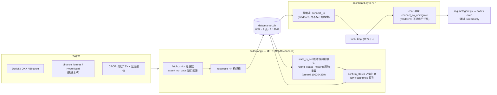

# VVV_Trade 系统日志 · 2026-08-02

> 本文是 2026-08-02 当日快照，基于 HEAD d9a2fb1（2026-08-02 22:33 +0900，工作树干净、与 origin/main 同步）与多路审计实测（除 6.5 申报的一处写副作用外全程只读）。
> 上一份快照是 `SYSTEM_LOG_20260731.md`，保留作历史。其中多处机制已被本文取代——**特别是 regime_audit_vN 全表清空迁移已换成版本谓词架构**（无删除动作，见第 8 节）。另注意：上一份日志头部免责声明写「已升 a6」，现行审计版本是 a7，快照的免责声明本身也滞后了一代。

---

## 0. 系统是什么

VVV_Trade 是一套市场状态（regime）判定系统：collector 每 5 分钟从 Deribit/OKX/Binance/Hyperliquid/CBOE 采集 10 个品种（3 加密 + 7 美股永续）× 3 周期（1h/4h/1d）的 K 线与衍生品数据，落入单一 SQLite 库（WAL），用显式规则树（无黑盒）在五状态（trend_up/trend_down/squeeze/high_vol_chop/range）间判定，每行入库 23 键审计快照 + 逐条规则命中清单，供本地面板（:8787）展示与 VVVhermes 助手（codex 后端）问答。所有阈值目前是先验值，回测校准是下一阶段的 P0——今天的全部工作是把「回测能信任的数据与判定基础设施」的主路径修到可回测的程度，不是校准本身；核心机制的测试覆盖与若干口径一致性问题仍在 6.1 清单里，不算「修到位」。

---

## 1. 自 07-31 快照以来的变化

时间线：8-01/8-02 两天的工作最终收敛为 6 个 commit，全部落在 2026-08-02 00:40~22:33 JST（`git rev-list --count HEAD` = 6）。git 是 8-02 才立起来的——上一份日志的缺口 #21「无版本控制」闭合了代码一半：数据（data/）仍被 .gitignore 排除在版本控制之外，且无备份策略（见 6.4）。8-01 的工作（时间对齐、usvol 权威分层）进入了 00:40 的 v1 初始提交 2987dd6（45 文件 7455 行）。

### 1.1 时间对齐批（8-01，入 2987dd6）

**动因**：已发生事故——1h→4h 重采样把残首桶经 upsert 定格永久留库，BTC/ETH/SOL 各坏 8 根、每天再坏 6 根（tests/test_resample_4h.py:6-10 留档）。同时 usvol 的时间格混乱、premium 未收线值入库。

**结果**：
- `_resample_4h` 桶纪律成文（regime/data.py:86-114）：UTC 整点 14400s 分桶，非末桶必须恰好 4 根（残首桶与中段残桶一律丢弃），末桶保留作形成中预览（进 live_bars 不进 ohlcv）；fetch_deribit 取数起点对齐 4h 边界作第二道独立保险（data.py:122-125）。
- 存量损坏用一次性脚本 `scripts/repair_time_alignment.py`（117 行，支持 --dry-run，用 connect_rw_nomigrate 摘掉迁移扳机）清掉——「代码修好也不自愈」的存量损坏单独成脚本，与迁移机制解耦。
- usvol 时间格统一为交易日 00:00 UTC（regime/usvol.py:26-28）。今日实测：usvol 25886 行 0 行偏离 00:00 UTC 时间格。
- premium 回填裁掉未收线末根（deriv.py:100-104 `pk[:-1]`，只裁这一个接口——OI 是当刻点采样、taker 本就是已收区间）——动因里提的「premium 未收线值入库」的方子就是它。
- DVOL 末行裁未收线（data.py:179 `iloc[:-1]`）——同一天内来回跳 4 次的坏点源。
- health age 口径修复：`age = now − (ts + TF)`，陈旧阈值同步由 2.5×TF 收紧到 1.5×TF（dashboard.py:165-172，判定边界不变已逐分钟扫描验证）——07-31 缺口 #26 就此闭环，本段是其「已修」留档。

### 1.2 usvol 权威分层（8-01，入 2987dd6）

**动因**：真实 bug——延迟报价 last-write-wins 盖回官方收盘价，错过收盘窗口该日永久停在盘中值，偏差实测 1.8 个 VIX 点（tests/test_usvol_authority.py:6-8 留档）。

**结果**（regime/usvol.py:26-28,53-65 + collector.py:77-138）：
- 权威单向分层：CSV 官方收盘价 > 延迟报价；报价只写 csv_max 水位之后的交易日。
- 水位单调不回退（CSV 尾部偶发缺失时报错、不降水位）。
- at/ok 双时间戳闸：at=上次尝试防刷、ok=上次成功控 24h 刷新；报价进入未确权交易日时 1h 重试下限触发补确权。
- CSV 与报价两次网络调用故障互不拖累；delayed_quotes 属 ToS 灰区，模块整体 30 分钟限频（collector.py:253）。
- 报价所属交易日用 last_trade_time 推断——周末/盘后不造假行。今日（周日）实测：5 指数 MAX(ts) 全部 = 2026-07-31（上一交易日），无造假行；确权水位 5 键一致 usvol_csv_max=1785456000000。
- test_usvol_authority.py 八确权场景（注入假 fetch 跑真 collector.sync_vol_index）护住全部语义。

### 1.3 修0-5 六批（bfd6a33 14:41 + afefbd2 14:47）

**修0-3（bfd6a33）**——四件结构性的事：
- **CI 上线**：.github/workflows/ci.yml，单 job pytest，Python 钉 3.9 与生产 CLT 一致。
- **面板只读连接**：曾实测面板每请求跑迁移时，审计代际一升版，一条 GET /api/dashboard 就能把 regime_history 清成 0 行（storage.py:62-64 注释留档）。拆成三连接：connect()（建表+迁移，collector 独占）/ connect_ro()（mode=ro）/ connect_rw_nomigrate()（chat 专用，不建库不迁移）。
- **版本谓词取代全表 DELETE**：旧「regime_audit_vN 键不存在就 DELETE 全表」有两个雷——超重算窗历史被永久截断、任何持迁移连接可清库。新方案 state_ts_set 只把 version+audit_version 双匹配的行算「已存在」，旧版本行判缺失→重算→upsert 原地覆盖，全程无 DELETE（storage.py:286-306,110-114）。
- **K 线修订失效重算** + **deriv 逐指标窗口**（详见 3.1）。

**修4-5（afefbd2）**：
- 新增 test_causality / test_confirm_states / test_resample_4h 共 264 行测试。
- **RULES_VERSION v1→v2**，唯一实质规则变更：direction 加权在 EMA200 缺席（<200 根）时权重重归一，取代 v1 的按 0 计入（structure.py:75-82）。动因：v1 在短历史品种上 |direction| 上限从 1.00 悄悄降到 0.90 却仍比同一个 0.30 阈值，系统性压低美股永续的趋势判定——受影响入库行 50.8%，549 行抽样翻转 2 行。THRESHOLDS 三件套 0.60/0.30/0.10 逐字未动（git show 亲验与 v1 初版相同）——**v2 只修判定公平性，不是校准**。
- SMA-ATR14 命名归实：docstring + README 显式声明非 Wilder，切换留给回测裁决。

### 1.4 外部审阅采纳：对抗校验 29 条收口（cbd0075 15:07）

对抗式校验发现的 29 条逐一收口，代表性三条：funding 结算窗判定下沉到 SQL 层分流（settled 显式命中 + NULL 旧行 8h 格 ±60s 过渡通道，storage.py:418-432）；upsert_ohlcv 对 NaN 整批拒收（否则 Inf 落库后 abs(a-b)==nan 恒 False，旧状态永不失效）；chat 写连接改 mode=rw 防静默建空库。

### 1.5 Codex 评审采纳：ultra r2/r3/r4 三十条（db6d167 18:48）+ r1 独立评审十七条（d9a2fb1 22:33）

**db6d167（30 条）**代表性采纳：codex 沙箱参数殿后强制 `-s read-only`；/api POST 全路径同源校验 + chat symbol 白名单（面板 /api 端点侧关死拼进 system 上下文的提示词注入——vvvhermes 同一注入向量未覆盖，见 6.1）；前端 load() 过期响应竞态（loadSeq）；cRSI NaN 语义四件套（np.where→np.maximum、参数边界 raise、NaN 入口 raise、divergence 补 confirmed_i 防 piv_len=5 根前视）；ECharts useUTC 全站统一。

**d9a2fb1（17 条，HEAD）**。该 commit 自述「抓到三条直接打脸前一批修复的」，三条全录：① `-s read-only` 放末尾挡不住 --dangerously-bypass-approvals-and-sandbox（独立开关）→ codex_args 过滤器；② CSS 写成 `.hmsg.unsent` 而实际类名是 `.msg`——发送失败的视觉告警从未生效（现 web/style.css:198 已是 `.msg.unsent`）；③ config_error 后端加了、前端不读——修复没落到界面（现 app.js:737-740 已消费）。②③与 6.1 的「标签双源未贯通」同属「修复没接线到消费端」一类教训。其余代表性采纳：assert_no_gaps 接入兜底源链（有洞就换源，不带病分类）；±Inf 拒收补全；历史中间补 K 线也触发状态失效；**AUDIT_VERSION a6→a7**（direction 重归一改了 dir 口径却没升审计版本，升版后自动重算，commit 记载当轮重算 5738 行）；src→src_round 改名（明确它是写行时本轮采集源、不是逐根 provenance）。high_vol_chop 标签也在这两轮里两次收敛到规则字面：「方向未证」→「趋势条件未齐」（实测 45.2% 该态行方向腿已通过、只是 ER 腿没过——标签不说规则没检验过的话）。

---

## 2. 系统总览

**三连接分工**（regime/storage.py:58-93）是部署语义的地基：`connect()`（建表+迁移+清理）全仓库仅 collector.py:310 一处调用；面板全部数据读路径 connect_ro（dashboard.py:463,507,528,567）；chat 两端点 connect_rw_nomigrate（585,600）。connect_ro/rw 在库尚未由 collector 建立时**报错而非静默建空库**——「先起 collector」的部署顺序语义由此成立。迁移/清库类重武器只有 collector 一个进程能触发，面板在数据库层面被拒绝一切写入。

**版本谓词**是今天最重要的机制变化，完整成文见第 8 节。

---

## 3. 已交付能力（按子系统）

### 3.1 数据采集与存储

- **三连接分工**：regime/storage.py:58-93（见上）。
- **_assert_grid 时间网格锚点校验**：storage.py:138-161。写入前校验 ts % 周期，批内多锚点或与存量锚点不一致一律拒写。动因：Deribit 1d 在 08:00 UTC 收线、OKX/Binance 在 00:00，主键 (symbol,tf,ts) 下两套锚点永不碰撞，换源一次就塞进约 300 根异格行且不可逆。
- **_invalidate_if_revised K 线修订失效**：storage.py:164-214。同窗旧行逐值对账（相对容差 1e-9），任一 OHLCV 变化、中间补根、旧行含 NULL/非有限值，即 DELETE 该 ts 起状态行，同轮重算补回；纯尾部追加豁免。配套 NaN/±Inf 整批拒收（storage.py:217-224）。
- **assert_no_gaps 缺口拒源 + 兜底链**：regime/data.py:65-84,301-338。已收盘序列有洞即换源（加密 deribit→okx→binance；美股永续 binance_futures→hyperliquid），已收盘不足 90 根同样拒源。
- **_resample_4h 桶纪律**：data.py:86-114（见 1.1）。
- **usvol 确权体系**：usvol.py:26-28,53-65 + collector.py:77-138（见 1.2）。
- **deriv kind 显式标记 + 逐指标窗口**：deriv.py:44,71,116 + storage.py:377-390,403-433。快照行 kind='pred'、结算史行 kind='settled'；get_deriv_col 按单列非空取窗（5 分钟快照不挤占 8h funding 史——按行整表 LIMIT 4000 时约 13.9 天就把 168 天 funding 史挤出窗口）；hourly_grid 双通道过滤（settled 显式 + NULL 旧行 8h 格 ±60s 过渡）。
- **funding 双独立闸**：collector.py:216-239 + deriv.py:121-136。interval 查询与 hist 补采各自独立 try、成功后才记 24h 时间戳；interval 失败返回 None 而非伪装 8.0（合闸时失败被静默当成功，真 4h 结算品种年化少算一半）。
- **instruments 热读注册表**：instruments.py:27-41 + instruments.json:5-11。每次调用重读，未登记/配置写坏回退加密默认源；7 个美股永续（class=us_stock_perp）。

### 3.2 特征层（regime/features/）

- **structure.py**：swing 分形（k=4 无未来函数）、EMA50 坡度 ATR 归一 + tanh 压缩、Donchian 位置、EMA200 条件参与；v2 权重重归一（structure.py:71-82）。
- **volatility.py**：SMA-ATR14（docstring 显式声明非 Wilder，volatility.py:25-34）、RV30 年化、BB 宽、vol_accel、downside_share；squeeze/high_vol 阈值 0.15/0.30/0.85 硬编码于此并镜像到 classify.py:76-78。
- **时段去季节化**：session_bucket 锚 ET 共 48 桶（UTC 分桶在 DST 切换时开盘小时桶因子错配近 3 倍、周末标志错归 5.08% 的 bar）；atr_rank_ds 影子字段，同桶 rolling(30,min8) + 全局 rolling(240,min48) 双 shift(1)，末值 NaN 返回 None 不塌值（volatility.py:49-88,117）。仅 us_stock_perp 且 1h/4h 计算（classify.py:293）。动因：美股永续 TR% 盘中/盘外 2.2-2.7 倍、周末塌陷 2-5 倍，raw atr_rank 在盘外主要识别「现在是夜里」。
- **crsi.py**：cyclic smoothed RSI 本地化，与 Pine 两处**有意偏离**成文（crsi.py:11-17）：带暖机等满 40 个有效值不出退化带、输入无 NaN 入口校验；时间语义声明（crsi.py:19-22）：回测/告警必须用 confirmed_i。完全在 classify 判定之外，仅面板与 Hermes 消费（grep 亲验）。
- **pathgeom.py**：chop_freq/dom_period/kendall_tau，WINDOW=120，影子期契约成文（pathgeom.py:19-21）：只入审计快照与面板，进规则须升 RULES_VERSION。
- **逐算子滞后明码表**：classify.py:26-36，slowest=pct_rank250 的 125 根，随每行快照入库（取代旧硬编码 15）。
- **分位口径警示**：er_rank/atr_rank/bbw_rank 由 utils.pct_rank 计算，是「最近**最多** 250 个有效值」的排位（features/utils.py:8-13——dropna().tail(250)，下限仅 2 个有效值，无任何样本量/跨度守门）。短史品种与各序列早期行的实际排位样本远小于 250：AAPL-1d 全序列仅 118 根（er30 暖机后 ≤88 个有效值即出分位）、SOXL 79 根，1d 美股永续整层如此。对比 deriv 侧分位有 ≥20 点且 ≥7 天的「宁缺毋滥」守门（dashboard.py:330-334）——判定核心的分位纪律反而比展示用分位更松；pct_rank 补守门列入 P1（见第 7 节）。

### 3.3 判定与版本（regime/classify.py）

- **五状态分层短路规则树**：classify.py:131-173。trending(er_rank>=0.60 AND |dir|>=0.30) > squeeze > high_vol > range；逐条规则命中/未满足清单随行入库。**state 选择**仅用 4 特征（er_rank、direction、squeeze、high_vol 布尔）；**confidence** 另消费 updown_tilt_20（vol_confirm 权重 0.20，classify.py:154-157）与 bbw_rank/atr_rank，tilt_confirm 同时进规则命中清单（classify.py:144-145）但从不改变 state——按影子契约（pathgeom.py：只入审计快照与面板）tilt 不算影子字段，「进判定」一词须按 state/confidence 分开读。
- **双版本常量与契约**：RULES_VERSION='v2'（classify.py:44）、AUDIT_VERSION='a7'（classify.py:53）；键集或任一字段口径变化必须升版（classify.py:46-53）。
- **audit dict 23 键**：classify.py:244-272。全库 5748 行 100% 覆盖 23 键（json_each 直方图亲验），回测无需重算特征。
- **_boundary_margin 可达翻转边界**：classify.py:81-112。按当前态只枚举能实际翻转输出的边界（分层短路树下裸取最小距离会给出假边界）；margin/nearest 只作影子字段。
- **confirm_states 非对称迟滞**：classify.py:176-211。chop 1 根立即、range 3 根、其余 2 根；raw/confirmed 双列使折叠可随时重放。
- **FEATURE_WINDOW=400 三处同窗**：classify.py:21 + collector.py:166 + dashboard.py:80,150。
- **混版哨兵**：collector.py:173-183。重算窗（10000+399）满时对窗外旧版本行计数并报 errors。

### 3.4 面板（dashboard.py + web/）

- **POST 同源校验**：dashboard.py:544-558（Origin 非同源 403，实测 evil.com 与 null 均拒）。
- **chat symbol 白名单**：dashboard.py:564-573（symbol 拼进 <panel> system 上下文，白名单关死注入；实测 'FOO)</panel>' → 400）。
- **8000 字如实拒绝（413）而非静默截断**：dashboard.py:582-584，与 agent 送模 [:8000] 对齐——避免库存全文而模型只看一半。
- **funding 预测/结算分字段**：dashboard.py:341-343,376-382。实测 AAPL 正是注释里的病例：pred=0.0 而 settled=0.01451%、分位 0.905，DOM 两格分开渲染无混淆。
- **deriv 逐指标独立 spans**：dashboard.py:313-334（实测 BTC oi 23.1 天 / funding 168.3 天——长短列互不背书）。
- **前端竞态防护**：load() loadSeq（app.js:85-103）、hermesSync 序号防回滚（app.js:695-712）、12 个渲染函数逐个 try/catch（app.js:127-132）、esc() XSS 转义（app.js:29-32 等 8 处）、静态文件 basename 化 + 白名单（dashboard.py:535-537，路径遍历实测 404）。

### 3.5 助手层（regime/agent.py 428 行 + vvvhermes.py 95 行）

- **codex 危险参数黑名单 + 末尾强制 `-s read-only`**：agent.py:265-288,326-334。黑名单式过滤（--dangerously-bypass-approvals-and-sandbox/-s/-C 等）**覆盖不全，已知绕过见 6.1**（--add-dir、-c 任意配置键均放行）；认证不经手 token（订阅走 ~/.codex/auth.json）。
- **openai 分支 key 变量名前缀检查**：agent.py:391-400。api_key_env 以 ANTHROPIC 开头直接 RuntimeError，防止只切 provider 就把 Anthropic 密钥 Bearer 给任意 base_url——是变量名形状检查而非值校验，**已知穿透见 6.1**（MY_ANTHROPIC_KEY、空 key）。
- **历史裁剪掐头**：agent.py:222-232。[-20:] 后弹掉开头孤立 assistant、断言末条必须是 user。
- **render_context 五处口径修正**：conf 标注「原始判定 conf——确认态无独立置信度」（agent.py:141）；休市分支带波动塌陷警告（119-129）；funding 预测/结算分列且分位只挂结算（195-204）；iv30 无分位时输出「历史短勿看分位」（172-188）；None 防护若干。实跑 BTC/AAPL 全部生效。
- **单问失败非零退出**：vvvhermes.py:26-44,64-68，失败不落库（chat 表行数亲验不变）。

### 3.6 工程面

- **CI**：.github/workflows/ci.yml:1-19，pytest 单 job，Python 钉 3.9；6 个测试全离线（合成数据+内存库+注入假源），无需 secret。
- **tests/ 六文件 715 行**：每个 docstring 写明守的是哪个真实事故——测试即事故档案（详见 5.3）。
- **requirements.txt 6 行**：pandas/numpy/requests 宽松下界 + urllib3<2（LibreSSL）+ anthropic + pytest，每个非平凡约束带单行理由。
- **launchd plist**：--once + StartInterval 300 单轮崩溃自愈设计——**未部署**（launchctl 无、LaunchAgents 无、日志文件不存在），README:133-135 如实标「可选」。

### 3.7 CLI 旁路（main.py + regime/report.py + scripts/）

此前盘点缺席的子系统，实测仍全部在树内：

- **main.py `--demo` 三级排查阶梯**：面板→直连交易所→合成数据（main.py:8,44,59-68）。demo_ohlcv 固定 seed=7，输出可逐字复现——全源断网时唯一还能验证计算侧的通道。
- **regime/report.py（123 行）终端报表**：与面板信息严重不对等——至今不含 warmup/raw_state/margin/pathgeom/atr_ds 任何一项（07-31 缺口 #18，未修，结转见 6.2）。
- **scripts/probe_stock_perps.py**：品种上新/下架对账工具，实测结算间隔，输出决定 instruments.json 写什么。不进主流程。

---

## 4. 关键设计决策

| 选了什么 | 否了什么 | 为什么 |
|---|---|---|
| 版本谓词判缺失 + upsert 原地覆盖 | 代际键 + 全表 DELETE | 无删除动作：超窗历史不截断、迁移扳机失去杀伤力 |
| K 线修订→删状态行本轮重算 | bar_hash 记录污染 | 让污染无法存在，不是让污染可追溯 |
| 宁缺毋假，全仓一致 | 静默兜底 | 残桶丢弃、缺口拒源、NaN/Inf 拒收、双网格拒写、premium/DVOL 未收线末根裁弃、interval 失败返回 None 不写默认 8.0 |
| funding 结算行写入时显式 kind 标记 | 事后时间戳推断 | 墙钟快照撞进整点 ±60s 窗口（实测 523 网格样本混入 18 个） |
| usvol 权威单向：CSV > 报价、水位只升不降 | last-write-wins | 延迟报价盖回官方收盘价的实测 1.8 VIX 点偏差 |
| 迁移权集中 collector 单进程 | 面板可迁移 | 一条 GET 曾能清空 regime_history |
| 缺席子分权重重归一（v2） | 按 0 计入 | 短历史品种被系统性压低趋势判定（50.8% 行受影响） |
| ATR 保留 SMA 变体 + docstring 承认非 Wilder | 悄悄换 Wilder | 名字必须诚实；切换属 RULES_VERSION 升版级变更，留给回测裁决 |
| 时段分桶锚 ET | 锚 UTC | DST 切换时 UTC 分桶开盘小时错配近 3 倍、周末错归 5.08% |
| 样本不足返回 None | 塌成退化值 | atr_rank_ds/pathgeom/cRSI 带暖机全仓一致（唯一例外 pct_rank 的 0.5 兜底，见 6.1） |
| cRSI 双时间口径分离（i / confirmed_i） | 单口径 | 防 piv_len=5 根前视进回测 |
| 影子字段 try/except 隔离 + 进规则必升版 | 直接进判定 | 影子期契约成文（pathgeom.py:19-21），影子字段绝不拖垮主判定 |
| 标签只说规则字面成立的陈述 | 解释性标签 | high_vol_chop 两次改标签，45.2% 该态行「方向」其实已过 |
| 消息超限 413 如实拒绝 | 静默截断 | 避免「库里存全文、模型只看一半还装作看完了」 |
| 抽样重算走 collector 完全同路径 | 另写简化重算 | 检验的必须是入库主路径本身 |

---

## 5. 实证盘点

全程只读（sqlite3 `file:...?mode=ro`、curl、ps、git log/gh、pytest 实跑），一处审计副作用除外（见 6.5）。

### 5.1 数据库实况（data/market.db，7.13MB + wal 197KB，quick_check=ok，WAL）

| 表 | 行数 | 要点 |
|---|---|---|
| ohlcv | 8329 | 29 个非空 (symbol,tf) 序列 LAG 差分**零缺口、零双网格**；加密 1d 锚全 08:00 UTC（Deribit）、美股永续 1d 锚全 00:00，每序列单源；source: binance_futures 5392 / deribit 2937 |
| regime_history | 5748 | **100% (v2, a7)，零混版**；23 键快照全覆盖；跨度 2025-12-29 08:00 → 2026-08-02 13:00 UTC；SOXL 1d 缺层（见 6.1） |
| deriv | 13451 | kind: NULL 快照 8682 / settled 4129 / pred 640；NULL 行仅 44 行落 8h±60s 格（24 行为补采窗起点 2026-02-17 之前的真结算 + 20 行为 8-01 kind 列上线前的墙钟快照污染，污染占网格样本约 0.5%——该 24+20 拆分按 ts 位置**推断**，未逐行验证） |
| usvol | 25886 | VIX 9241（1990-01-02 起）/ VXN 4248 / VIX3M 4242 / RVX 4239 / VIX9D 3916；0 行偏离 00:00 UTC；MAX(ts) 全 = 2026-07-31，与 meta 水位 5 键完全一致 |
| dvol | 734 | BTC/ETH 各 367 行至 2026-08-01 |
| live_bars | 29 | 29 个 symbol×tf 各一根形成中 K 线 |
| iv30（deriv 内） | 7×59 | 起点 2026-07-31 16:28 UTC——**历史极短，分位不可用**，Hermes 文案已声明 |
| chat | 24（审计中→26） | 面板与终端共享单流，无 symbol 维度 |
| meta | 75 键 | backfill 闸 20 / funding 水位 30 / usvol 15+3 / 代际遗留 5（已死键未清理）/ status+last_run 2 |

### 5.2 判定层分布与可复现性

| 状态 | 确认态 state | 原始 raw_state |
|---|---|---|
| range | 2670 | 2997 |
| trend_down | 970 | 935 |
| high_vol_chop | 967 | 755 |
| squeeze | 677 | 620 |
| trend_up | 464 | 441 |

- state≠raw_state 共 708/5748 行（12.3%）——迟滞折叠实际生效；confidence min 0.29 / avg 0.7422 / max 1.0，全非空。
- **抽样重算零差异**：走 collector 完全同路径（同 limit、同 session_aware 路由），BTC-1h/ETH-4h/TSLA-1h/SOL-1d 各尾部 30 行共 120 行，raw_state/confidence/rules/22 个非 src_round 特征键/双版本全部一致（TOTAL_MISMATCH 0）。
- min_bars=90 精确成立：每组 regime 行数 = ohlcv 行数 − 89，29 组全对（BTC-1h 358→269、AAPL-1d 118→29、TSLA-1d 186→97）。注意 min_bars=90 只保证有 90 根 K 线，**不保证分位满窗**：er_rank/atr_rank/bbw_rank 是「最多 250 个有效值」的排位（见 3.2 分位口径警示），1d 美股与各序列早期行的实际排位样本远小于 250。
- m_near 六值分布与规则树逐态精确自洽（exit_trend 1376 = raw trend 935+441；squeeze 620=536+84；chop 755=660+95；range 2997=950+920+1127）；margin∈[0,0.592] 零 NULL。
- 影子字段覆盖如实：margin 5748/5748；pathgeom freq 865 行 NULL（窗口<120 根的早期行，AAPL/QQQ/SPY 1d 0/29）；atr_rank_ds 全库 1449/5748，只出现在美股永续 1h（各 35/258）与 4h（各 172/222）。**加密与 1d 恒 0** 与 session_aware 布线一致，是设计不是缺陷；但**美股 1h 仅 13.6% 的覆盖是深度不足，不是设计**——周末桶 min_periods 叠加 shift(1) 需约 750 根 1h（约 31 天）才全桶出值，当前仅存约 258 根（07-31 缺口 #8 的结论，解药是旧路线图 P1-1 分页拉取更长历史，见第 7 节对账）。
- 存疑数字已核伪：volatility.py:30 docstring 称 SMA vs Wilder「1h 末根差 39%~57%」，当前 BTC 1h 358 根实测末根 9.9%、中位 9.3%、P90 24.0%——定性结论（差异实质存在、迁移须换算）成立，具体数字是过期快照（见 6.1）。
- 面板↔库同源：curl BTC-1h 面板现算 state/conf/margin/nearest 与库内末行逐值相同；三品种 payload 全部序列长度 == candles N、索引零越界（misaligned: none × 9）。

### 5.3 测试图谱（tests/ 六文件 715 行，多轮实跑全绿 6 passed，25.4~33.5s）

| 文件 | 行数 | 组数 | 守什么（事故/承诺档案） | 突变体验证记录 |
|---|---|---|---|---|
| test_causality.py | 122 | 4 | walk-forward 因果：前缀 vs 完整两条真实路径逐字段比较；增量=全量口径 | 有（:18-19，切片 i→i+1 必红） |
| test_confirm_states.py | 81 | 8 | 迟滞状态机全分支（确认/恢复/抖动重置/回本态清零） | 无 |
| test_resample_4h.py | 95 | 6 | 4h 残桶事故档案 + assert_no_gaps 拒带洞序列 | 有（d9a2fb1 提交信息：⑥ 突变体必红） |
| test_session_ds.py | 166 | 7 | ET 分桶 DST 钉死 + UTC/ET 错配对照 + 宁缺毋滥 | 无 |
| test_usvol_authority.py | 125 | 8 | VIX 被盖回事故档案，注入假 fetch 跑真 collector | 无 |
| test_pathgeom.py | 126 | 7 | 频率轴/τ/None 语义 + margin 分层边界 | 有（:36-39，留档旧断言曾让突变体存活） |

诚实边界：突变体验证是 3 处**文档声明**而非可复跑工具链（无 mutmut 类工具入依赖）；test_causality 自声明测不出特征内部 shift 方向错（两条路径同错就比不出）。**零覆盖清单**见 6.1。

### 5.4 运行时

| 项 | 实测 |
|---|---|
| 进程 | collector.py PID 4396（22:31:08 JST 起）+ dashboard.py PID 4441（--port 8787）——手动后台进程，CLT 系统 Python 3.9.6（非 .venv，小版本恰好一致） |
| collector.log | 17422 行，453 完成轮（今日 250）；耗时 <10s 363 / 10-20s 80 / 20-60s 9 / ≥60s 1，近 50 轮 avg 10.5s；status cycle_sec 7.8s |
| 错误全谱 | SOXL 1d 不足 90 根 ×367 + 瞬时 DNS/代理失败约 30 条，**无其他异常类型** |
| 面板 | curl / → 200（0.75ms）；/api/dashboard BTC 1d health: warmup=false stale=false bars=305；/api/symbols 10 符号；/api/agent/info provider=codex model=gpt-5.6-sol；live 预览 age 211s；无 /api/status 端点（探测 404，从未存在） |
| 安全实测 | Origin evil/null → 403；注入 symbol → 400；8001 字 → 413；600KB → 413；路径遍历两种编码 → 404；旧 messages 直传分支确认已删（→400） |
| CI | gh run list 仅 2 次且全绿（cbd0075 2m20s、d9a2fb1 2m6s）；合并 push 的中间 commit 无独立信号 |
| git | 6 commits 全在 08-02；main 与 origin/main 同步；工作树干净 |

### 5.5 代码规模与环境

| 模块 | 行数 |
|---|---|
| collector.py | 337 |
| dashboard.py | 650 |
| regime/（核心） | 1997 |
| regime/features/ | 576 |
| tests/ | 715 |
| **py 合计** | **4645** |
| web/ | 1124 |

环境：Python 3.9.6（macOS CLT，LibreSSL→urllib3<2 钉住）；venv: pandas 2.3.3 / numpy 2.0.2 / requests 2.32.5 / pytest 8.4.2。

---

## 6. 已知缺口与风险

### 6.1 现行缺陷（本次审计确认，可修）

- **SOXL-USDT 1d 整层无数据**：min-90 闸（data.py:329-331）拒掉仅 79 根的 SOXL，与该行注释「上市较新也放行靠 warmup 提示」的意图矛盾。每天 +1 根约 11 天自愈，期间每轮 1 条 WARNING（累计 367 次）、1d 层状态完全缺失。
- **_safe_codex_args 是黑名单不是白名单**（agent.py:265-288）。docstring 本身（:275）是黑名单式表述（「拒绝任何能突破只读沙箱或改变工作目录的参数」）；自称「白名单」的是 agent.py:332 的行内注释与 d9a2fb1 提交信息（「改为 codex_args 白名单，实测四种绕过形式全拒」）——与代码事实不符。覆盖面：黑名单 6 个条目中仅 3 项是 codex exec 实际存在的选项（-s/--sandbox、--dangerously-bypass-approvals-and-sandbox、-C/--cd），另 3 项（--full-auto、--yolo、-a/--ask-for-approval）在本机 `codex exec --help` 里根本不存在；24 个 exec 选项里其余 21 个全部放行。实测放行且解析成功：--dangerously-bypass-hook-trust、--add-dir、**-c 任意配置键**（能改 model_providers.*.base_url，把注入了完整面板数据的 prompt 发到任意端点——最该先堵）。两个穿透形式（粘连短参 -sdanger…、--sandbox-mode）靠外部 CLI 的重复参数/游离参数检查兜住（实测均 exit=2，fail-closed）——但防线落在 codex CLI 的解析行为上而不是自己的过滤器上，CLI 换版本允许重复 -s 覆盖，洞就实变。`-c sandbox_mode` 是否被末尾 `-s read-only` 压过**未验证**（验证需真跑写操作，超出只读授权）——本次审计没落实的关键结论之一（另一处推断性结论：5.1 中 deriv 44 行 NULL-kind 的 24+20 拆分按 ts 推断，未逐行验证）。
- **timeout_sec 只被 codex/openai 消费**：anthropic 硬编码 120.0（agent.py:371）、ollama 硬编码 300（agent.py:425）。现网 provider=codex 无即时影响，切换后会被静默截短。
- **openai fail-closed 是变量名前缀形状**：api_key_env="MY_ANTHROPIC_KEY" 实测穿透，把 sk-ant- 密钥送到 openrouter；key 为空时照发空 Bearer。值形状校验（sk-ant- 前缀 + base_url 域名）严格更强。
- **render_context 数值位无 None 防护且在 chat() 的 try 之外**（agent.py:141,148,154 vs 218/235）：实测 confidence=None 抛 TypeError，穿透成面板 500 / CLI traceback。
- ~~**vvvhermes.py 缺面板已有的闸**~~ → **审计后当场修复**（vvvhermes.py:26-39,54,64-65,81-89）：补 `_check_symbol()` 白名单（单问模式 SystemExit 退出码 1、REPL 提示后继续）与 8000 字上限，与面板 /api/agent/chat 同一边界。实测注入串 0.2s 被拒、**不再调用模型**、退出码 1；6.5 那两行误写已删（chat 24 行，max id=28）。
- **XSS 转义遗漏一处**：web/app.js:597-598 raw_state fallback 未过 esc() 进 innerHTML（同文件 :180 已 esc，口径不一）。
- **标签双源未贯通**：后端 states_map 的 v2 新标签前端完全未消费，UI 显示 app.js:5-11 的旧短标签；Hermes 用新标签——两个消费者口径不一。且 render_context 全未使用 STATES 映射，中文标签与英文码（squeeze vs 低波动挤压）并排让模型自己猜。
- **squeeze/high_vol 阈值双处硬编码镜像**（volatility.py:129-130 / classify.py:76-78）靠注释约定人工同步，无断言防漂移；_OPERATOR_LAG 是声明值非计算值，改窗长忘改字典则 lag 字段说谎。
- **main.py:64 CLI 路径不截 FEATURE_WINDOW**：现靠 fetch limit=300<400 偶然保护，调大 limit 即与库内口径分叉（面板已修，CLI 漏网）。
- **utils.pct_rank <2 有效值返回 0.5 中性兜底**，与全仓「未知不得塌成中性」纪律矛盾（生产因 min_bars=90 几乎不可达）。
- **deriv NULL-kind 过渡通道注释与事实不符**（storage.py:419-421）：44 行是永久居民不是「过渡」——24 行真结算永远拿不到 settled 标记（早于补采窗起点）、20 行墙钟污染 ts 不同永不被覆盖。一次性清理或改注释。
- **/api/agent/history limit 非数字返回 500**（应 400，dashboard.py:527）；**/api/symbols 无 try/finally 连接泄漏面**（dashboard.py:507-509）；**同源校验可被 DNS rebinding 绕过**（本机绑定下现实风险低，可加 Host 白名单）；hermesClear 不递增 syncSeq 的 <1s 显示层竞态。
- **turn 并发无保护**：面板与 CLI 都是「读历史→调模型（codex 可达 600s）→写两行」，并发交错成 U,U,A,A；裁剪不合并连续同角色（实测 [U1,U2] 原样送模）。
- **测试零覆盖清单**（全绿≠全覆盖）：storage.py 505 行核心机制（_assert_grid/_invalidate_if_revised/state_ts_set 谓词/get_deriv_col SQL 过滤——恰是本次大改主角）零直接测试；agent.py 428 行零测试（codex 参数过滤、掐头、fail-closed 都是纯函数极易测，现全靠人肉复验）；deriv.py/instruments.py/crsi.py/dashboard HTTP 端点/web 前端/vvvhermes/main.py 全零。
- ~~**README 三处过时 + docstring 过期数字**~~ → **审计后当场修复**：README:22 a6→a7、:121 改「浅色主题」、ci.yml:18 改「六个测试」；volatility.py:29-30 的 39%~57% 换成本次实测（BTC 1h 358 根：末根 9.9% / 中位 9.3% / P90 24.0%）并注明旧值是特定时点极值。

### 6.2 结转未修项（07-31 快照即存在，未根治）

- ~~**confidence 与确认态错配**~~ → **2026-08-03 按方案 1 修复（纯前端归属修正）**：confidence 是 raw_state 的置信度，迟滞折叠后的确认态没有自己的置信度。agent 侧此前已口径标注（agent.py:141）；本次把面板侧也改齐——分歧时卡片头部不再显示 conf、conf 数字挂到酝酿/原始判定行、置信度条改用原始态颜色（app.js），特征表表头改「conf(原始)」。翻转表经核不必改：确认切换那根 bar 上 raw 恒等于新确认态（confirm_states 仅在 raw==pending 达标时切换），conf 归属本来就对。实测 ETH 1d 分歧活案例（trend_up/raw=squeeze/0.93）与无分歧案例渲染均正确。**给确认态定义独立置信度**属新指标设计，仍归回测校准裁决，不在本修范围。
- **1d 日界跨源未根治**：加密 1d 锚 Deribit 08:00 UTC、美股永续锚 00:00。_assert_grid 保证了「永不混格」，但代价是加密 1d **实际上不可换源**——Deribit 若失效，兜底链会被网格校验拦死，只能整层重建。
- **chat 无 symbol 维度**（storage.py:40-43 仅 id/ts/role/content）：终端 /symbol 切换、面板切品种在历史里不留痕，模型可能看到「BTC 的历史问答 + AAPL 的面板」的拼接且无从察觉。
- **NYSE 假日历缺失**：market_open 判定无真实假日历，盘中分支只有节假日免责文案（agent.py:119-129）——文案兜底不是数据兜底。
- **阈值全部是先验值**：0.60/0.30/0.10 与 0.15/0.30/0.85 自 v1 初版逐字未动（classify.py:43 自认「待回测校准」），迟滞确认根数 1/2/3 同样是先验。
- ~~**数据健康标志不入库（07-31 缺口 #17）**~~ → **2026-08-03 a8 修复**：audit dict 增加 `win`（计算窗实际根数）与 `warmup`（可用历史 < 280）两键，AUDIT_VERSION a7→a8，版本谓词自动全量重算 5954 行（100% (v2,a8) 零混版；warmup 严格前缀、每条完整序列恰 190 行 = 280−90，逐根验证）。实测 **77.7% 的行处于 warmup 期**——回测按质量分层自此可行。stale 不入库：它是服务时刻属性，历史行收线即定，无此语义。
- **CLI 与面板信息不对等（07-31 缺口 #18，未修）**：report.py 至今不含 warmup/raw_state/margin/pathgeom/atr_ds 任何一项；main.py 不传 session_aware，CLI 永远拿不到 atr_rank_ds（另见 6.1 的 FEATURE_WINDOW 分叉）。

### 6.3 远期哨兵（当前无实害，条件成熟即实变）

- **10k 窗口混版**：get_states（storage.py:336-345）无版本谓词——重算窗（10399 根）满后窗外滞留的旧版本行会静默混进 confirm 折叠与面板。现最大历史仅 358 根且全库单代，靠 collector.py:173-183 哨兵报数 + 人工处置。这是升版机制**唯一未闭合的边**。
- **deriv 窗口稳态**：oi/premium/taker 逐指标 limit=20000（5 分钟一行，折算约 69 天触顶）、funding 结算 limit=1100（8h 格折算约一年）。现 spans 最长 168 天，触顶后进入滚动稳态——届时任何「全历史」口径的消费方需自知。
- **codex CLI 会话留存**：~/.codex/sessions 现有 121 个 rollout jsonl（0644），实测最新一个内含完整 system 提示词 + 面板数据 + 内联对话史逐字落盘——全在本项目 /clear 语义之外。另 prompt 走 argv 传递（agent.py:334，无 -- 分隔符），同用户任何进程 ps -ww 可读整段面板上下文；改 stdin 可一并解决。
- **iv30 事实暖机态，且断了就永久缺、坏了就归零**：每美股符号仅 59 个点（07-31 起），任何用 iv30 分位的规则短期内不可信；加密侧无 iv30（用 DVOL），跨资产口径不一。「历史短」只是症状，结构性质是（07-31 缺口 #24/#4 残留）：deriv 每轮快照、iv30、live_bars 都是**点位采样**——iv30 仍以 time.time() 快照写入（collector.py:266-269），无任何回补路径，采集中断多久序列就留多长的**永久空洞**；iv30 无历史源，**重建库即归零**（bfd6a33 只给 funding 结算史加了每日补拉，oi/taker/premium/iv30 都没有）。07-31 附录未做项（deriv 同行三字段指向三个不同时刻、加 available_at 列）一并结转，仍未做。

### 6.4 环境与运维陷阱

- **采集不自愈**：launchd plist 在仓库但未部署，实际靠手动后台进程——机器重启后采集与面板均死。两套启动方式共存需留意别双开（log 首行的 once=True 是 7-31 旧启动残留）。宕机的代价不只是「停摆」：点位采样序列（deriv 快照/iv30/live_bars）在宕机期间的空洞永久留存，见 6.3。
- **status 滚动错误窗掩盖历史故障（07-31 缺口 #7，未修）**：collector.py:325 仍是 `"errors": errors[-10:]`，无累计故障计数器——07-31 已实际掩盖过一次 14 条错误的全源 DNS 中断；本文 5.4 的「错误全谱」正是**绕过 status 读全量日志**才拿到的，恰好复演了这个缺陷。修法（warmup 与真实故障分级 + 不滚动的累计故障计数器）07-31 已给出，一条没做。
- **数据不入 git 且无备份策略（07-31 缺口 #21 的另一半 + #12 + 规矩四，未结转过，此处补上）**：.gitignore 实查确含 data/——「代码有 diff、数据没有」，5748 行审计史只有 market.db 这一份文件。版本谓词消灭了全表 purge，但 _invalidate_if_revised 仍会 DELETE 状态行（见 3.1）。备份须先 `PRAGMA wal_checkpoint(TRUNCATE)`（当前 wal 197KB），否则丢 WAL 未回写内容。备份决断项已排进 P2。
- **~/.zshrc:5-7 两个 alias（VVVhermes/vvvhermes）是项目树外改动**（07-31 已记，未变）：迁移/卸载须手工回滚，clone 到别的机器上终端入口会「莫名其妙不存在」。
- **collector.log 无轮转**（07-31 缺口 #22 残留）：已 17422 行（5.4 引用的正是它）且无上限增长。
- **解释器分叉隐患**：进程跑在 CLT 系统 Python 3.9.6 而非 .venv（ps 实测），当前小版本恰好一致，系统升级时会与 requirements 锁定的 .venv 静默分叉。
- **_SCHEMA 与 _migrate 分裂**：regime_history 的 5 个列只在 _migrate 的 ALTER 里（storage.py:100-102），绕过 connect() 直接 executescript(_SCHEMA) 会建出缺列表——已实测踩中的开发者陷阱。
- **共享 scratchpad 根目录的 pandas.py**（8-01 遗留，不在仓库内）会 shadow 真 pandas，本次两路审计均实测中招——在该目录跑 Python 换子目录。
- meta 5 个已死代际键与新旧两代 backfill 闸并存，无害但拉长清点。

### 6.5 审计副作用申报

助手层审计执行 `vvvhermes.py -s NOPE-USDT "test"` 验证退出码时，因 vvvhermes 无 symbol 白名单，该命令未如预期本地失败，而是真实调用了 codex 并写入 chat 表两行（id=29 user / id=30 assistant，行数 24→26）。除此之外全程零写入，git 工作树干净。

**后续处置**：该事故直接暴露了 6.1 的「CLI 缺白名单」——同一个提示词注入向量，面板端点早已关死而 CLI 一直敞着。审计结束后已补上闸门并删除这两行（现 chat 24 行、max id=28）。**这是本次审计最有价值的产出之一：不是读出来的，是踩出来的。**

---

## 7. 路线图（与 README 对账）

> **2026-08-03 P0 落地更新**：回测框架首版完工（regime/backtest.py + scripts/run_backtest_p0.py，评估协议 p3）。要点：严格未来窗 CRPS 技能 vs 无条件基线、目标在完整 K 线网格上算再映射状态尾段（版本空洞一律报错）、锁箱按**收线时刻**前向累积（≥2026-09-01，开箱一次性）、环块 bootstrap CI、环移 surrogate 带**明确降级为描述性参照**（状态回看窗 ~250 根 vs 序列 ~300 根，环移后状态见过未来，构不成干净零假设）、结论门槛按被评估记录覆盖的 episode 数、trial ledger（data/backtest_ledger.sqlite3，id=参数+数据清单+代码摘要哈希，同 id 异结果报错）。经两路 codex 对抗评审（统计/工程共 24 条）修正后二轮重跑；首轮实验 `daf9232f3a98`（docs/BACKTEST_P0_20260803_daf9232f3a98.md）：**没有任何格子达到正向信息的观察门槛**；三个探索性观察（BTC/ETH/SOL 1h H24 条件化劣于无条件且低于 surrogate 带——1h 状态对 24h 视界疑似误导性条件器）留待数据增长复验。**阈值校准仍未开始**——下方"等待回测裁决的具体清单"全部有效；验收目标框架段落中的「条件分布」表述已被预研 §3 + p3 协议修订（严格未来窗 proper score，防自证），该段保留作历史记录。
> 评审遗留未修项（新增缺口）：collector 的确认折叠（get_states→confirm_states）读**全版本**状态序列——长历史升版时新版本开头几行的确认态会继承旧版本末态；当前全库单版本零实害，升版跨代时须先全量重算或按版本隔离折叠。
>
> **2026-08-03 深夜追加：历史回填 + 复跑反转**。scripts/backfill_history.py 沿各序列当前源回填 4.4 万根（加密 1d 至 2022-06、1h 至 5000 根、美股至上市日；`_invalidate_if_revised` 把前插判为结构性修订→自动全量重算，架构零手工迁移）。库 8,535→52,393 根 K 线、5,954→49,812 行状态，**warmup 占比 77.7%→9.3%**，零缺口零混版。复跑 P0（`407071b9336a`）：**上一轮三个"1h 状态误导 24h 风险"的探索性观察在 20 倍数据下全部消失**（BTC −0.399→−0.011 等）——薄数据伪象，"非结论"纪律避免了一次错误结论入档。新图景：技能普遍微小（±0.05），美股永续 1h（MU/QQQ/SPY）出现小幅正技能且高于 surrogate 带（数百 episode），需注意可能部分来自时段可预测性而非状态信息。梯队一 E1-E4 首轮（`c87c12901219`）：E1 估计器分歧超过"无意义"闸门（RMA vs SMA squeeze 门翻转 8-12%）；E2 挤压后波幅扩张 1h 随门槛收紧增强（bbw<0.05 → 1.21-1.24×）、4h 全网格 1.3-1.4×、**1d 无扩张优势**、方向 4h/1d ≈0.5 与文献一致；E3 中位数去季节化因子 7/7 全胜现行均值因子；E4 跟踪代理对 N 无分辨力、churn 差 2.5 倍——确认根数的裁决轴是换手成本。每周一 09:00 本地时间的自动复跑已挂（scripts/weekly_rerun.sh + 调度任务，幂等账本）。

**P0：回测框架。** 这一条要说透：今天全天的工作没有校准任何一个阈值——v2 修的是判定公平性（缺席子分不再按 0 计入），不是阈值正确性。现在处于「基础设施主路径完工（核心机制的测试覆盖缺口见 6.1）、裁决未开始」的状态，而基础设施的每一件都是为回测服务的：

- 每行 23 键审计快照 + 逐条规则清单 → 回测无需重算特征；
- raw/confirmed 双列 → 迟滞折叠可离线重放，确认根数（1/2/3）本身可作为回测变量；
- 双版本谓词 → 回测结果可按 (RULES_VERSION, AUDIT_VERSION) 分桶，永不混代；
- walk-forward 因果测试 + 逐算子滞后明码表（slowest=125 根） → 回测不会拿未来函数骗自己；
- 数据层「宁缺毋假」全套 → 回测输入无残桶、无缺口、无混格、无修订残留。

等待回测裁决的具体清单：THRESHOLDS 三件套（0.60/0.30/0.10——其中 0.10 tilt_confirm 只作用于置信度与规则清单、不改变 state，与前两个 state 门槛不是同级，见 3.3）、squeeze/high_vol 边界（0.15/0.30/0.85）、迟滞确认根数、SMA-ATR vs Wilder 切换（升 RULES_VERSION 级）、影子字段（pathgeom 三项 / atr_rank_ds / margin）是否入规则（每项入规则均须升版）。**回测不开工，这些全部悬空。**

**验收目标框架（07-31 缺口 #0 / P0-1 的既定结论，结转不重议）**：主目标是**状态→风控背景的条件分布**——各状态下的条件波动率、最大回撤分布、状态持续时长分布、状态间转移概率，这些量对仓位/风控路由直接可用且不依赖方向性假设；另设一个**廉价的方向性对照实验**（各状态下一根收益的费后分布），把 regime-spectrum「方向性收益费后不成立」当**待检验的先验**而非结论。两条约束一并结转：**1d 美股样本量不足以校准阈值**（07-31 缺口 #9；本文 5.1 恰好显示 AAPL-1d regime 仅 29 行，问题仍在），1d 阈值应先用加密样本校准；**审计快照缺健康位/win 字段**（缺口 #17，见 6.2）——补键属 AUDIT_VERSION 升版级变更，回测按数据质量分层依赖它，宜在回测开工前一并升版。

**P1（安全与可信度，多为纯函数级工作量）**：_safe_codex_args 改真白名单 + prompt 走 stdin；openai fail-closed 加值形状校验；render_context None 防护并纳入 try；vvvhermes 补 symbol 白名单与 8000 字闸；agent.py / storage.py 核心机制补测试（三个安全关键函数都是纯函数，极易测）；pct_rank 补样本量守门（或至少把当行排位样本数记入审计快照——属 AUDIT_VERSION 升版级，见 3.2 分位口径警示）。

**P2（对账与清理）**：README 三处过时修正（a6→a7、主题矛盾、ci.yml 注释）；标签双源统一（前端消费 states_map）；44 行 NULL-kind 永久居民清理或改注释；app.js:597 补 esc；history limit 400；launchd 部署与否做决断（要么 load 要么从仓库移除，现状两头不占）；SOXL 1d 约 11 天自愈后确认 warmup 语义；数据备份决断（data/ 不入 git + 无备份策略 + wal_checkpoint 前置，见 6.4）；scripts/validate_palette.js 找回或把校验结论作为常量注释钉进 web/style.css（07-31 缺口 #25 结转：五态配色「过 dataviz 六项校验」现不可复现，且原校验在深色模式做而面板已浅色）；data.py:298 死常量 DEFAULT_SOURCES 删除（全仓无引用，一行即可）。

**旧路线图对账（07-31 待办 7 条）**：P0-1（回测框架）与 P0-2（阈值校准）由上文 P0 承接；其余 5 条本文此前未提及，逐项**结转**、无一废弃——
- **P1-1 分页拉取更长历史 + parquet 缓存**：结转。它是 atr_ds 1h 覆盖被周末桶锁死的解药，真实深度目标 ≥ 约 750 根 1h ≈ 31 天（07-31 缺口 #8，见 5.2）。
- **P1-2 持仓/杠杆特征进状态机**：结转，依赖 P0 回测验证增量。
- **P2-1 死盘外生日历剔除 + EMA 种子 k≥1.5n**：结转（RULES_VERSION 升版级）。
- **P2-2 面板简洁模式**：结转（纯体验项）。
- **P3-1 规则分类 vs HMM 对照**：结转（依赖 P0-2 给出基准）。

**监控约定**：无 /api/status 端点，外部探活用 /api/dashboard 的 health 块或 meta.status——如需独立监控需先约定。

---

## 8. 版本纪律（成文）

这是今天最重要的机制变化，完整记录如下。

**双版本常量**：
- `RULES_VERSION = 'v2'`（classify.py:44）——判定规则的版本。改任何进判定的阈值、权重、规则结构必须升版。v1→v2 的唯一变更：direction 缺席子分权重重归一。
- `AUDIT_VERSION = 'a7'`（classify.py:53）——审计特征集的版本。**键集或任一字段口径变化必须升版**（classify.py:46-53 契约成文）。a6→a7 = dir 口径变化 + src→src_round 改名。教训：direction 重归一改了 dir 的语义却一度没升审计版本——同一 audit_version 不允许标识两种语义。

**谓词机制**（storage.py:286-306）：`state_ts_set` 只把 `version == RULES_VERSION AND audit_version == AUDIT_VERSION` 的行算「已存在」。旧版本行不删除、不迁移，直接被判「缺失」→ 下一轮 `rolling_states_missing` 重算 → `upsert_states` ON CONFLICT 全列原地覆盖（含双版本列，storage.py:309-324）。**全程无任何 DELETE 动作。**

**与旧机制的对比**：旧「regime_audit_vN 键不存在就 DELETE 全表」有两个雷——超重算窗历史被永久截断；任何持迁移连接的进程（曾包括面板的一条 GET）都能触发清库。谓词方案没有删除动作，天然无此风险（storage.py:110-114 保留考古注释）。升版从「危险的迁移操作」降格为「改一个字符串常量，下一轮自动收敛」。

**配套件**：
- collector 显式传双版本（collector.py:167），重算窗 10000 + FEATURE_WINDOW−1（399）根 pre-roll，保证窗口最老行不在截尾上下文里被算出。
- 混版哨兵（collector.py:173-183）：窗满时对窗外旧版本行计数报 errors——窗外旧行永远重算不到，必须让人看见。
- K 线修订失效（storage.py:164-214）与谓词互补：谓词管「代码变了」，失效管「数据变了」，两者都收敛到同一条重算路径。
- 面板消费方（get_states）**无版本谓词**——这是机制唯一未闭合的边（见 6.3），当前靠全库单代 + 哨兵兜底。

**今日收敛证据与边界**：**写路径**的升版重算已在产线发生一次（d9a2fb1 commit 记载当轮重算 5738 行）；现库 regime_history 5748 行 100% (v2, a7)、零混版——但这只证明当前恰好单代，证明不了谓词在混版下的行为；「内存库实测升版 upsert 原地覆盖后总行数不变」无仓库内可复跑工件（引用时须知）；抽样 120 行走主路径重算零差异。**读路径**（get_states）混版防护未闭合（见 6.3），state_ts_set/storage 核心机制零直接测试（见 6.1）。机制的写路径已被产线行使过一次，完整闭环仍待测试覆盖——不宜再说「已验证的现实」。

---

*本文全部数字来自 2026-08-02 多路审计实测（sqlite mode=ro / curl / ps / git log·gh / pytest 实跑；除 6.5 申报的一处写副作用外全程只读）。未验证与推断性结论均已就地标注（-c sandbox_mode 未验证见 6.1；deriv 44 行拆分为 ts 推断见 5.1；内存库实测无可复跑工件见第 8 节）。下一份快照应覆盖：回测框架开工情况（按第 7 节验收目标框架）、SOXL 1d 自愈确认、P1 安全项收口、旧路线图 5 条结转项进展。*
