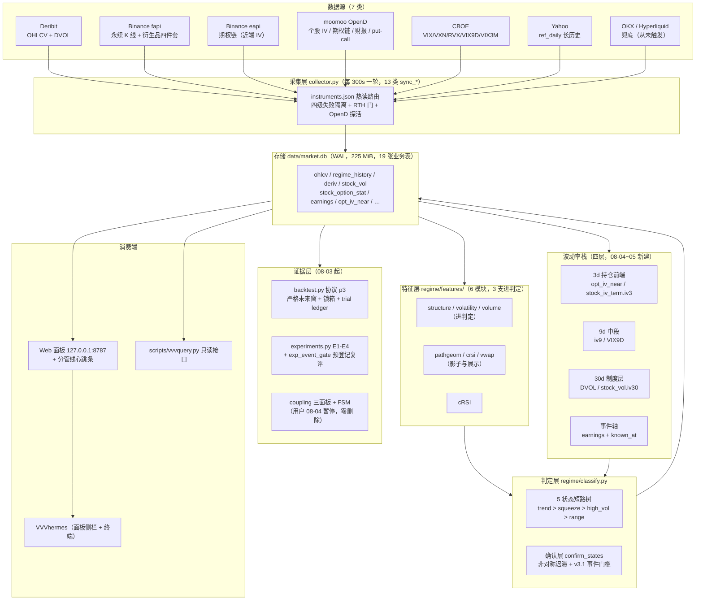

# VVV_Trade 系统日志 · 2026-08-05

> 上一版是 `SYSTEM_LOG_20260731.md`（覆盖期：项目启动 → 2026-08-01，另附两个批次附录到 08-05）。
> **本文是截至 2026-08-05 06:01 UTC 的快照**，覆盖期 2026-08-01 → 2026-08-05，共 **72 个提交**。
> 旧版不废弃：它记录的是 v1 的诚实状态，本文不逐条改史，只在结论变了的地方明写「旧版说 X，现在是 Y」。
>
> 数据基准：`data/market.db`（只读 `mode=ro`）、`data/collector.log`（全量 1,175 轮）、`tests/` 实跑、`git log`
> 数字来源标注：📊 库内实测 / 🧪 测试实跑 / ⚠️ **活体漂移**（采集仍在跑，复核时必然对不上）/ 📐 推算
>
> **本文的产出方式本身是一条方法**：7 个 agent 并行盘点七个子系统，每维产出带 `file:line` 证据的结构化事实，
> 再由 7 个独立 agent 逐条回代码/库里对抗核验。**核验推翻或修正了 67 条**（占全部断言约 30%），
> 其中包括「盘点者引用的注释数字早已过期」「盘点者自己的算术不成立」「盘点期间文件被改动导致行号偏移」。
> 本文只收录核验通过或已按核验修正的条目——**凡本文写下的数字，都是被查过两遍的**。

---

## 这个系统是什么

VVV_Trade 是一套**市场状态（regime）识别与路由系统**，不是信号系统，也不是预测器。它回答的唯一问题是：**当前这个品种、这个周期，处在哪一类市场状态**——趋势上行 / 趋势下行 / 低波动挤压 / 高波动无序 / 震荡，五选一。得到状态之后用什么策略是人的事；系统只负责把「现在是什么环境」做得可解释、可复现、可回测。

四天前那一版的一句话总结是：「六层贯通，但阈值仍是先验值、回测框架尚未开工」。这四天补上的不是阈值，是**证据基础设施与观测维度**：

- **宇宙翻倍再翻倍**：10 → 38 → **74 个品种**（X1 与 X2 两次扩容），且 X2 的名额分配依据是实测的**张成盲区**而非直觉——相关性张成检验显示系统把科技板块看得几乎完美（R²=0.938）却对公用事业（0.044）、能源（0.061）、必需消费（0.148）、医疗（0.151）结构性失明，于是名额优先给低 R² 板块。
- **个股 IV 换源**：此前 29/31 个美股品种拿 VXN 当自己的 IV（口径错配的假象），现在是 moomoo 的真·标的级 IV，**47,185 行 / 63 品种 / 3.1 年**。
- **波动率栈分成四层**：3d 持仓前端 / 9d 中段 / 30d 制度层 / 事件轴。这是用户明确裁决的优先级——**三层同等重要、3d 交易价值最高**（持仓周期 1-3 天，3d 直接计价持仓窗内的风险）。
- **规则层第一次带上事件语义**：RULES_VERSION v2 → **v3.1**，财报窗内的 squeeze→趋势确认多要 1 根。
- **回测框架从「尚未开工」变成「已跑过两轮、协议冻结在 p3、锁箱在计时」**。

一句话概括当前进度：**观测面与证据设施大幅扩张，规则层刚开始吸收事件信息，但六个阈值仍未被回测校准，且本次盘点发现若干「已建成但从未真正运行过」的机制**。这是 v3.1 的诚实状态。

---

## 系统总览

链路要点（相对旧版的变化）：

- **采集与展示仍是两个进程**，但面板已改**全程只读**（`storage.connect_ro()`），只有 `chat` 表用 `connect_rw_nomigrate` 写。旧版里「面板也能触发迁移与 purge」那个放大风险的结构**已经消除**——`connect()` 的 docstring 里留着那次事故的记载（面板跑迁移，一条 GET 就把 `regime_history` 清成 0 行）。
- **波动率栈是新增的一整层**，横切在采集与判定之间：30d 制度层进分位与显示、事件轴进 v3.1 确认门槛、3d/9d 目前**只进显示层**（无分位，因为没有厂商历史，正在自攒）。
- **证据层（回测/实验/耦合）是旧版完全没有的**。旧版说「回测框架尚未开工」，现在它有协议版本、有因果测试、有锁箱、有 trial ledger。

---

## 自 0731 以来发生了什么（72 个提交）

按主题归类，每类给数量与代表提交：

| 主题 | 提交数 | 一句话 | 代表提交 |
|---|---|---|---|
| **个股 IV 换源（moomoo）** | 14 | 从「29/31 拿 VXN 当自己 IV」到真·标的级 IV，3.1 年 × 63 品种 | `0e1d50b` 个股 IV 全面替代 |
| **波动率前端层（3d/9d）** | 8 | 近端 IV 扩到 8 标的 + 美股 3d/9d/30d 期限曲线 + 估计器稳健化 | `a97a8e9` IV vs RV 卡升级 + 估计器稳健化 |
| **X2 扩容** | 7 | 38 → 74，名额按张成盲区分配 | `36f320a` 补已实测盲区而非加厚科技维度 |
| **审阅与修复** | 12 | 两轮 codex 编队（6 路 + 12 路）约 190 条发现，全部独立复核 | `3fb8665` 12 路审阅修复批 |
| **规则升版 v2→v3.1** | 4 | A1 事件感知确认门槛，含一次 P0 自纠（UTC→ET 语义） | `8961341` / `3fb8665` |
| **新维度采集** | 9 | put/call 期权流、财报日历、市场宽度、VRP、双速期限结构 | `b7ec841` 新维度取舍判决 |
| **耦合系统** | 8 | M1 计算层 + M2 判定层 + calibrated-1 阈值代；08-04 起暂停投入 | `cdec45b` / 阈值代 `COUPLING_CALIBRATED1` |
| **面板与前端** | 6 | 3d 分卡、翻转折叠、心跳条、耦合雷达折叠 | `509b58e` 分管线心跳条 |
| **文档与治理** | 4 | GAPS 盘点、审阅报告、系统日志附录 | `18acfa6` 空白盘点 |

**这四天的工作方法本身值得记一笔**：几乎每个批次都是「先调研 → 再设计 → 后实施 → codex 编队对抗审阅 → 独立复核 → 入档」。两轮编队审阅共约 190 条发现，**所有真 P0 都出自同一条路线：端到端数值对拍**（拿代码现算的值与库内值逐字段比）。这条经验已经institutionalize 成审阅的默认形态。

---

## 已交付能力

### 1. 采集层（3,373 行）

每 300 秒一轮，一轮跑 **13 类 sync_\***，按序：universe_snapshot → bbo → ref_daily → **74×3 的 OHLCV + 判态主循环** → vol1h → deriv → usvol/iv30 → moomoo_iv → binance_opt_iv → stock_iv_term → moomoo_iv_live → breadth → DVOL。

**四级失败隔离**（这是全源断网只降级不崩溃的结构基础）：cycle 顶部三个治理动作各自 try → OHLCV 按 `(symbol,tf)` try → vol1h/deriv 按 symbol try → 最底层 `deriv.fetch_snapshot` 里 taker 接口失败只把 `taker_ratio` 置 None，不作废整个快照。

📊 **实证**：2026-08-05 12:10:39 与 12:15:39 两轮遭遇全源不可达（macOS 撤销了 Claude 的文稿目录权限，连 SSL 证书都读不了），各报 373 错误、耗时 5.7s / 5.4s、**库零增长、进程存活**；权限恢复后下一轮自愈。同型事件 08-04 21:38:24 也发生过一次（229 错误 / 0.3s）。

**RTH 门与 OpenD 探活**：三处 RTH 门统一走仓库自己的 NYSE 日历（`regime/calendar_nyse.py`，含 2025–2027 硬编码假日表 + **6 个**半日市 13:00 ET 收盘，表外年份一律当休市）。`opend_alive` 是 2 秒超时的 TCP 预检（127.0.0.1:11111），一轮最多被调 4 次——**这是全采集层唯一的挂死防线**，因为 moomoo SDK 连不上时会无限重试而不抛错。

**节流闸有三类语义不同的实现**，这个不一致值得记：
1. `_should(key, 秒)`：跨进程持久在 meta 表，**先记时间戳再干活**；
2. deriv 的 `funding_interval` / `funding_hist`：刻意不用 `_should`，改成**成功后才写时间戳**（注释明写理由：「用 _should 先记后做的话，一次网络失败要沉默等满 24h 才重试」）；
3. breadth：`(slot, UTC日)` 主键 + meta 双保险。

**修法只应用在了 deriv 上**——`usvol`(1800s) / `moomoo_iv`(3600s) / `binance_opt_iv`(1800s) / `stock_iv_term`(3600s) 四处仍是先记后做。对正在自攒历史的 3d 层，这意味着**一次网络超时 = 永久损失一个采样点**（见缺口 P1-3）。

### 2. 存储层与时间纪律（1,058 行）

单文件 SQLite（WAL），📊 **235,712,512 字节 = 224.8 MiB**，**19 张业务表**。全部写入幂等：13 张走 `ON CONFLICT DO UPDATE`（其中 7 张用 `COALESCE(excluded.c, c)` 做**列级合并**）、2 张 `INSERT OR REPLACE`、2 张 `INSERT OR IGNORE`。

**三道结构性闸门全在 `upsert_ohlcv` 一处**，且库内实测三者均在岗：

| 闸门 | 防的是什么 | 库内实测 |
|---|---|---|
| `_assert_grid` 跨源日界锚点断言 | Deribit 1d 收 08:00 UTC、Binance 收 00:00，主键永不碰撞，一次源切换会塞入约 300 根不覆盖旧行的行、序列不可逆退化成双网格 | 📊 1h/4h 锚点 100% 为 0；1d 呈 binance 00:00（9,137 行/32 品种）与 deribit 08:00（4,506 行/3 品种）两套互不碰撞的锚点 |
| `_invalidate_if_revised` | 交易所修订历史 K 线后，基于旧值算出的状态仍留在库里 | 在岗 |
| 源粘性（`storage.py:299-307`） | 同一 `(symbol,tf)` 序列混拼两个源的口径 | 📊 无一个 `(symbol,tf)` 出现多源 |

**版本谓词已完全取代旧的全表 DELETE**。旧版描述的 `regime_audit_vN` 递增 meta key + `DELETE FROM regime_history` 机制已经拆掉，只留考古注释；现在是 `state_ts_set` 按 `(RULES_VERSION, AUDIT_VERSION)` 谓词跳过已算行。📊 **236,830 行 regime_history 100% 是 v3.1/a8，零残留旧版本行**。

### 3. 特征层与判定核心

特征层 6 个模块 634 行，**但只有 structure / volatility / volume 三支进判定**；pathgeom / crsi / vwap 全部是影子或展示层。

判定是**一棵四层短路树**（trend > squeeze > high_vol > range）：两个趋势阈值 `er_rank ≥ 0.60`、`|direction| ≥ 0.30`，加上三个波动分位阈值 `SQUEEZE_BBW=0.15 / SQUEEZE_ATR=0.30 / HIGHVOL_ATR=0.85`，共 **5 个阈值决定 state**；`tilt_confirm = 0.10` **只调置信度，不改 state**。

📊 **库内实况**（236,830 行 / 74 品种 / 180 个 (symbol,tf) 组合）：

| 量 | 值 |
|---|---|
| 确认态分布 | range 47.4% / high_vol_chop 13.7% / trend_down 13.2% / squeeze 13.1% / trend_up 12.5% |
| **迟滞改写率**（state ≠ raw_state） | **12.6%**（29,834 行） |
| 迟滞的方向 | range 123,765→112,252（−9.3%）；high_vol_chop 25,107→32,496（**+29.4%**）；squeeze 28,405→30,948（+9.0%） |
| 按 `raw_state` 分组的原判平均置信度 | squeeze 0.937 / high_vol_chop 0.930 / trend_up 0.680 / trend_down 0.674 / range 0.677 |
| margin < 0.15（边界过渡中）占比 | 65.0% |
| **窗深达 250 的行占比** | 1h **93.5%** / 4h **76.6%** / 1d **73.1%** |

**窗深这一条是四天里最大的静默改善**：旧版的诚实交代是「只有约 24% 的行拥有完整 250 分位窗口」，现在是 73–93%。这来自 08-03 的历史回填（1h→5000 / 4h→2000 / 1d 加密→1500 根）。按更严的 `FEATURE_WINDOW=400` 算，全库 80.7%（1h 87.6% / 4h 57.4% / 1d 63.1%）。

**v3.1 事件门槛**（`docs/A1_EVENT_GATE_20260805.md`）：事件窗 = **ET 日历日差 ∈ [0,10]，含财报当天**；窗内 squeeze→trend_up/trend_down 的确认根数 2→3；high_vol_chop 始终 1 根；`event_win=None` 时与 v2 逐位相同。

关于它的强度必须写清楚：📊 **全库重放 180 组合 236,830 行，confirm_states 与库内 state 零差异**（机制正确）；但**它实际只改变了 102 行**（美股 151,981 行的 0.067%）。门槛强度取的是最小值 +1 根，属**版本化先验而非已证结论**——诊断 z≈0.9 未达显著、样本仅 2 个财报周期。

### 4. 波动率栈四层（本批次核心）

| 层 | 数据源 / 表 | 📊 现状 | 能否算分位 |
|---|---|---|---|
| **3d 持仓前端** | 加密+金属：`opt_iv_near`（币安 eapi） 美股：`stock_iv_term.iv3`（moomoo 期权链） | **48 行 / 8 标的**（08-05 12:01 因估计器稳健化清零重攒） **0 行**（尚未经历第一个 RTH 窗口） | ❌ 无厂商历史，自攒中 |
| **9d 中段** | 美股：`stock_iv_term.iv9` 指数：VIX9D | 0 行 3,918 天（2011 起） | ❌ 个股侧 / ✅ 指数侧（仅以比值进期限结构） |
| **30d 制度层** | `stock_vol.iv30`（moomoo） `dvol`（Deribit） | **47,185 行 / 63 品种 / 780 交易日**，63/63 全部过 `IV_RANK_MIN=120` 闸 740 行（BTC/ETH 各 370 天） | ✅ **这是唯一活的分位层** |
| **事件轴** | `earnings` + `known_at` | 602 行 / 50 品种，`known_at` 仅 **23 行非空（3.8%）** | 用于条件分位与 v3.1 门槛 |

**分水岭就一条：有没有厂商历史**。30d 有（moomoo 3.1 年 / CBOE 指数 16–36 年），3d/9d 没有，只能自攒。`tenor_days` / `t3` / `t9` / `t30` 随值落库，正是为将来「同期限桶内分位」留的钩子。

**条件分位机制**（`EARN_WINDOW_D=30` / `EARN_COND_WIN=504` / `EARN_COND_MIN=60` / `rank_kind` cond|raw 并存）：实证依据是**财报污染是阶跃不是斜坡**——事件前 10 日只占样本 15.4% 却占 IV 分位 ≥0.8 的 35.2%，即三分之一的高波信号是日历伪信号。条件化把富集从 1.92× 压到 0.94×。📊 分歧极大且方向基本可解释（in30=True 则 cond<raw：NVDA 0.092/0.611、UBER 0.154/0.702；in30=False 则 cond>raw：META 0.948/0.663）——但核验发现 **50 个走 cond 的品种里有 5 个违反该方向**，说明「方向严格」这个说法过强。

**近端 IV 估计器稳健化**（08-05 当天建当天修）：首版「单 ATM 行权价 C/P 均值」被单点坏 mark 击穿——XAU 在近 2 小时内读出 43.2 → 37.4 → 22.5 → 37.9，拉链检查发现 XAG 链一半报价钉在 110.0 的平台占位值上、正常簇 32–44 里混着 88.5 的坏点。修法三步：**占位簇剔除**（同一到期内完全相同的 markIV ≥3 次即整簇剔除）→ **ATM 邻域**（最近 `K_NEAR_STRIKES=5` 个距离档，注意**对称行权价共享距离档**，实际覆盖约 9 个行权价 18 条报价）→ **中位数**。修后 20 秒复探漂移 <0.25pt。首日 40 余行旧口径数据按「升版即重算」纪律清零重攒。

### 5. 证据层（回测 / 实验 / 耦合）

**回测框架**：协议冻结在 **p3** 且协议版本进 `experiment_id` 哈希。把因果构造、锁箱按收线裁剪、环块 bootstrap（n_boot=1000, seed=7, block=2×H）、surrogate 降级为描述性、结论按 episode 计数全部写死，🧪 **12 个 pytest 钉住**。未来窗 `HORIZONS`：1h [6,24] / 4h [6,18] / 1d [5,10]。门槛：`MIN_TRAIN=20 / MIN_EVAL=30 / MIN_EPISODES=10 / MAX_SHIFTS=120 / FEE_BPS=5.0`。锁箱起点 **2026-09-01**（距今 27 天）。

**实验体系**：E1 估计器赛马（**5 个估计器：sma_atr 基准 + rma_atr / parkinson / gk / rs 四个挑战者——注意 Yang-Zhang 从未实现**，文档里的「六种」是错的）、E2 BBW×ATR 4×3 网格、E3 48 桶三方对照、E4 迟滞 N=1..4。

**耦合系统**：三面板（all247 / usrth / cross）+ 双速 EWMA（140/420）+ Fisher-z + pair 四态 FSM + 块级三票，阈值代 **calibrated-1**。📊 08-04 用户决定暂停投入后，**零删除、零禁用，面板仍在生产实时计算**（本次实测 `/api/coupling` 74×74 矩阵 + 37 对 FSM 状态齐出，首算 2–3 秒量级、5 分钟缓存），只在前端改成默认折叠、并从每周复跑里缺席。

### 6. 面板 / Hermes / 心跳

面板是零依赖标准库 HTTP 服务，7 条路由，**读路径全程只读**。前端浅色单页，6 个 ECharts 实例，60 秒自刷新。08-05 一天四次改版：3d 独立成卡、翻转明细折叠且 1h 不列、**表头分管线心跳条**、耦合雷达折叠。

**心跳条**是本次新增的可观测性：五路管线各按自己的采集节奏判新鲜度（近端IV 24/7 / 个股IV RTH / 期限曲线 RTH / 衍生品 / OpenD TCP 探活），RTH 门控管线盘外显示灰色 idle 不误报。它解决的是「整体『数据新鲜』徽章只能证明循环活着、某条管线静默断流时循环照常转」这个哑故障（GAPS C3 的部分收口）。

⚠️ **本次盘点当场抓到心跳条自己的一个 bug 并已修**：「个股IV」lane 的阈值按 30 分频设计（75/150 分钟），而 `sync_moomoo_iv_live` 的 docstring 明写「每轮都跑，不节流」、📊 库内实测就是每 ~5 分钟一行——**闸松了 15 倍，且比面板自己丢弃实时值的 30 分钟闸还松**，会出现「心跳说正常、面板已不显示实时 IV」的自相矛盾。已改为 15/30 分钟。

**口径标注纪律**整体极严：预览-未收线、实时-未结算、结算IV、代理 GLD/SLV、倒挂、CBOE影子、观察池、诊断非信号，都有显式文案。

### 7. 测试 / CI

🧪 **12 个测试文件 / 69 个用例 / 265 条 assert，本次实跑全绿（约 1 分钟）**。GitHub Actions 自 08-02 落地以来 **68 次运行 100% 绿、零失败**，全部离线（合成数据 + 内存库 + 注入的假数据源）。

测试分布高度不均：`test_stock_vol.py` 一个文件 34 个用例（波动率栈是这四天的重心），`test_backtest_causality.py` 12 个（因果不变量），其余 10 个文件共 23 个。6 个早期文件仍用单个 `test_all()` 聚合全部断言。

---

## 关键设计决策（本批次新增）

沿用旧版体例：**选了什么 / 否掉了什么 / 代价是什么**。编号接旧版的 20 条。

**21. 个股 IV 换 moomoo 而非 IBKR / ORATS / Polygon。** 用户先问 IBKR，实测判决走 moomoo：**零成本**（用户已有账户，行情门槛是港美股总资产 >$0 或有美股持仓）、协议 3303/3304 直接给标的级 IV 与 3.1 年历史、31/31 覆盖。否掉 ORATS（长历史但收费）、IBKR（IV 需自己从期权链反解）。代价：依赖本机 OpenD 网关的登录会话，重启/登出即断流（缺口 C3/C4）；且历史只有 3.1 年（服务端统一保留边界 2023-06-26）。

**22. `source` 进主键，而非加一个普通列。** `stock_vol` / `stock_option_stat` / `earnings` 的 PK 都含 source。**这让「跨口径混算分位」在结构上不可能**——不同源的行是不同的行，不会互相覆盖，分位查询必须显式指定 source。代价：同一品种同一天可以存在两行，读端必须永远带 source 条件（Hermes 的查询提示里为此加了硬性要求）。⚠️ **这条纪律没有推广到 `deriv`**：deriv 表没有 source 列，而 `iv30` 列同时承载 CBOE 影子字段——同一条路上完全没有对应机制（见缺口 P2-2）。

**23. settled / live 双轨，分位只在 settled 上算。** moomoo 的 3303 盘中滚动更新、3304 历史接口**也会返回当日未结算行**。写入前必须用 `settled_only()` 按 NYSE 真实收盘时刻过滤——否则分位的分母里含着还会变的值。这与「K 线只收 `iloc[:-1]`」是同一条纪律的两个实例。实时值单独写 `stock_vol_live`，前端显式标注「实时(未结算)」并给**预览分位**。🧪 双轨隔离有专门的不变量测试。

**24. 期限曲线取 3/9/30 三点，而非近月/次月两点。** 原设计（GAPS A2）是「近月 vs 次月 ATM」。实施时改成三个固定目标期限，理由是**它能把事件定价隔离出来**：📊 首次探针 NVDA 3d=44.4 / 9d=38.2 / 30d=44.4——9d 到 30d 之间抬升的 6 个点正是 21 天后（8/26）财报的定价，它在 30 天窗内、不在 9 天窗外。单看 IV30=44 无法区分「环境紧张」与「日历事件」。代价：请求量大（每日约 183 次链请求建表），靠**按 ET 日缓存期权链**压到可接受（盘中每轮只做 2 次批量快照）。

**25. 近端 IV 用中位数 + 占位簇剔除，而非单点 ATM 均值。** 见上文「估计器稳健化」。**这条决策是被数据强迫的，不是设计出来的**——首版上线当天就被单点坏 mark 击穿。教训写进 GAPS C15：`stock_iv_term` 的 ATM 取法与首版同构（单行权价 C/P 对），列为两周观察项。

**26. 事件门槛动确认层不动测量层。** v3.1 只改 `confirm_states`（确认根数 2→3），不改 `classify`（状态判定本身）。理由：测量层要保持「机器看到什么就是什么」，事件信息属于「要不要相信这次转换」的范畴。副作用是 `raw_state` 保持纯净，这让**离线重放两种确认层做对照**成为可能——正是缺口 P0-2 的解药。

**27. 耦合课题暂停用「停止投入」而非「删除代码」。** 用户 08-04 的明确选择（经 AskUserQuestion 确认为「只暂停投入，代码与面板都保留」）。代价现在看清楚了：**面板仍在每 5 分钟实时计算，但 `coupling_events` 账本自 08-04 19:04 起停更**——暂停期间发生的真实脱耦事件不会留下任何账本痕迹（见缺口 P2-4）。

**28. 用 codex 编队做对抗审阅，Claude 做监工。** 用户的标准工作法。两轮编队（6 路 + 12 路）共约 190 条发现，**每条都由 Claude 独立复核**。经验：**端到端数值对拍是最高产出的审阅形态**（两轮全部真 P0 都出自它）；且监工的「安全断言」两次救了 CRWD 清修（先防误删真实数据、再暴露源端重灌）。本文的产出方式（7 盘点 + 7 核验）是这套方法的又一次应用，**核验推翻了 67 条**。

---

## 已知缺口与风险

按「离产生错误读数的距离」排序。**标 🆕 的是本次盘点新发现的**。

### P0：正在产生错误或缺失数据

**P0-1 🆕 CBOE 个股 iv30 循环无限速，超过一半的品种永久拿不到数据，且失败零日志。** `collector.py:714-728` 对 61 个 us_stock_perp 逐个发请求、无任何 `time.sleep`，实测第 26 个之后被 CDN 返回 429。📊 日志全量统计（08-05 全天 26 个 usvol 轮）成功数在 **25/27/28 三值间浮动**。更关键的是这些失败只 `errors.append` 不打日志——核验给出了精确的恒等式：

> **每轮错误数 = 42 + (61 − iv30 成功数)**，逐轮无一例外。

这解释了长期以来「错误数在 42 与 78 之间跳变」的全部来源，而日志里完全看不见。影响：L2 影子层对 33–36 个美股品种是永久零数据。修法明确（加限速 + 打日志），未做。

**P0-2 🆕 A1 预登记复评在被自己改造过的数据上评估自己。** `scripts/exp_event_gate.py:35` 读的是 `regime_history.state`（**确认态**），并统计 squeeze→trend 的 10 根失败率。但 v3.1 的事件门槛正是通过**压制事件窗内的 squeeze→trend 确认**来生效的——被门槛拦掉的转换根本不会出现在 `state` 里。**门槛把自己的分母压掉了**，剩下的样本还是「扛过 3 根确认」的选择性子集，失败率天然更低。

📊 后果已经可见：窗内样本从立项时的 37 掉到 **16**，失败率差从 +6.6% 翻转成 **−3.9%**（窗内 72.0% vs 窗外 75.9%），方向与 A1 立论相反。到 n≥100 时它会自动输出「建议 v4 撤销门槛」——**而这个结论是门槛自身的选择效应制造的**。

正确做法：在 `raw_state` 上离线重放 v2/v3 两种确认层再比（E4 已有 `_confirm_fold` 可复用，系统本来就存 raw_state 就是为这类重放）。**这是一个方法论改动，按「先诊断后实施」在此留档，等你裁决。**

**P0-3 🆕 `universe_snapshot` 被 `--symbols` 子集运行污染。** 📊 已发生：08-04 18:20:10 产生了一条**只有 1 行（CRWD）的宇宙快照**，18:24:05 又产生一次假重快照。回测按 `snapped_at` 取当时成员会取到一个只有 CRWD 的宇宙；`universe_hash` 也被子集运行改写，会触发无意义的新版本。修法方向：`snapshot_universe` 只在全量运行时写。

### P1：机制已建成但从未真正运行过

这一类是本次盘点最意外的发现——**有四个机制处在「代码写好、测试通过、但一次都没在生产里跑过」的状态**。

**P1-1 🆕 每周复跑从未执行过一次。** 调度任务 `vvv-weekly-backtest-rerun` 在册（cron `0 9 * * 1`，已启用，挂在 Claude Code 的调度器上而非系统 cron），但建于 08-03 16:21——当天周一的 09:00 已过，**首次真实触发是 2026-08-10**。更麻烦的是：**首跑会同时改变三个变量**（rules_version v2→v3.1、品种 10→74、单序列长度大幅增长），而 SKILL.md 的「同族对比」判据不含 rules_version，极可能给出跨版本的伪趋势结论。且复跑规模未做运行时评估（上轮 25 序列，下轮最多 74×3=222 序列，无超时保护、无进度输出）。

**P1-2 🆕 `stock_iv_term` 至今 0 行。** 落地于 08-05 09:49 JST（= 08-04 20:49 ET，美股已收盘），此后到本文写作时刻未经历任何 NYSE 交易时段；探针测试行按提交说明被主动清掉。**这不是缺陷，但系统日志此前把它记成了既成能力**——本文更正：管线已完整、有 2 个单测，**但一次都没在 RTH 内跑过**。首个 RTH 窗口（08-05 22:30 JST）是它的真正验收点，需盯 61 品种的链请求是否在 moomoo 限频内跑完。相应地，GAPS C15 的「两周观察窗」实际尚未开始计时，起算点应改成**首个 RTH 采集日**。

**P1-3 🆕 `calibrated-1` 从未跑过它自己规定的满额终验。** 它是现行阈值代、面板正在用它出判定，但只过了 1000 路/组合的网格；`docs/` 里唯一那份 20k 路满额报告**实际是 prior-1 的产物，且全文没有任何 threshold_version 印章**。设计 §5 与 `run_coupling_grid.py` 自己的落款都要求满额终验才算正式效力。随耦合课题一并冻结。

**P1-4 🆕 锁箱开箱仪式无代码实现。** 只有 docstring 承诺「只允许开一次」，ledger 里无表、无列、无写入路径。27 天后（2026-09-01）锁箱数据开始累积，**一旦偷看，整个 P0 立论的处女数据前提失效且无任何痕迹**。

**P1-5 `_should` 先记时间戳再干活（四处）。** 见「采集层」。对正在自攒历史的 3d 层，一次网络超时 = 永久损失一个采样点。deriv 已单独修过，修法现成。

### P2：结构性缺口与不对称

**P2-1 🆕 `upsert_ohlcv` 的三道结构性闸门零单元测试覆盖。** 日界锚点断言、修订失效、源粘性、NaN/Inf 拒收——这四条是全系统时间口径与数据完整性的最后防线，**每条都有明确的历史事故来历**（双网格污染、修订后状态不重算、混口径拼接、NaN 落库炸死品种），却没有一个测试钉住它们。

**P2-2 🆕 `deriv` 表没有 source 列，而 `iv30` 列同时承载 CBOE 影子字段。** `stock_vol` 系列用「source 进主键」把混拼分位堵死了，deriv 这条路上完全没有对应机制。同理 `ref_daily` 的 source 是普通列 + `INSERT OR REPLACE`——ohlcv 有源粘性硬闸拒绝混源，ref_daily 换源则**静默 last-write-wins 且不报错**。

**P2-3 🆕 usrth / cross 面板的 124 个资格对从未进 FSM。** `dashboard.py` 一句注释「pair FSM 目前只有 all247 有资格对」跳过了这两个面板，但📊实测 usrth 有 **21 个** ELIGIBLE 对、cross 有 **103 个**。**跨类脱耦（美股↔加密）恰恰是耦合层最有交易含义的部分**。连带更正：GAPS B5 记的「美股 RTH 相关面板已攒 ~300/400 根，约 10 月中自然达标」是错的——该面板实测已有 779 行、21 个资格对，**门槛早已越过**。

**P2-4 🆕 `coupling_events` 账本停更。** 最后写入 08-04 19:04；`weekly_rerun.sh` 不含任何 coupling 脚本。面板每 5 分钟算出的 FSM 状态与事件全部不落库。

**P2-5 🆕 ledger 里 5 条实验全是 v2，而 `regime_history` 已被 v3.1 全量覆盖。** 旧结果**永不可复现**——这正是版本纪律要防的事，只是这次是纪律生效后的必然后果而非违规。下轮复跑是第一次 v3.1 的基线。

**P2-6 `pct_rank` 有效样本 <2 时返回 0.5。** 与全仓「宁缺毋滥、不许用 0.5 伪装中性」的纪律（vwap / pathgeom / crsi 三处都写了）直接冲突，且它在判定路径上。

**P2-7 🆕 5 个品种完全无波动率卡。** HYPE（无币安期权）、SKHY（KRX 期权不通，C6 已登记）、**CL / XPT / XPD（未配 vol_proxy）**——最后三个与 XAU→GLD、XAG→SLV 是同一类问题，USO / PPLT / PALL 是现成的 ETF 代理，但没被登记为可做项。另：SKHY 作为唯一 `intl_stock_perp` 在面板上是三等公民（无市场状态徽章、无去季节化 ATR、无事件窗、无 IV 卡），而 KRX 与 NYSE 时段完全不重叠，「休市期波动塌陷」的警示对它同样成立却没有任何提示。

**P2-8 66 个品种单源无兜底。** 📊 74 个品种里只有 BTC/ETH/SOL 走 `deribit→okx→binance` 三源链，**66 个钉死单源 `binance_futures`**，5 个配了 hyperliquid 兜底。📊 **库里从未出现过 okx / binance 现货 / hyperliquid 的行——兜底链一次都没被触发过**，属未验证代码路径。且源粘性会拒绝异源写入，真到切源时会直接报错而非静默降级（设计意图如此，但意味着兜底链事实上被源粘性关掉了）。

### P3：卫生与运维

| # | 项 | 状态 |
|---|---|---|
| P3-1 | **守护进程无自启**（collector / dashboard / OpenD 三者皆手工）。plist 已写好但从未安装（`~/Library/LaunchAgents` 目录都不存在），crontab 为空。Mac 重启或休眠后系统静默停摆 | 已知未处置 |
| P3-2 | 🆕 **`collector.log` 无轮转**：📊 12.2MB 且以约 2.3MB/天无界增长；面板每 60 秒 `readlines()` 全量读取只为取最后 25 行 | 本次新发现 |
| P3-3 | 🆕 **`web/` 下三个 `.bak` 文件会被 HTTP 服务出去**（实测 `curl /app.js.bak` → 200）。`_file` 无扩展名白名单。127.0.0.1 绑定下风险低，属卫生问题 | 本次新发现 |
| P3-4 | 🆕 静态文件响应无任何缓存控制头——「改了没生效」的假象来源 | 本次新发现 |
| P3-5 | 🆕 常驻 collector 与 launchd plist 的潜在双写：当前跑的是无 `--once` 的常驻循环，plist 配的是每 300 秒 `--once`。日后为解决 P3-1 加载 plist 而忘记杀常驻进程，会双写 | 条件已具备 |
| P3-6 | `meta.status.errors` 只保留最后 10 条，而实际每轮 42–78 条——面板与 Hermes 只能看到不到 1/4 | 已量化 |
| P3-7 | 🆕 `bbo`（22,073 行）与 `universe_snapshot`（224 行）**无任何消费者**，且写入是**无列名的位置式 INSERT**——加列会静默错位 | 本次新发现 |
| P3-8 | 三张新表（`opt_iv_near` / `stock_iv_term` / `stock_vol_live`）无保留边界。📐 `stock_vol_live` 按 63 品种 × 78 点/交易日 ≈ 1.2M 行/年 | 未立案 |

### 文档与代码的漂移（本次逐条定位）

这一类单独列，因为**它们会让读者拿到错误的心智模型**：

| 位置 | 写的 | 实际 |
|---|---|---|
| `README.md:22` | AUDIT_VERSION「当前 **a7** 为 **23** 项」 | **a8** / **25** 项 |
| `.github/workflows/ci.yml:18` | 「**六个**测试全部离线」 | **12 个文件 / 69 个用例**（「全部离线」仍成立） |
| `.gitignore:6` | data/「约 **9MB**」 | 📊 **256MB**，差 **28 倍** |
| `structure.py:74` | 「实测受影响的入库行占 **50.8%**」 | 📊 今日 **7.62%**（1d 23.09% / 4h 16.51% / 1h 4.47%） |
| `classify.py:71-72` | high_vol_chop 的 chop_freq 与 range「只差 **2.1%**」；「**45.2%** 的该态行 \|dir\|≥0.30」 | 📊 均值相对差 3.28% / 中位 9.2%；**35.46%** |
| `dashboard.py` 耦合矩阵注释 | 「38×38」 | **74×74**（X2 后 app.js 的注释更新了，dashboard.py 的没跟上） |
| `data.py` 文件头 | 「Deribit 优先，OKX、Binance 依次兜底」 | 66/74 品种钉死单源，兜底链从未触发 |
| `stock_iv_term.py` docstring | 招牌示例把跨源差（moomoo 聚合 48.0 vs 自算链上 44.4）解释成**期限溢价** | 与本仓「绝不混拼不同源」的纪律直接冲突 |
| `regime/features/__init__.py` | `__all__` 导出列表 | **死代码**——全仓零调用方走包级导入 |
| `experiments.py` E1 文档 | 「六种估计器」 | **5 个**（Yang-Zhang 从未实现） |
| `README` 路线图第 5 项 | `DATA_DEGRADED` 已完成 | **该标识符全仓仍不存在**（旧版已指出，四天后依然） |

**根因是结构性的**：📊 README 在 72 个提交里只被改过 4 次，而 `regime/` 被改过 40 次。RULES_VERSION 有「改阈值必须递增并重算」的硬纪律兜底，**README 与注释没有任何对应机制**。

---

## 路线图

### 用户已裁决的优先级（08-05）

**波动率四层同等重要，3d 交易价值最高**（持仓周期 1-3 天）。制度判定继续用 30d 分位（唯一有深历史的层），3d/9d 分位待自攒转正——**3d 分位转正是第一顺位**（GAPS B6/B7），📐 美股约 60 个交易日、加密约 12 天可做粗分位。

### 排队中（按本文缺口重排）

| 优先级 | 项 | 一句话理由 |
|---|---|---|
| **P0** | 修 CBOE iv30 限速 + 补日志 | 一半美股品种永久零数据，且错误数在日志里说不清 |
| **P0** | 重设计 A1 预登记复评口径（改用 raw_state 重放） | 现机制会用自己制造的选择效应给出「撤销门槛」的伪结论 |
| **P0** | 修 `universe_snapshot` 子集污染 | 已产生 1 行的假宇宙，会毒化回测的成员集 |
| **P1** | 每周复跑首跑（08-10）的护栏 | 三变量同时变；至少要让判据带 rules_version、加进度输出与超时 |
| **P1** | 锁箱开箱仪式落成代码 | 27 天后开始累积，纯靠自觉且无痕迹 |
| **P1** | 补 `upsert_ohlcv` 四道闸门的单测 | 全系统时间口径的最后防线，零覆盖 |
| **P1** | 3d 层继续自攒 + 首个 RTH 验收 | 本文的第一顺位数据工程 |
| **P2** | usrth / cross 两个面板接进 FSM | 124 个资格对闲置，跨类脱耦最有交易含义 |
| **P2** | CL / XPT / XPD 配 vol_proxy（USO / PPLT / PALL） | 与 XAU→GLD 同类问题，现成解 |
| **P2** | 六个阈值的回测校准 | **v1 起的老账，仍未还** |
| **P3** | 守护自启 + 日志轮转 + 清 .bak | 运维卫生 |

### 时间锚

- **2026-08-05 22:30 JST**：`stock_iv_term` 首个 RTH 窗口——P1-2 的验收点
- **2026-08-10**：每周复跑首次真实触发——P1-1 的护栏必须在此前就位
- **2026-09-01**：锁箱开箱——P1-4 的截止线
- **2026-09 上旬**：B4 去季节化 ATR 转正回看（既定约定，⚠️ E3 白名单仍只覆盖 7 个美股而非 61 个）

---

## 版本纪律

旧版这一章的立论不变：**不同版本产生的 `regime_history` 行混在一起，会悄悄污染回测统计**。四天里它经历了一次真实考验，结果是**纪律赢了**。

### 两套版本机制（现状）

| 机制 | 当前值 | 含义 | 升版后果 |
|---|---|---|---|
| `RULES_VERSION` | **v3.1** | 判定规则或阈值的语义版本 | 全量重算确认态 |
| `AUDIT_VERSION` | **a8** | 审计快照的字段集版本 | 全量重算特征 |
| `THRESHOLD_VERSION`（耦合） | `calibrated-1` | 耦合阈值代 | 独立演进，不牵动上面两个 |
| 回测协议 | `p3` | 进 `experiment_id` 哈希 | 旧实验自动不可比 |

**旧的全表 DELETE 机制已经拆掉**，改为版本谓词跳过。📊 库内 236,830 行 100% 是单一 `(v3.1, a8)` 组合，零残留。

### 这四天的实证：纪律的两次生效与一次代价

**生效一：v3 的 P0 被六条独立审阅路线同时抓到。** v3 首版用 UTC 毫秒比较事件窗，导致**财报当天被整个排除**、且有 DST 漂移。修成 v3.1（ET 日历日语义）后重算，📊 **确认态零差异**——因为库里当时还没有落在该边界上的样本，是一个纯前向的修复。

**生效二：CRWD 4:1 重定价的清修。** 监工的安全断言（「所有断点前的行都是冻结的零成交量数据」）在核实中**被自己推翻**——六月那段是真实交易，断点是 4:1 重定价（773.10/192.95 = 4.007）。断言救了一次误删。随后发现删除会被下一轮采集重新灌回，于是新建 `series_floor_{symbol}` meta 机制（📊 当前只有 `series_floor_CRWD-USDT`）。⚠️ **`backfill_history.py` 仍不读 floor**（GAPS C8），手工回填会把旧口径段灌回来。

**代价：ledger 里 5 条实验全部作废。** 见 P2-5。这是纪律的成本，不是纪律的失败。

### 一条正在被消耗的安全余量 🆕

版本谓词方案「不会永久截断历史」的论断，依赖**重算窗（10,399 根）> 最长序列（5,046 根）**。📐 1h 序列以每天 24 根增长，从 5,046 到 10,399 约需 **223 天**（≈2027-03）。届时 `collector.py` 的告警分支会触发。现在记下来，免得那天靠考古。

---

## 一句话收尾

四天里这个系统从「10 个品种、六层贯通但没有证据」变成「74 个品种、四层波动率栈、规则层带事件语义、回测协议冻结、两轮编队审阅过筛」。**工程侧的密度是真的**：236,830 行状态快照 100% 单一版本、窗深从 24% 提到 73–93%、69 个测试全绿、CI 68 次零失败、全源断网实测只降级不崩溃。

但本次盘点最该被记住的不是这些，而是**四个「建成了却从未运行过」的机制**：每周复跑（首跑 08-10）、`stock_iv_term`（首个 RTH 未至）、`calibrated-1` 的满额终验（从未跑）、锁箱开箱仪式（无代码）。它们在文档里都写着「已完成」——这是一种比 bug 更隐蔽的债：**代码写完了、测试过了、提交了，于是心智上归档为「有了」，但生产里一次都没转过。**

还有一条更该警惕：**`exp_event_gate` 会在数据攒够时自动给出「建议撤销事件门槛」的结论，而那个结论是门槛自身的选择效应制造的**。一个自动化的、看起来很严谨的、预登记的判据，正在通往一个错误答案——如果不是这次逐条核验，它会在几周后以「预登记复评的客观结论」的身份出现在你面前。

阈值仍然是先验值。这一点四天前是真的，今天还是真的。区别只在于：现在有了回测框架、有了锁箱、有了 trial ledger、有了 74 个品种的数据——**校准的前置条件基本齐了，欠的是把它跑起来**。
